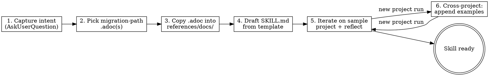

Invokes `Skill` tool to use `/skill-creator` internally to create skill as described below.

### STRICT RULE !!!!!IMPORTANT!!!!

The skill is the thinnest possible layer over migration-path docs.
So the best skill would be just referencing the migration path files!!!!
START WITH THE MOST MINIMALISTIC AND THEN ITERATE WITH EVALS.

## Goal

Produce ONE, atomic new skill under `.claude/skills/axon4to5-<scope>/` that migrates
**exactly one** AF4 construct instance per run to its AF5 form. An
orchestrator dispatches many invocations; this generator is not it.

**Done when**:

- a new skill directory exists,
- frontmatter valid,
- procedure references a copied migration-path doc,
- output passes the checklist in `references/skill-quality-checklist.md`
- evals defined and executed on projects from [axon-examples](../../../.knowledge/repositories/axon-examples) - should
  check if the behavior of migration axon4 is preserved based on the expected output in axon5.

## Input

- Source construct (AF4) — annotation / class shape / config key
- Target construct (AF5) — concrete API
- (Optional) sample project path for iteration

If `$ARGUMENTS` empty, ask via `AskUserQuestion` what construct to migrate.

## Output

```
.claude/skills/axon4to5-<scope>/
├── SKILL.md
└── references/
    ├── docs/                        # copied .adoc files (preserve tree)
    └── examples/
        └── 01-<short-variant>.md    # one real before/after per file
```

There might be scripts and assets as well if needed. Prefer scripts (like bash or python) over ad-hoc LLM edits.

## Hard rules

| MUST                                                                                                                                                                                                              | MUST NOT                                                                                    |
|-------------------------------------------------------------------------------------------------------------------------------------------------------------------------------------------------------------------|---------------------------------------------------------------------------------------------|
| Generated skill is **project-agnostic** — framework terms only (annotations, class shape, API signature). Project-specific patterns never accumulate inside the procedure itself. Might be described in examples. | Reference project paths, module names, package layouts in procedure                         |
| Generated skill is **atomic** — exactly one candidate per run                                                                                                                                                     | Bundle multi-target sweeps; that is the orchestrator's job                                  |
| Generated skill is **self-contained** — copies migration-path .adoc into `references/docs/`                                                                                                                       | Reference files outside the skill directory at runtime                                      |
| Generated skill is **behavior-preserving** — AF4 semantics, no DCB, no new patterns, AggregateBasedEventStore preserved                                                                                           | Introduce AF5 patterns that change semantics (DCB, new event store)                         |
| Generated skill supports **Java and Kotlin**                                                                                                                                                                      | Hardcode one language; trust LLM to translate between them                                  |
| Generated skill's procedure ends with **diff + human review**                                                                                                                                                     | Treat `mvn compile` / `gradle build` as success — mid-migration projects are usually broken |
| Procedure cites the migration-path .adoc as source of truth                                                                                                                                                       | Duplicate migration-path knowledge into the skill body                                      |
| New project variants → append example file under `references/examples/`                                                                                                                                           | Replace existing examples; route on observable shape, never project name                    |

## Process



### 1. Capture intent

Use `AskUserQuestion` to confirm — do not assume:

- **Source construct**: the precise AF4 shape (e.g. `@Aggregate` class with at least one `@EventSourcingHandler`).
- **Target construct**: the AF5 form, with a concrete API reference (e.g. `@EventSourcedEntity` +
  `@EventSourcingHandler`).
- **Selection rule** when multiple candidates exist: lexical-by-file-path is the default; alternatives are "user names
  it" or "first match by Grep". Atomic means atomic: pick exactly one per run.

### 2. Pick migration-path .adoc(s)

Browse `.knowledge/repositories/axonframework/AxonFramework5/docs/reference-guide/modules/migration/pages/paths/` and
pick files relevant to the construct. If none cover the transformation, tell the user to draft a migration-path doc
first (via the `migration-path` skill in the AxonFramework5 repo) — do **not** invent one inside the skill.

### 3. Copy .adoc into the skill

`cp` the chosen `.adoc` files into the new skill's `references/docs/` preserving the directory structure under `paths/`.
The skill must run without reaching outside its own directory.

### 4. Draft SKILL.md from template

Read `references/migration-skill-template.md`. Fill every `<...>` placeholder. Keep the body short (<300 lines); push
detail into `references/`.

The procedure must:Con

- State the **selection rule** explicitly.
- Read the migration-path .adoc **before** transforming anything.
- Carry **transformation instructions** as the heart of the skill — the LLM-specific edits and gotchas that grow over
  time via `reflect`. Start lean (one or two steps). These extend the .adoc; they do not restate it. These are the
  LLM-specific edits and gotchas that the migration-path doc doesn't
  cover on its own — written generically so they hold across projects. DO NOT DUPLICATE
  KNOWLEDGE FROM THE MIGRATION-PATH DOC. This is the source of truth. The best instruction would be just "follow the
  migration path".
- Expose a `--configuration-mode` argument with values `spring-boot` and
  `axon-configuration` (default `spring-boot`). It controls the **target**
  AF5 wiring flavor, not the source. The skill must still recognize the
  AF4 candidate when it is written in either Spring Boot or plain Axon
  Configuration form — recognition rules come from the migration-path
  .adoc, not from runtime detection. All four AF4-source × AF5-target
  combinations must be supported.
- Be **idempotent**. Prior work (an OpenRewrite recipe, a manual edit, an
  earlier run of this skill) may have already applied some or all of the
  target form. Before any edit, the procedure must check the candidate
  against the AF5 target shape and short-circuit when the goal is already
  reached — report "already migrated" with zero diff. Partial completion
  is also a valid input: only edit what is still on the AF4 form.
- Load reference files **conditionally**. The generated SKILL.md must
  carry a References routing table with one row per `.adoc` / example
  file (or directory) and a concrete load condition (e.g. *source flavor
  is Spring Boot*, *target is `--configuration-mode=axon-configuration`*,
  *source × target = plain Axon → Spring Boot*, *Variant V triggers*,
  *fallback*). The procedure loads only rows whose condition matches the
  current run. "Always" rows are allowed but used sparingly. Never load
  everything by default — different migration variations need different
  subsets of the references.
- End with **diff summary + human review** as the success gate. Zero
  diff is an acceptable outcome when the candidate was already on the
  target form.

Source repos ([AxonFramework5](../../../.knowledge/repositories/axonframework/AxonFramework5)
or [AxonFramework4](../../../.knowledge/repositories/axonframework/AxonFramework4)) are a **fallback** only — when the .adoc + transformation instructions
leave a gap. Hitting the fallback is a signal to run `reflect` next.

### 5. Iterate on a sample project

Run the new skill against one real candidate from: [axon-examples](../../../.knowledge/repositories/axon-examples) ask human to judge the outcome. 
After every human correction (manual edit, "no, do it like this",
regenerated code), invoke `reflect` on the **migration skill** (not on this creator) so the lesson folds into
transformation instructions before the next iteration.

This creator skill is scaffolding around that loop. The migration skill is the artifact that gets better.

### 6. Be additive across projects

When the same skill meets a different valid pattern on a second project:

- **Append** a new file under `references/examples/NN-<short-variant>.md`.
- Add a "Variants" entry in SKILL.md that routes on **observable input shape** (annotation present/absent, base class,
  payload type) — never on project name or path.

Two patterns conflict → document both, route on shape.

## Routing: where to look for AF5 API answers

Before writing logic into a skill, check the migration guide first.
If the guide lacks a before/after example for a pattern, search reference repositories and put an example in skill
files (dedicated per example, reference from SKILL.md) Do not duplicate examples from the migration guide.

| Need                     | Look here first                                       | Then                                           | Last resort                                 |
|--------------------------|-------------------------------------------------------|------------------------------------------------|---------------------------------------------|
| Migration of a construct | `.knowledge/.../migration/pages/paths/*.adoc`         | `references/AxonFramework5/axon-5/api-changes` | AF5 source `.knowledge/.../AxonFramework5/` |
| How to do X in AF5       | `.knowledge/.../AxonFramework5/docs/reference-guide/` | `.../AxonFramework5/examples`                  | AF5 source                                  |
| Working code example     | Local migrated projects (if linked)                   | `.../axoniq-claude-plugin` how-tos             | AF5 source                                  |

Anything copied into the new skill becomes self-contained: it lives under `references/docs/` or `references/examples/`,
never as an external path.

Exploration order when researching a pattern:

1. Migration guides: [migration](../../../.knowledge/repositories/axonframework/AxonFramework5/docs/reference-guide/modules/migration) - check the API
   against Axon Framework 5 source code (YOU MUST READ PROPER MIGRATION GUIDES TO DEVELOP THE SKILL).
2. API Changes: [api-changes](../../../.knowledge/repositories/axonframework/AxonFramework5/axon-5/api-changes)
3. Axon Framework 5 reference guide - how to do
   something [reference-guide](../../../.knowledge/repositories/axonframework/AxonFramework5/docs/reference-guide/)
4. Example projects in [axon-examples](../../../.knowledge/repositories/axon-examples)
5. Example projects in Axon Framework 5 repo [examples](../../../.knowledge/repositories/axonframework/AxonFramework5/examples)
6. Axon Framework 5 how-to from: [claude-plugin](../../../.knowledge/repositories/axonframework/claude-plugin)
7. AxonFramework 5 examples: [axon5](../../../.knowledge/repositories/axon-examples/axon5) - it's a really good way to find code
   snippets.
8. Framework source in [AxonFramework5](../../../.knowledge/repositories/axonframework/AxonFramework5)

## References

| Topic                               | File                                     | Load When                |
|-------------------------------------|------------------------------------------|--------------------------|
| Skeleton for the generated SKILL.md | `references/migration-skill-template.md` | Step 4: before drafting  |
| Quality checklist for the new skill | `references/skill-quality-checklist.md`  | Step 4: before finishing |

## Checkpoints

Decision gates in the generated skill MUST use `AskUserQuestion` per the project's checkpoint protocol — never plain
text. The "diff + human review" step at the end of every migration skill's procedure is such a gate.

## Verification

Use projects from [axon-examples](../../../.knowledge/repositories/axon-examples), especially bike-rental-extended to confirm the skill content.
Prepare evals for skills. So try to execute the skill on axon4/bike-rental-extended and compare to
axon5/bike-rental-extended - any differences discuss with human. Do the same for other axon-examples.

- Verification cannot expect a whole project to compile. Every skill does a small step towards that.
  The skill should compile just classes that changed and check if this works, it'd be the best to run tests against
  them (if they exist).

### Eval inputs MUST exist on disk

Every `input_files` path declared in `evals/evals.json` MUST resolve to a real file at commit time.

- **Prefer real candidates** under `.knowledge/repositories/axon-examples/axon4/...`, with the AF5 counterpart under
  `.knowledge/repositories/axon-examples/axon5/...` referenced as `expected_reference`.
- **Fall back to synthetic fixtures** under `evals/fixtures/<variant>/` ONLY when no real example covers the variant
  (e.g. multi-entity, polymorphic hierarchy, state-stored stop-condition). In that case you MUST:
    1. Create the self-contained synthetic `.java` file(s) under `evals/fixtures/<variant>/` — commands/events as
       nested types is fine; the fixture must mirror the AF4 shape the skill is meant to recognise.
    2. Mark the eval entry with `"source": "synthetic"` and add a `"fixture_rationale"` field explaining why a real
       example is unavailable.
    3. Set `"expected_reference": null` — there is no AF5 file to diff against; the assertions live in
       `expected_output`.
- **Never invent a `fixtures/...` path without also creating the file.** A path that doesn't resolve is a defect, not
  a TODO.

### evals.json, run.sh, README.md MUST stay in sync

The three files in `evals/` are different views of the same set of inputs. They MUST point at the same files. If one
drifts (e.g. `run.sh` references a real path while `evals.json` still names a placeholder fixture), fix the lagging
file — don't paper over the mismatch.

## Communication to user

End-of-run message (friendly, with emojis, single block):

```
✅ Created skill: axon4to5-<scope>
   📂 .claude/skills/axon4to5-<scope>/
   📄 Migration-path doc(s) copied: <list>
   🧪 Try it on a real candidate, then /reflect to fold lessons back.
```

On failure (missing .adoc, ambiguous intent), report which step failed and what's needed to continue.
