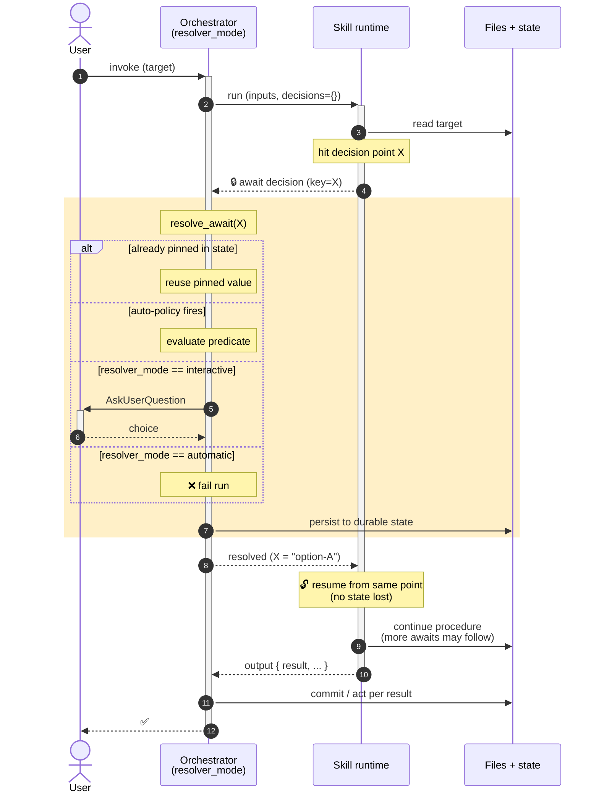
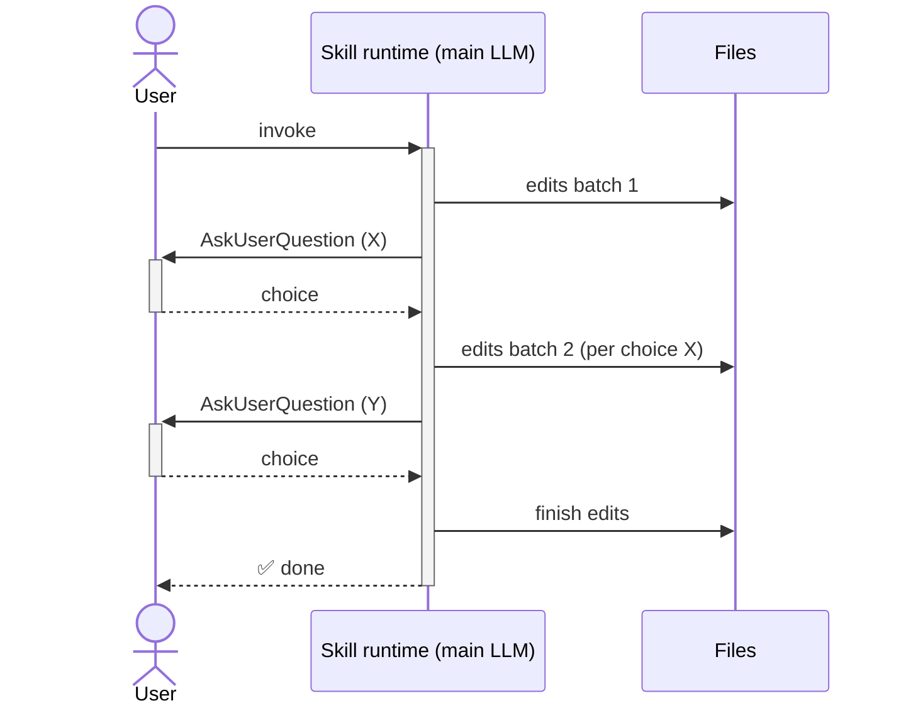
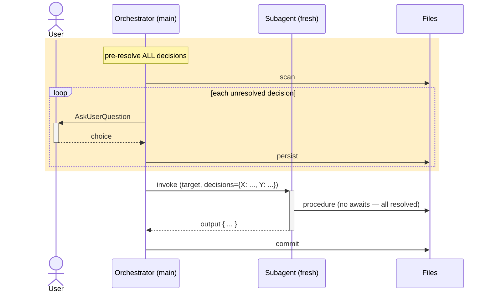

# Decision Points & `await decision` — workflow pattern for LLM-driven skills

A portable specification of a workflow primitive that lets an LLM skill **pause for a choice**, hand control to an orchestrator, and resume from exactly that point once the answer is in hand. Works identically whether the choice is auto-resolved from declared policy, pulled from previously-pinned state, or surfaced to the user via `AskUserQuestion`.

Reference implementation: `skills/axon4to5-migrate/` (Axon Framework 4 → 5 migration), specifically `references/_template.md` (full contract) and `references/aggregate.md` (canonical recipe). This spec generalizes the pattern for other domains.

---

## Problem

LLM skills that perform per-target transformations (code migrations, document conversions, dependency upgrades, …) routinely face choices that:

- Depend on project context (the target's shape, declared style, license model)
- Have no universal answer (different teams want different defaults)
- Sometimes can be auto-resolved from declared policy
- Sometimes must come from a human

The naïve approach is to scatter `AskUserQuestion` (or equivalent) calls through the skill's procedure. This breaks:

| Capability | Why it breaks with inline prompts |
|---|---|
| Subagent fan-out | Subagents can't show prompts to the user — their UI surface is the spawning agent, not the user. |
| CI / batch mode | No user available; the run hangs or fails non-deterministically. |
| Eval / regression testing | Test harness can't auto-answer ad-hoc prompts; assertions become flaky. |
| Reproducibility | Same input → different output depending on user click; can't replay. |
| Workflow visibility | A future maintainer can't tell what questions the skill will ask without reading every branch of the procedure. |

## Solution

A **three-part contract** between the skill and its orchestrator:

1. **Decision points** — declarative section in the skill listing every choice it can pause for, with detection logic, options, and policy.
2. **`await decision <key>`** — primitive the skill emits when it hits a decision point that isn't yet resolved. Suspends the skill's procedure mid-flow; partial work stays preserved.
3. **Resolver mode** — orchestrator-side strategy injected at runtime: `interactive` (ask user) / `automatic` (policy or fail) / `dry-run` (stub, never edit).

The skill author writes `await decision X` and ignores resolution mechanics. The orchestrator picks the strategy from its mode + the decision point's declared auto-policy. Skill authors never call user-facing tools directly.

---

## Core concepts

### Skill response types

Each skill invocation emits exactly one of:

| Response | When | Skill state | Orchestrator action |
|---|---|---|---|
| 🔒 **`await decision <key>`** | Skill hit a declared decision point that isn't yet resolved | alive — will resume from same point after the orchestrator returns the answer; partial edits stay on disk | resolve the decision (auto / pinned / interactive), then resume the skill with the answer in scope |
| **`output { result: ... }`** | Skill finished | terminal | act on `result` per the variant table below |

The skill **NEVER calls `AskUserQuestion` directly**. All user-facing prompting goes through the orchestrator via `await decision`.

### Resolver modes

The orchestrator carries two orthogonal mode axes:

| Axis | Values | Meaning |
|---|---|---|
| **Source mode** | varies per skill (e.g., single / phased / debug) | how units to process are picked |
| **Resolver mode** | `interactive` (default) · `automatic` · `dry-run` | how `await decision` is resolved |

```
resolve_await(await, pinned, resolver_mode):
    # 1. Decision already pinned in durable state?
    if await.key in pinned.decisions:
        return pinned.decisions[await.key]

    # 2. Auto-policy fires for current pinned state?
    answer = evaluate_auto_policy(await, pinned)
    if answer != ASK_USER:
        return answer

    # 3. Fall back per resolver mode
    if resolver_mode == "interactive":
        return AskUserQuestion(await.question, await.options)
    elif resolver_mode == "automatic":
        raise UnresolvableDecision(await.key)       # CI guardrail — no user to ask
    elif resolver_mode == "dry-run":
        return SENTINEL_BLOCKED                      # stub; report but don't edit
```

### Lifecycle



The shaded region is the **universal resolver** — same machinery regardless of skill domain. The skill author writes `await decision <key>` and is oblivious to which path resolution takes.

---

## Decision-point schema

Each decision point is a structured declaration in the skill's documentation. Recommended location: a `## Decision points` section listing every entry the skill can pause for.

```markdown
### <decision-key>

- **Trigger**: detected-at-preflight | triggered-in-procedure | always-asked
- **Detection** *(if detected-at-preflight)*:
    ```
    <how to detect the trigger condition — grep, AST query, runtime check>
    ```
- **Question**: > "<literal text the user sees if AskUserQuestion fires>"
- **Options**:
    - `<option-a>` — <semantic meaning>
    - `<option-b>` *(Recommended for <context>)* — <semantic + reason>
    - `<option-c>` — <semantic>
- **Auto-policy**:
    - `<predicate>: <option-name>`
    - `<predicate>: <option-name>`
    - `fallback: <ask-user | <option-name> | fail>`
- **Effect**:
    - `<option-a>` → <what changes in subsequent procedure>
    - `<option-b>` → <...>
    - `<option-c>` → <...>
```

### Field reference

| Field | Required | Notes |
|---|---|---|
| `decision-key` (the `### <key>` heading) | yes | unique within the skill; matches the key used in `await decision <key>` and `decisions.<key>` |
| `Trigger` | yes | when does this fire? `detected-at-preflight` (grep at start), `triggered-in-procedure` (only when a specific code path is reached), `always-asked` (every invocation) |
| `Detection` | conditional | required for `detected-at-preflight` triggers; the literal command/query the orchestrator runs to detect the trigger |
| `Question` | yes | verbatim text the user sees in interactive mode; orchestrator uses it as-is |
| `Options` | yes | enumerated choices; one MAY be marked `(Recommended for <context>)` |
| `Auto-policy` | yes | predicate-matching list ending with a `fallback:` line |
| `Effect` | yes | what each option does to the rest of the procedure |
| `Reference` | optional | link to a shared blocker registry, RFC, or domain doc explaining the gap |

## Auto-policy DSL

A deterministic, predicate-matching mini-language. Top-down evaluation; first matching predicate wins. The last line MUST be `fallback:`.

### Predicates

| Form | Matches when |
|---|---|
| `pinned.<key> == "<value>"` | `pinned[<key>]` equals the literal value (exact string match) |
| `pinned.<key> in ["<v1>", "<v2>"]` | `pinned[<key>]` is in the listed set |
| `pinned.<key>` | `pinned[<key>]` is set to any non-empty value (presence check) |
| `decisions.<other-key> == "<value>"` | a previously-resolved decision (from earlier in this same run) matches |
| `always` | unconditional — useful for safe defaults |

### Fallback

The last line is one of:
- `fallback: ask-user` — defer to `AskUserQuestion` in interactive mode; **fail the run** in automatic mode.
- `fallback: <option-name>` — unconditional default choice if no predicate fires. Use only for safe defaults that don't surprise the user.
- `fallback: fail` — explicitly refuse to choose; orchestrator emits `result: failed` regardless of resolver mode.

### Why a DSL, not free-form prose

The orchestrator must evaluate the policy **deterministically** every run. A constrained DSL guarantees the same `pinned` state produces the same answer — critical for reproducible CI runs and eval suites. Free-form prose would force the orchestrator-LLM to interpret the policy each time, introducing nondeterminism.

If you find yourself wanting `!=`, regex, arithmetic, or boolean combinators — that's a smell. Either:
- Split into two simpler decisions, or
- Push the conditional into the skill's procedure (where it has full programming power)

---

## Execution contexts

A skill runs in one of two execution contexts. The contract holds in both — only the resolution mechanics differ.

### Main session (default)

The LLM driving the user's session reads the skill docs and follows its procedure. `await decision` is implemented as a native `AskUserQuestion` call (or an internal policy lookup). The LLM's conversation context preserves partial work across the pause.



Partial edits between awaits are **preserved** — same LLM context, same on-disk state.

### Subagent (fan-out)

Orchestrator pre-resolves every decision point's `await` upstream in the main session (interactive if needed; auto-policy if matched), then spawns the subagent with a complete `decisions` map. The subagent receives all resolved decisions in its input and never pauses.



**Eligibility constraint**: a skill is subagent-eligible only if every decision point can resolve via auto-policy (against current pinned state) OR is pre-pinned. Decisions with `fallback: ask-user` and no matching auto-policy MUST be resolved in the main session before fan-out.

---

## Worked example 1 — JUnit 4 → JUnit 5 test migration

A migration skill that ports test classes. One of the choices is how to handle JUnit 4 `@Rule`, which has no direct JUnit 5 equivalent.

```markdown
### junit4-rule

- **Trigger**: detected-at-preflight
- **Detection**:
    ```
    grep -nE '@Rule\b|@ClassRule\b' <test file>
    ```
- **Question**: > "Test class uses JUnit 4 `@Rule` / `@ClassRule`. JUnit 5 has no direct equivalent. How should this rule be handled?"
- **Options**:
    - `migrate-to-extension` — rewrite the rule class as a JUnit 5 `Extension` with the appropriate lifecycle callbacks (`BeforeEach` / `AfterAll` / etc.)
    - `keep-as-junit4-test` — leave this test on JUnit 4; flag in CI excludes so JUnit 5 modules don't try to run it
    - `pause-migration` — stop; user redesigns the rule's responsibility before resuming
- **Auto-policy**:
    - `pinned.strictness == "no-junit4-deps": migrate-to-extension`
    - `decisions.<package>.junit4-tolerance == "allow": keep-as-junit4-test`
    - `fallback: ask-user`
- **Effect**:
    - `migrate-to-extension` → continue Procedure Step 5 (rewrite rule); the orchestrator may detect the extension class needs its own decision point
    - `keep-as-junit4-test` → add `<exclude>` to surefire/failsafe config; do NOT rewrite the test
    - `pause-migration` → `output { result: blocked, reason: "rule redesign needed first" }`
```

Procedure references the decision inline:

```markdown
### Step 4 — Handle @Rule usages

4.1. 🔒 await decision [`junit4-rule`](#junit4-rule)
4.2. Based on `decisions.junit4-rule`:
     - `migrate-to-extension` → see Step 5
     - `keep-as-junit4-test` → see Step 6
     - `pause-migration` → exit (already handled by decision point's Effect)
```

## Worked example 2 — Sphinx → MkDocs docs migration

A docs migration skill that converts `.rst` files to `.md`. One choice: how to handle Sphinx-specific `:ref:` cross-references which don't exist in stock MkDocs.

```markdown
### sphinx-cross-references

- **Trigger**: detected-at-preflight
- **Detection**:
    ```
    grep -nE ':ref:`[^`]+`' <rst file>
    ```
- **Question**: > "Document uses Sphinx `:ref:` cross-references. MkDocs has no direct equivalent. How should they be handled?"
- **Options**:
    - `convert-to-relative-links` — best-effort rewrite to `[label](relative/path.md#anchor)` using the build index; some may produce broken links
    - `convert-with-mkdocs-plugin` — keep as-is and rely on the `mkdocs-section-index` plugin to resolve at build time
    - `flag-as-todo` — leave the `:ref:` text and add a `<!-- TODO: convert :ref: -->` HTML comment; manual cleanup later
- **Auto-policy**:
    - `pinned.mkdocs-plugins.section-index == true: convert-with-mkdocs-plugin`
    - `pinned.allow-todo-comments == true: flag-as-todo`
    - `fallback: convert-to-relative-links`
- **Effect**:
    - `convert-to-relative-links` → Step 3 walks the build index and rewrites each match; emits warnings for unresolvable refs
    - `convert-with-mkdocs-plugin` → Skip Step 3; leave the `:ref:` markup in place
    - `flag-as-todo` → Step 3 wraps each match in an HTML comment + emits a follow-up report
```

This example shows a `fallback:` that's a safe default (`convert-to-relative-links`), not `ask-user`. Most projects can take the default; only edge cases need the question.

## Worked example 3 — npm package v1 → v2 codemod

Each call to the deprecated `oldApi(opts)` in user code can be:
- Replaced with `newApi({...opts, ...defaults})`
- Wrapped with a compat shim that emits a runtime deprecation warning
- Left as-is (user accepts the deprecation warning v2 emits)

```markdown
### deprecated-api-handling

- **Trigger**: triggered-in-procedure (only when a call site is rewritten)
- **Detection** (in Procedure, not Preflight):
    Each AST visit of `oldApi(args)` triggers this decision once per project (not per call site).
- **Question**: > "Project uses `oldApi(opts)`, deprecated in v2. How to handle ALL call sites in this project?"
- **Options**:
    - `replace-with-new-api` — rewrite every call site to `newApi(...)` with adapted arguments
    - `wrap-with-compat-shim` — replace with a project-local `oldApiCompat(opts)` shim that logs a deprecation warning and delegates to `newApi`
    - `leave-as-is` — keep calls; rely on v2's built-in deprecation logging
- **Auto-policy**:
    - `pinned.no-deprecated-apis == true: replace-with-new-api`
    - `pinned.minimum-disruption == true: leave-as-is`
    - `fallback: ask-user`
- **Effect**:
    - `replace-with-new-api` → Step 4 walks all call sites; per call site MAY trigger sub-decisions for unusual arg patterns
    - `wrap-with-compat-shim` → Step 5 generates `oldApiCompat.js` and rewrites imports
    - `leave-as-is` → no rewrites; emit advisory note in output
```

This example shows `triggered-in-procedure` — the decision isn't detected at Preflight (because the AST hasn't been visited yet) but the first time the procedure encounters the pattern.

---

## When to use this pattern

✅ **Strong fit:**

- Skill performs multiple transformations per target
- Choices depend on project state / user preference (no universal default)
- Mix of mechanical work + judgment calls
- Need to support both interactive (user driving) and CI/batch (no user) modes
- Want to fan out work to subagents for parallelism
- Want regression-testable evals (`automatic` mode + pre-pinned decisions = deterministic eval runs)

❌ **Don't use when:**

- Pure mechanical transformation with zero choices — overhead not worth it
- One single up-front question is sufficient — just call `AskUserQuestion` once at INIT, pin the answer, run procedure
- All decisions are global / project-level — pin them once at orchestrator-INIT (not per-target decision points)
- The skill is a one-liner — `await decision` machinery is heavier than the work itself

## Adoption checklist

To introduce this pattern in a new skill:

1. **Identify decision points.** Walk through the skill's procedure. Anywhere there's a branch that depends on user/project context, ask: is this a decision point or a project-global pin (license / mode / target backend)? Project-global pins are pinned ONCE; decision points fire per target.

2. **Write the `## Decision points` section.** One entry per decision per the schema above. Include detection, question, options, auto-policy, effect.

3. **Use `await decision <key>` in the procedure.** Replace any inline `AskUserQuestion` calls. Use the literal marker `🔒 await decision [<key>](#<key>)` so the orchestrator parser can find them.

4. **Define the response schema.** `output { result, ... }` for terminal; `await decision <key>` for interim. Make sure your skill never emits `needs-decision` or similar as a result variant.

5. **Implement `resolve_await` in the orchestrator.** Three branches: pinned lookup, auto-policy evaluation, resolver-mode-dependent fallback. ~30 lines of code.

6. **Persist resolved decisions in durable state.** When the orchestrator resolves a decision (auto or interactive), write it to the project's persistent state file (`progress.md` / `state.json` / equivalent). Re-runs reuse the answer without re-asking.

7. **Document the resolver modes.** Tell users they can run `interactive` (default) / `automatic` (CI / batch) / `dry-run` (preview). Define how the mode is selected (CLI flag, env var, etc.).

8. **Set up evals.** With the pattern in place, you can write tests that pre-pin decisions in inputs and assert the skill produces the expected output for a given (target, decisions) pair. Deterministic.

## Anti-patterns

- **Skill calls `AskUserQuestion` directly inside the procedure.** Breaks subagent fan-out and automatic mode. Always go through `await decision`.
- **Auto-policy uses ambiguous predicates** like "if reasonable". The DSL is intentionally constrained — split into multiple predicates with explicit values.
- **Decision points appear mid-procedure without `## Decision points` declaration.** A future maintainer can't enumerate the questions the skill will ask. Every decision point MUST be declared.
- **Resolution state is held in skill memory, not persisted.** A re-run starts fresh and re-asks. Always persist resolved decisions to durable state.
- **The skill returns multiple decisions in one response.** One `await decision` per response. Even if Preflight finds three blockers, the skill emits one `await`, gets the answer, re-enters Preflight to find the next blocker, emits the second `await`, etc. Predictable resolution order.
- **`fallback: fail` without auto-policy predicates above it.** If you don't want this decision to be auto-resolvable in any case, that's fine — but the field is still required; use `fallback: ask-user` (interactive only) or `fallback: fail` (no answer ever — for genuinely unresolvable cases).

## Glossary

| Term | Meaning |
|---|---|
| **Skill** | A self-contained workflow (docs + procedure) the orchestrator invokes to transform a target |
| **Recipe** | A skill specialized to one transformation kind (e.g., "migrate an aggregate" in axon4to5-migrate); a skill may host many recipes |
| **Target** | The unit being transformed (a file, class, document, package, …) |
| **Decision point** | A declared choice the skill may pause for; identified by a stable key |
| **`await decision <key>`** | Primitive the skill emits to suspend procedure; orchestrator resolves and resumes |
| **Auto-policy** | DSL declaring how a decision point can be resolved without asking a user |
| **Resolver mode** | Orchestrator-side strategy for resolving `await decision`: `interactive` / `automatic` / `dry-run` |
| **Pinned state** | Durable project-level decisions that override per-target decisions (`license`, `wiring`, `style`, …) |
| **`output`** | Terminal response — skill is done; orchestrator commits / acts per `result` |

---

## Reference implementation

`skills/axon4to5-migrate/` in this repository is the canonical implementation:

- `references/_template.md` — full skill-side contract with sequence diagrams
- `references/aggregate.md` — a ported recipe with 5 decision points (snapshotting, deadline-handler, map-typed-aggregate-member, saga-test-fixture, skip-or-deep-verify)
- `references/blockers.md` — shared blocker registry; multiple recipes link to the same blocker entries
- `SKILL.md` — orchestrator contract with `resolve_await` pseudocode and the mermaid flow diagram showing `await decision` → `Resolve` → loop back to recipe
- `evals/run.py` + `evals/evals.json` — eval harness that exercises recipes with pre-pinned decisions (proves the `automatic` mode is real, not aspirational)

To introduce this pattern in a different skill, copy the `_template.md` shape, replace the Axon-specific bits with your domain, and implement `resolve_await` in your skill's orchestrator. The DSL, the response types, and the resolver-mode axis are domain-agnostic — they port unchanged.
