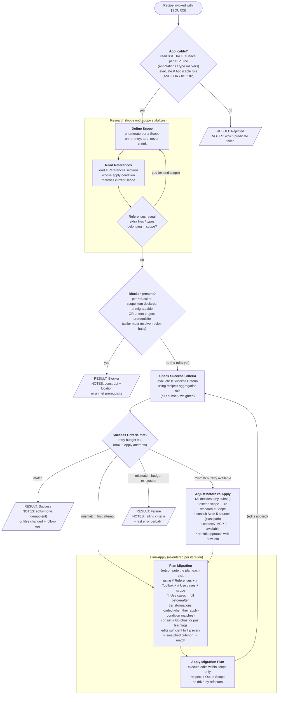

# Recipe sub-flow

The orchestrator-owned spec for executing any recipe in `references/recipes/`. Recipes never re-implement this — they fill in the named sections referenced from the diagram nodes (see `references/recipes/_template/RECIPE.md` for the authoring guide).

Retry budget = **1** additional Apply (≤ 2 Applies total). Each diagram node names the recipe section it consults using markdown header refs (`# Applicable`, `# Scope`, etc. — these map to top-level headings in the recipe file).



## Result

Each recipe **MUST** emit **exactly one** result block, formatted as markdown, before returning control to the orchestrator. The orchestrator reads the bolded **Result** line to control the flow. **Omitting the Result block is an error** — without it, the orchestrator cannot route the outcome.

### Schema

```markdown
**Result:** ✅ Success | 🚧 Blocker | ⏭️ Rejected | ❌ Failure
**Source:** `<fqn or file path>`
**Recipe:** axon4to5-<component>

**Notes:** <short summary — why this result, what to look at next. Do NOT enumerate changed files; git diff covers that.>

**Learnings:** (always present — one dated entry per fired trigger, OR `none — <one-clause why>`)
## YYYY-MM-DD — <one-line headline>
**Trigger:** <tag from § Learning Triggers, or other:<short-tag>>
**Where:** `<fqn>` | `<file:line>` | `<module>` | project-wide
**Surprise:** <what was unexpected>
**Resolution:** <what was done>

**Options:** (required when Result = Blocker; otherwise omit)
- [ ] **<id>** — <short description>
- [ ] **<id>** — <short description>
```

**`Learnings` is always present — silence is never allowed.** Write one complete dated entry for every `§ Learning Triggers` tag that fired this run (see `DEFAULT.md § Learning Triggers` — the canonical list and the governing rule: *capture any surprise that helps the next recipe run more smoothly*). The executor authors the prose — it witnessed the surprise; the orchestrator stamps the date and, on commit, the sha. On a genuinely clean run write `**Learnings:** none — <one-clause why>` — an explicit, auditable assertion that zero triggers fired, which the orchestrator may challenge. Each entry's `**Trigger:**` field carries its tag, so no separate tag-list is needed.

**Options is required on Blocker outcomes.** The recipe must enumerate every continuation path it considers viable from the current partial state. Three options are **always** available (defined in `references/recipes/DEFAULT.md`):

- [ ] **skip** — keep `$SOURCE` in its current partial state; queue moves on.
- [ ] **revert** — undo any edits this recipe applied to `$SOURCE`; return to pre-recipe state; queue moves on.
- [ ] **solve-manually** — pause this item; caller fixes the blocker by hand outside the skill, then re-invokes to continue.

Recipes MAY add more options when there is a genuine recipe-specific path; they MUST NOT override or remove the baseline three. The orchestrator's `BLOCKER_RESOLUTION.md` node surfaces this list to the caller.

**Notes baseline** per-outcome guidance lives in `references/recipes/DEFAULT.md` (§ Result Notes / Learnings baselines) and always applies. Recipes may augment via their own `# Result` subsections when they have recipe-specific facts to record; they cannot override the baseline.

### Example — ✅ Success (clean run — explicit `none`)

> **Result:** ✅ Success
> **Source:** `com.dddheroes.heroesofddd.creaturerecruitment.write.calendar.Calendar`
> **Recipe:** axon4to5-aggregate
>
> **Notes:** All Success Criteria match on first Apply. OpenRewrite Phase 1 had already produced the correct AF5 shape; this recipe only verified.
>
> **Learnings:** none — first-Apply idempotent green run, nothing surprised the recipe.

### Example — ✅ Success (with Learnings — surprises encountered)

> **Result:** ✅ Success
> **Source:** `com.dddheroes.heroesofddd.creaturerecruitment.write.army.Army`
> **Recipe:** axon4to5-aggregate
>
> **Notes:** All Success Criteria match. Isolated test green; one test expectation updated for the AF5 entity-creator semantics.
>
> **Learnings:**
> ## 2026-06-01 — AF5 no-arg `@EntityCreator` materialises an empty entity instead of throwing
> **Trigger:** api-shape
> **Where:** `creaturerecruitment.write.army.ArmyTest:expectException`
> **Surprise:** AF4 threw `AggregateNotFoundException` for a missing aggregate; AF5 with a no-arg `@EntityCreator` materialises an empty entity and runs the instance handler, so the domain rule (`Can remove only present creatures`) fires instead.
> **Resolution:** Rewrote the test expectation to assert the domain-rule failure; documented the gotcha in `creation-policy-decision.md`. Criterion then passed.
> ## 2026-06-01 — Stranded comment after `CREATE_IF_MISSING` removal
> **Trigger:** other:stranded-comment
> **Where:** `creaturerecruitment.write.army.Army:1`
> **Surprise:** `// performance downside in comparison to constructor` referred to `CREATE_IF_MISSING`'s per-command cost, which no longer exists.
> **Resolution:** Left in place — still loosely accurate (instance handler re-loads the aggregate) — but the original referent is gone; next reader should not trust it.

### Example — 🚧 Blocker

> **Result:** 🚧 Blocker
> **Source:** `com.dddheroes.heroesofddd.creaturerecruitment.write.dwelling.Dwelling`
> **Recipe:** axon4to5-aggregate
>
> **Notes:** Caller must decide before re-running. OpenRewrite Phase 1 already dropped the snapshotting attribute and left a `// TODO #LLM: reconfigure snapshot trigger`. AF5's `@EventSourced` does not yet expose a snapshotting API.
>
> **Learnings:**
> ## 2026-06-01 — AF4 `@Aggregate(snapshotTriggerDefinition)` has no AF5 equivalent yet
> **Trigger:** blocker
> **Where:** `creaturerecruitment.write.dwelling.Dwelling`
> **Surprise:** AF5 `@EventSourced` exposes no snapshotting API — per `not-supported.md` B1 this needs an explicit caller decision; the recipe cannot pick one.
> **Resolution:** Halted with Options (below). Existing snapshot rows are NOT touched — data migration is the caller's. Side note for stabilization: the `public DwellingId dwellingId;` fields (`// needs to be public for snapshotting`) can be tightened to `private` once snapshotting is dropped — not by this recipe.
>
> **Options:**
> - [ ] **skip** — leave `Dwelling` in its current partial state (annotation already dropped, TODO comment present); queue moves on.
> - [ ] **revert** — restore `@Aggregate(snapshotTriggerDefinition = "dwellingSnapshotTrigger")`, undo OpenRewrite's snapshotting changes, return to pre-recipe state.
> - [ ] **solve-manually** — pause this item; caller hand-resolves snapshotting (e.g. by removing the snapshot trigger bean themselves) and re-invokes.

### Example — ⏭️ Rejected

> **Result:** ⏭️ Rejected
> **Source:** `com.dddheroes.heroesofddd.creaturerecruitment.read.DwellingReadModelProjector`
> **Recipe:** axon4to5-aggregate
>
> **Notes:** Not an aggregate — this is a read-side projector (`@ProcessingGroup`, not `@Aggregate`); Applicable predicate failed on the first surface check. Recipe did not apply any edits. Route to the event-processor recipe instead.
>
> **Learnings:**
> ## 2026-06-01 — Projector migration is mostly OpenRewrite + one manual sequencing-policy move
> **Trigger:** other:projector-migration-path
> **Where:** `creaturerecruitment.read.DwellingReadModelProjector`
> **Surprise:** For projectors in this codebase the migration is almost entirely OpenRewrite output (`@ProcessingGroup` → `@Namespace`; `@EventHandler` / `@ResetHandler` / `@MetadataValue` imports). The one manual step is moving the AF4 `axon.eventhandling.processors.<group>.sequencing-policy` YAML key onto the class.
> **Resolution:** Annotate with `@SequencingPolicy(type = MetadataSequencingPolicy.class, parameters = GameMetaData.GAME_ID_KEY)` in the event-processor recipe. Do NOT delete the shared `gameIdSequencingPolicy` bean — 4 other processor groups reference it in YAML; the write-configuration recipe cleans it up once all groups are annotated.

### Example — ❌ Failure

> **Result:** ❌ Failure
> **Source:** `com.dddheroes.heroesofddd.creaturerecruitment.process.WhenCreatureRecruitedThenAddToArmyProcessor`
> **Recipe:** axon4to5-aggregate
>
> **Notes:** Retry budget exhausted (2 Applies). Compilation OK on both attempts. Failing Success Criterion: isolated test — last error verbatim: `Wanted but not invoked: commandGateway.send(IncreaseAvailableCreatures.command(...), ...); Actually, there were zero interactions with this mock.`
>
> **Learnings:**
> ## 2026-06-01 — AF5 `CommandGateway.send` surfaces failures on the future, not in try/catch
> **Trigger:** api-shape
> **Where:** `creaturerecruitment.process.WhenCreatureRecruitedThenAddToArmyProcessor`
> **Surprise:** `send(...)` returns a `CommandResult` whose `getResultMessage()` is a `CompletableFuture<? extends Message>`. The AF4 try/catch around `send(...).getResultMessage()` never catches — a real behavioural regression: AF4 automations that compensated via try/catch silently stop compensating under AF5.
> **Resolution:** Not fixed (outside this recipe's scope; wrong recipe — this is a processor, route to event-processor). Suspected shape: `.exceptionallyCompose(error -> commandDispatcher.send(...).getResultMessage())`, likely needing a `.thenApply(m -> m)` bridge to widen `CompletableFuture<? extends Message>` to `CompletableFuture<Message>`.
> ## 2026-06-01 — AF5 `Message` is NOT generic
> **Trigger:** investigation
> **Where:** `axon-messaging-5.1.1-SNAPSHOT.jar` (`org.axonframework.messaging.core.Message`)
> **Surprise:** Declared `public interface Message` — non-generic. Verified via `javap`. Any recipe pseudocode using `CompletableFuture<? extends Message<?>>` will not compile.
> **Resolution:** Correct shape is `CompletableFuture<? extends Message>`. Flag recipe docs that still show the generic form.

## MUST / MUST NOT

MUST:
- Emit exactly one Result block (schema per § Result) before returning. No exceptions.
- Emit a `**Learnings:**` field on every Result: one complete dated entry per fired `DEFAULT.md § Learning Triggers` tag, or `none — <one-clause why>` on a clean run. Never leave it silently empty.
- Author the Learnings prose yourself — you witnessed the run. When dispatched as a subagent, return the entries in the Result block; do NOT write `learnings.md` (the orchestrator persists it).
- Emit ✅ Success (not ⏭️ Rejected) when `$SOURCE` is already migrated and Success Criteria pass without edits — that is an idempotent Success, not a Rejected outcome. ⏭️ Rejected is reserved for when the `# Applicable` predicate fails (wrong recipe for this source type).
- Emit `**Options:**` when Result = 🚧 Blocker.

MUST NOT:
- Return to the orchestrator without emitting a Result block.
- Emit more than one Result block per recipe execution.

## Invariants

- **Applicable check sits outside Research** — cheap surface check on `$SOURCE` alone; don't pay the Research cost for the wrong recipe.
- **Scope before References** (inside Research) — `scope` drives *which* `references` sections are read.
- **Research is a fixed-point loop** — exits only when SQ says "no new in-scope items"; `scope` can only grow.
- **Single Check Success Criteria** — same evaluation logic pre- and post-Apply; the diamond branches on whether retry budget remains.
- **Blocker fires only from `Blocker in scope?`** — emitted after Research stabilizes. Check / Plan / Apply never short-circuit to Blocker; partial work either passes the Check or counts as Failure.
- **Apply loop is `Check → Plan → Apply → Check`** — only Apply consumes the retry budget. Adjust activities (re-research, source consultation) are *free*.
- **Adjust is open-ended** — on retry the AI picks any subset of: extend scope, consult Axon 5 sources / context7, rethink the approach. Plan Migration is rebuilt each iteration using whatever new info Adjust gathered.
- **Recipe owns content; orchestrator owns control flow.** A recipe never decides "retry" or "skip a step" — it only fills the named sections referenced from the diagram nodes.
- **Result block is non-negotiable** — every flowchart path (SC, RJ, BL, FL) exits through a Result block. The recipe has no valid return path without one.
