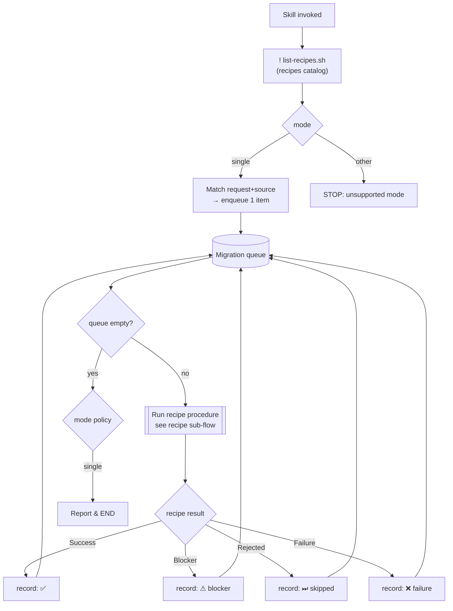
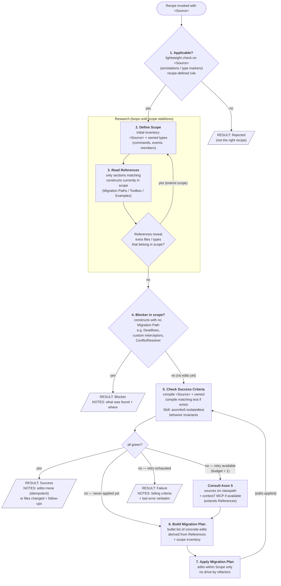

# axon4to5-migrate

## Available recipes (auto-listed)

!`./scripts/list-recipes.sh`

## Inputs

- `mode` (required): currently only `single`.
- `source` (optional, mode=single): user-supplied hint identifying the thing to migrate (class name, file path, FQN).

## Modes

### `single`

Migrate ONE element (one aggregate, one handler, etc.) using exactly one recipe from the list above.

Steps:

1. Parse `mode` from `$ARGUMENTS`. If `mode != single` → STOP and report unsupported mode.
2. Match user's request + `source` to ONE recipe in the auto-listed set (by `name` + `description`). If ambiguous → ask
   user via `AskUserQuestion` to pick. If no match → STOP and report.
3. `Read` the chosen recipe file (`references/recipes/<name>.md`) and follow it exactly for the single source.
4. Verify behavior is preserved (no DCB, keep `AggregateBasedEventStorageEngine`, etc.).
5. Report: recipe used, files changed, follow-ups.

MUST NOT:

- Run multiple recipes in one invocation.
- Migrate more than the single source named by the user.
- Introduce DCB or swap event storage engine.

## Flow

Every mode ends up producing a **queue** of `(recipe, source)` items. A single processing loop drains it. What happens on empty queue depends on the mode.

> The `[[Run recipe procedure]]` node is a **nested sub-flow** defined inside each recipe's `Procedure` section. The orchestrator only reacts to its **result** (one of: `Success`, `Blocker`, `Rejected`, `Failure`) — it does not look inside.

### Result handling

| Result     | Orchestrator action                                            | `single` mode end-state |
|------------|----------------------------------------------------------------|-------------------------|
| `Success`  | Mark item done, continue draining queue                        | Report ✅                |
| `Blocker`  | Record unclear migration path (e.g. Deadlines), continue queue | Report ⚠ with reason    |
| `Rejected` | Recipe not applicable to this source, continue queue           | Report ⏭ with reason    |
| `Failure`  | Recipe applied but criteria still fail, continue queue         | Report ❌ with reason    |

Rule of thumb:

- `single` → enqueue exactly 1, process, END (report whichever result came back).

## Recipe contract

Every file in `references/recipes/` MUST follow `references/recipes/_template.md`. The template defines **what each phase means** (Detect / Early-exit / Plan / Apply / Verify); the orchestrator owns **how phases sequence and when results are emitted** — shown below.

### Recipe sub-flow (orchestrator-owned)

Step numbers below match the recipe's documented contract (and the template's `## Phase implementations` headings). Retry budget = **1**.

Step numbers below match the recipe's documented contract (and the template's `## Phase implementations` headings). Retry budget = **1**.

Step numbers below match the recipe's documented contract (and the template's `## Phase implementations` headings). Retry budget = **1**.

Notes:

- **Step 1 sits outside Research** — a cheap surface check on `<Source>` alone (annotations/type markers) to confirm the recipe is the right tool *before* paying the cost of cataloging scope and loading References.
- **Scope before References (inside Research)** — scope inventory drives *which* References sections are worth reading (avoids loading the whole playbook for every recipe run).
- **Research is a loop** — if References for a construct reveal that other files / types belong in scope (e.g. a snapshot trigger, a related event class), scope is extended and References re-consulted. Loop exits when scope stabilizes.
- **Step 5 is the single Success Criteria check** — visited at least once (pre-edit), and again after every Apply. The edge labels `(no edits yet)` and `(edits applied)` make the visit context explicit; the check logic is identical. Idempotent re-runs and post-migration verification share the same node.
- **Blocker fires only from step 4** — emitted after Research stabilizes; checks for constructs with no entry in the loaded Migration Paths. Steps 5–7 never short-circuit to Blocker; partial work either passes verification or counts as Failure.
- **Apply loop is `5 → 6 → 7 → 5`** — retry budget = 1 attempt; on the second red verdict after Apply, `CTX` is used to *extend* References before the next plan rebuild, not to re-apply verbatim.
- The recipe file fills in *what to do* inside each numbered step (`Applicable`, `Success Criteria`, `References`, `Migration Plan` builder). Sequencing and retry budget above are fixed by this skill.
