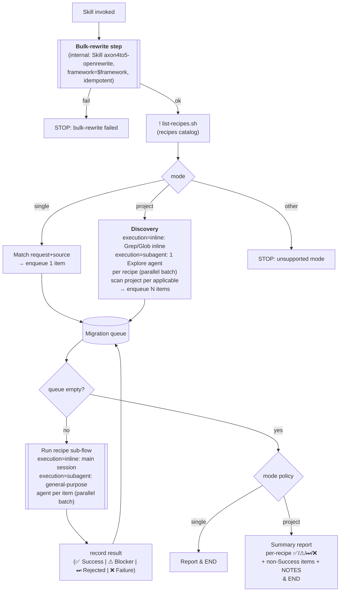
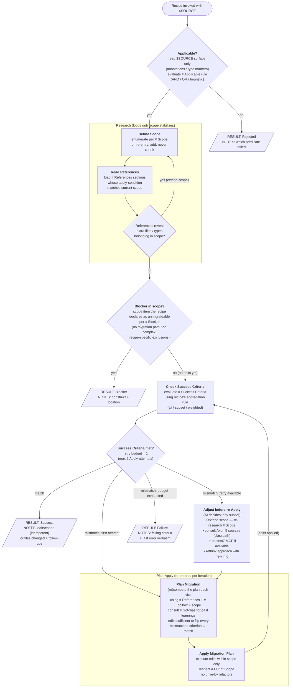

# axon4to5-migrate

## Available recipes (auto-listed)

!`./scripts/list-recipes.sh`

## Inputs

- `framework` (**required**): which Axon flavor to migrate. Currently supported values: `axon`, `axoniq`. Any other value → STOP.
- `configuration` (**required**): how the application wires Axon. Currently supported values: `native`, `spring`. Any other value → STOP.
- `mode` (required): what gets migrated in one invocation.
  - `single` — one element (a class, e.g. an Aggregate). Requires `source`.
  - `project` — the whole application (default: current working directory). `source` ignored.
- `execution` (optional, default `inline`): how the orchestrator runs its steps. Only meaningful for `mode=project` — for `mode=single` it has no observable effect.
  - `inline` — main session does discovery + recipe runs sequentially. No `Agent` tool use.
  - `subagent` — orchestrator MAY dispatch via the `Agent` tool: discovery → `Explore` subagent, recipe sub-flow per item → `general-purpose` subagent (parallel batches). Useful for `project` mode on large codebases.
- `source` (required for `mode=single`): hint identifying the thing to migrate (class name, file path, FQN).

## Pre-steps (common to every mode)

These run **before** any mode-specific logic — independent of whether `mode=single`, `project`, or anything added later.

1. Parse `framework`, `configuration`, `mode`, `execution` from `$ARGUMENTS`.
   - If `framework` is missing or ∉ {`axon`, `axoniq`} → STOP and report unsupported framework.
   - If `configuration` is missing or ∉ {`native`, `spring`} → STOP and report unsupported configuration.
   - If `mode` is missing or ∉ {`single`, `project`} → STOP and report unsupported mode.
   - `execution` defaults to `inline` if missing. If present and ∉ {`inline`, `subagent`} → STOP and report unsupported execution.
2. **Run the bulk-rewrite step** — internally invoke `axon4to5-openrewrite` via the `Skill` tool, passing `framework=$framework`. This is a step of this orchestrator, not a separate command. Idempotent — safe even on a partially-migrated tree. If it fails → STOP and report the failure (no gap-filling on a broken bulk pass).

Only after pre-steps complete does the mode-specific producer below run.

## Modes

### `single`

Migrate ONE element (one aggregate, one event processor, etc.) using exactly one recipe from the list above.

Steps (after the common pre-steps):

1. Match user's request + `source` to ONE recipe in the auto-listed set. Primary signal: the catalog's `applicable` block (surface predicates against `$SOURCE` — annotations / type markers). Fallback signal: `name` + `description`. If ambiguous → ask user via `AskUserQuestion` to pick. If no `applicable` block matches and description is also unclear → STOP and report.
2. `Read` the chosen recipe file (`references/recipes/<name>/RECIPE.md`) and execute it per the **Recipe sub-flow** below. Recipe-local auxiliary files (examples, fixtures, supporting docs) live alongside it under `references/recipes/<name>/`.
3. Verify behavior is preserved (no DCB, keep `AggregateBasedEventStorageEngine`, etc.).
4. Report: recipe used, files changed (since OpenRewrite step), follow-ups.

MUST NOT:

- Run without all required parameters resolved to a supported value.
- Run multiple recipes in one invocation.
- Migrate more than the single source named by the user.
- Migrate anything outside the supported `(framework, configuration)` matrix — the rest of the codebase stays untouched.
- Introduce DCB or swap event storage engine.

### `project`

Migrate **everything in the working directory** that any recipe in the catalog declares applicable. `source` is ignored.

Steps (after the common pre-steps):

1. **Discovery** — for each recipe in the auto-listed catalog, evaluate its `applicable` predicates across the codebase to produce candidate sources.
   - `execution=inline` → orchestrator scans inline using `Grep` / `Glob` / `Read`.
   - `execution=subagent` → dispatch one `Explore` subagent **per recipe** (parallel batch via a single `Agent` tool message with multiple calls). Each agent receives the recipe's `applicable` block + `name` and returns a list of FQNs / file paths. Read-only — no edits.
2. **Enqueue** every `(recipe, source)` candidate. Deduplication is recipe's concern (handled inside its Recipe sub-flow); orchestrator does not collapse items across recipes.
3. **Drain the queue** — for each item run the Recipe sub-flow:
   - `execution=inline` → run in main session, sequentially.
   - `execution=subagent` → dispatch each item to a `general-purpose` subagent. Batch independent items in a single `Agent` tool message so they run in parallel. Subagent receives `(recipe path, source, framework, configuration)` and the full Recipe sub-flow spec; returns one result block (`RESULT:` line + NOTES). Orchestrator parses and records.
4. **Summary report** — per-recipe tally of ✅ / ⚠ / ⏭ / ❌ + a list of all non-Success items with their NOTES.

MUST NOT:

- Spawn a subagent under `execution=inline`.
- Pass anything beyond `(recipe path, source, framework, configuration)` to a recipe subagent — context bloat defeats the parallelism win.
- Cross repository boundaries during discovery.
- Halt the queue on a single Failure — record and drain the rest.
- Introduce DCB or swap event storage engine.

## Queue flow

`$SOURCE` is referenced throughout the recipe sub-flow as the argument passed to the skill from `source`.
Every mode produces a **queue** of `(recipe, source)` items. A single processing loop drains it. What happens on empty queue depends on the mode.



> The `[[Run recipe sub-flow]]` node is the **nested** sub-flow defined below. The queue only reacts to the recipe's emitted result.

### Queue-level result handling

| Result     | Queue action                | `single` mode end-state | `project` mode end-state             |
|------------|-----------------------------|-------------------------|--------------------------------------|
| `Success`  | mark item done, drain next  | Report ✅                | tallied under ✅ in summary           |
| `Blocker`  | record + drain next         | Report ⚠ with reason    | listed under ⚠ in summary + NOTES    |
| `Rejected` | record + drain next         | Report ⏭ with reason    | listed under ⏭ in summary + NOTES    |
| `Failure`  | record + drain next         | Report ❌ with reason    | listed under ❌ in summary + NOTES    |

Rule of thumb:

- `single` → enqueue exactly 1, process, END (report whichever result came back).
- `project` → Discovery enqueues N (one per matching `(recipe, source)`), drain (sequential if `execution=inline`, parallel batches if `execution=subagent`), END with summary report. Single-item failures never halt the queue.

## Recipe sub-flow

The orchestrator-owned spec for executing any recipe in `references/recipes/`. Recipes never re-implement this — they fill in the named sections referenced from the diagram nodes (see `references/recipes/_template/RECIPE.md` for the authoring guide).

Retry budget = **1** additional Apply (≤ 2 Applies total). Each diagram node names the recipe section it consults using markdown header refs (`# Applicable`, `# Scope`, etc. — these map to top-level headings in the recipe file).



### Result emission

Each recipe completes by emitting **exactly one** result block. The orchestrator parses the `RESULT:` line; the rest is human-readable context.

```
RESULT: <Success|Blocker|Rejected|Failure>
SOURCE: $SOURCE
RECIPE: axon4to5-<component>
FILES_CHANGED: [<path>, ...]
NOTES: <one short paragraph — why this result, what to look at next>
```

### Invariants

- **Applicable check sits outside Research** — cheap surface check on `$SOURCE` alone; don't pay the Research cost for the wrong recipe.
- **Scope before References** (inside Research) — `scope` drives *which* `references` sections are read.
- **Research is a fixed-point loop** — exits only when SQ says "no new in-scope items"; `scope` can only grow.
- **Single Check Success Criteria** — same evaluation logic pre- and post-Apply; the diamond branches on whether retry budget remains.
- **Blocker fires only from `Blocker in scope?`** — emitted after Research stabilizes. Check / Plan / Apply never short-circuit to Blocker; partial work either passes the Check or counts as Failure.
- **Apply loop is `Check → Plan → Apply → Check`** — only Apply consumes the retry budget. Adjust activities (re-research, source consultation) are *free*.
- **Adjust is open-ended** — on retry the AI picks any subset of: extend scope, consult Axon 5 sources / context7, rethink the approach. Plan Migration is rebuilt each iteration using whatever new info Adjust gathered.
- **Recipe owns content; orchestrator owns control flow.** A recipe never decides "retry" or "skip a step" — it only fills the named sections referenced from the diagram nodes.


## References/Docs: Migration paths catalog

Shared cross-recipe knowledge base at `references/docs/paths/`. Recipes pick relevant entries in their `### Migration Paths` subsection, each with an **apply-condition** (a fact about current scope that triggers loading the file). The orchestrator never reads these directly — only recipes do, gated by their declared apply-condition.

Catalog (one file per topic; `.adoc`):

| Path                                                | Topic                                                                                |
|-----------------------------------------------------|--------------------------------------------------------------------------------------|
| `aggregates/index.adoc`                             | Aggregate migration entry point                                                      |
| `aggregates/configuration-migration.adoc`           | Aggregate Spring/Configurer wiring                                                   |
| `aggregates/multi-entity-migration.adoc`            | Aggregates with child entities (`@AggregateMember`)                                  |
| `aggregates/polymorphism-migration.adoc`            | Polymorphic aggregates                                                               |
| `configuration.adoc`                                | Global Axon configuration / Configurer                                               |
| `messages.adoc`                                     | Command / Event / Query message changes                                              |
| `event-store.adoc`                                  | Event Store engine + APIs                                                            |
| `snapshotting.adoc`                                 | Snapshot trigger + storage                                                           |
| `serializers.adoc`                                  | Serializer registration + payload formats                                            |
| `interceptors.adoc`                                 | Command / Event / Query handler interceptors                                         |
| `projectors-event-processors.adoc`                  | Projection / Event Processor wiring                                                  |
| `sequencing-policies.adoc`                          | Event sequencing policies                                                            |
| `dlq.adoc`                                          | Dead-Letter Queue                                                                    |
| `test-fixtures.adoc`                                | Test fixtures migration                                                              |
