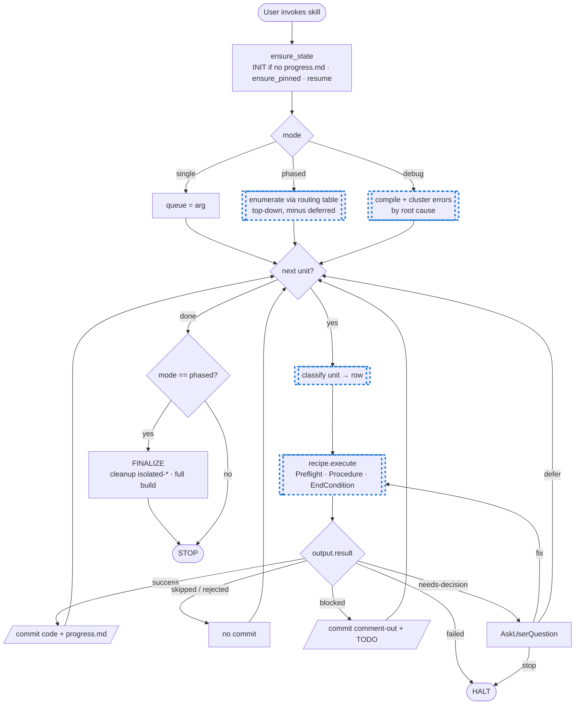

# AF4 → AF5 migration

Classify each candidate file → run its recipe → commit per item. State lives in `<target>/.axon4to5-migration/progress.md`. Self-contained: every example referenced is bundled under `evals/fixtures/`.

**Out of scope.** SQL, DDL, data migration, event-store row copies, snapshot rewrites. **Code only.** Every `move-to-*` blocker option is a code-rewrite choice; the user owns any data move out-of-band.

## Modes

| `$ARGUMENTS` | Mode | Flow |
|---|---|---|
| empty / `phased` | **PHASED** | Walk routing table top-down; resumable from `progress.md`. |
| `debug` | **DEBUG** | Run compile, cluster errors by root cause, route highest-leverage cluster, repeat. |
| `<file path or FQ class>` | **SINGLE** | Classify, run one recipe, commit, stop. |

Bad path → surface error, do NOT fall back to phased. Ambiguous → `AskUserQuestion`.

## Routing — recipes

Recipes are independent. Ordering matters only for two endpoints:
- **`openrewrite` runs first** (bulk transform; other recipes depend on its rewrites).
- **`event-storage-engine` runs last** (depends on every iterative recipe having already migrated handlers and gateways).

Everything else can run in any order — the table lists the default sequence used by PHASED mode.

| Order | Recipe | Discovery (grep) | Exclude-when (grep) | Notes |
|---|---|---|---|---|
| 1st | [openrewrite](references/openrewrite.md) | n/a — project on `org.axonframework.*`, not yet AF5 BOM | — | one-shot |
| 2 | [aggregate](references/aggregate.md) | `@Aggregate\b\|@AggregateRoot\b` | — | iterative |
| 3 | [event-processor](references/event-processor.md) | `@ProcessingGroup\|org\.axonframework\.eventhandling\.EventHandler` | — | iterative |
| 4 | [command-gateway](references/command-gateway.md) | `org\.axonframework\.commandhandling\.gateway\.CommandGateway` | `@EventHandler\|@CommandHandler\|@QueryHandler\|@MessageHandlerInterceptor` | iterative |
| 5 | [query-gateway](references/query-gateway.md) | `org\.axonframework\.queryhandling\.QueryGateway` | `@EventHandler\|@CommandHandler\|@QueryHandler` | iterative |
| 6 | [query-handler](references/query-handler.md) | `org\.axonframework\.queryhandling\.QueryHandler` | — | iterative |
| 7 | [interceptors](references/interceptors.md) | `implements\s+MessageDispatchInterceptor\b\|implements\s+MessageHandlerInterceptor\b` | `@CommandHandler\|@EventHandler\|@QueryHandler` | iterative |
| 8 | [config-reads](references/config-reads.md) | field type `org\.axonframework\.config\.(Configuration\|EventProcessingConfiguration)` AND a `commandBus()` / `queryBus()` / `eventProcessor` lookup in the body | — | iterative — handles read-side variants of `command-gateway` / `query-gateway` / `event-processor` |
| last | [event-storage-engine](references/event-storage-engine.md) | n/a — declares `EventStorageEngine` / `EmbeddedEventStore` / `AxonServerEventStore` bean | — | one-shot; bundles bootstrap-layer config sweep |

**Non-recipe rows** (referenced by `saga` blocker + DEBUG mode):

| Recipe | Discovery | Notes |
|---|---|---|
| [saga](references/saga.md) | `@Saga\b\|@SagaEventHandler\|@StartSaga\|@EndSaga\|SagaConfigurer` | not-supported — per-saga decision, never auto-rewrite |
| [debug](references/debug.md) | build errors | mode, not a phase. Drives cluster-and-route after a red compile. |

### Single-file classification

User passes a file path or FQ class. Read the file once; for each iterative/one-shot row in the table (top-down), if `Discovery` matches AND `Exclude-when` does not → that row wins. Multiple matches → first wins. User overrides via `AskUserQuestion`.

`config-reads` is checked LAST among the iterative rows because most gateway-injecting / handler classes also have an AF4 `Configuration` import lying around; `config-reads` only wins when the file is genuinely a configuration-reader.

## Recipe Output — six results, one schema

Every recipe emits one fenced ```yaml block:

```yaml
result: success | skipped | rejected | needs-decision | blocked | failed
target: <FQ class | file path | "n/a">
reason: <one short line>                # required for everything except success
decisions: { <recipe-specific keys> }
route_to: <recipe>                      # OPTIONAL, only on rejected
notes: <optional>
```

The orchestrator derives the rest from `result:`:

| `result:` | Orchestrator action |
|---|---|
| `success` | commit code + `progress.md`; next item. |
| `skipped` | no commit; next item. |
| `rejected` | no commit; if `route_to:` set, re-route; else next. |
| `needs-decision` | `AskUserQuestion` with `notes` options. fix → re-run recipe; defer → commit `progress.md` only; stop → HALT. |
| `blocked` | comment-out AF4 surface + `TODO[AF5 migration: <blocker-key>]`. Commit code + `progress.md` if any edits; else commit `progress.md` only. Record blocker key in Pinned-decisions; next. |
| `failed` | no commit; surface `reason` + `notes`; `AskUserQuestion`: hand off to `debug` / pause / stop. |

Blocker keys (`B1`..`B10`) live in [references/blockers.md](references/blockers.md). Recipes invoke the matching AskUserQuestion from there; one place for "AF5 gaps".

## Orchestrator flow

**Two loops, one switch.** The outer loop drains a unit queue; the inner loop retries on user-deferred decisions. Everything else is a flat 6-way switch on `output.result`. **Double-bordered nodes `[[…]]` (also dashed-blue) are subagent-eligible** — read-only or pure-analysis steps with no `AskUserQuestion`, no git, no shared state mutation.



### Subagent boundaries (dashed nodes)

| Step | Why subagent-safe |
|---|---|
| `enumerate (phased)` | discovery greps walk the project read-only; results are file lists |
| `enumerate (debug)` | parses compile output read-only; returns clustered (row, item) pairs |
| `classify (unit)` | inspects a single file; emits a recipe selection — no edits |
| `recipe.execute` | recipe's Preflight + Procedure run as analysis + edit proposal — **only when the recipe declares `## Subagent guidelines` AND its Procedure does NOT use `AskUserQuestion`** (those prompts must reach the main conversation) |

Everything else is **orchestrator-owned**: `ensure_state` / `INIT` issue `AskUserQuestion` for pinned decisions; `Commit` / `CommitBlocked` own git; `Ask` is interactive; `Finalize` decides on red builds.

### Procedural sketch (for code-style readers)

```
queue = enumerate(mode)              # single → [arg]; phased → routing-table walk;
                                     # debug → cluster build errors
for unit in queue:
  row    = classify(unit)
  output = recipe.execute(row, unit)
  act(output)                         # flat switch on output.result — see table above
wrap_up(mode)                         # phased → FINALIZE; otherwise STOP
```

### One-shots

**INIT** (first PHASED run, before the queue):
- `mkdir <target>/.axon4to5-migration/`; seed from `assets/*-template.md`.
- `ensure_pinned()` — mandatory.
- scan project for blockers per [blockers.md](references/blockers.md) Detection greps (saga, mongo-event-store, jdbc-event-store, axon-kafka); record decisions.
- commit `chore(af5-migration): initialize migration`.

**ensure_pinned()** (INIT + first SINGLE run on a virgin project):
- **license** — `recommend_license()` returns `axoniq-commercial` if project depends on `axon-{mongo,kafka,amqp,tracing-opentelemetry}` / any `org.axoniq.*` artifact / uses saga / upcaster / replay / DLQ-on-mongo; else `free-af5`. `AskUserQuestion` with recommendation listed first as `(Recommended) — {reason}`.
- **wiring** — `axon-spring-boot-starter` dep OR `@SpringBootApplication` → `spring-boot`; `DefaultConfigurer.defaultConfiguration` or direct `Configurer` → `framework-config`; else `AskUserQuestion`.
- **build-tool** — `pom.xml` only → `maven`; `build.gradle*` only → `gradle`; both → `AskUserQuestion`; neither → HALT.

**FINALIZE** (after every PHASED unit done):
- for each `isolated-<X>` scope in `progress.md`: invoke `axon4to5-isolatedtest` with `cleanup: true`.
- promote AF5 deps; remove activation refs from scripts/CI/docs.
- full build: `./mvnw -f <target>/pom.xml clean verify` (Maven) / `./gradlew -p <target> clean build` (Gradle).
- if red, classify: recipe-traceable → reopen that recipe; missed-dep → diff scope deps + retry; env/infra → `AskUserQuestion`.
- commit `chore(af5-migration): remove isolated-* scaffolding`; recommend `/clear`.

Pinned decisions are **never re-asked**. Stored in `progress.md` Pinned-decisions block in fixed order: license → wiring → build-tool → blocker decisions.

## External skills (Skill tool)

- `axon4to5-openrewrite` — bulk first-pass migration. Args: `--framework axon|axoniq --commit false`. Pinned license → framework: `free-af5`→`axon`, `axoniq-commercial`→`axoniq`.
- `axon4to5-isolatedtest` — per-target `isolated-<TargetName>` build scope. Inputs: `target-name`, `build-file` (abs path), `main-sources` (repo-relative), `test-sources` (repo-relative or `[]`), `extra-deps`, `cleanup: false` while iterating / `true` on last green run before commit. Idempotent — augments existing scopes.

**Never** hand-craft `./mvnw -P …` / `./gradlew :test…` / OpenRewrite invocations — that's what the skills are for.

## State directory

`<target>/.axon4to5-migration/`:
- `progress.md` — single source of truth. Rewritten before every commit. Must include `▶︎ RESUME HERE` block pointing at the **next** unit with exact recipe + exact verify command. A fresh session reads this and resumes with zero clarifying questions about state.
- `learnings.md` — append-only narrative. Surprises, manual fixes, blocker keys.
- `index.md` — short README pointing at the above.

Templates: [assets/](assets/).

**Persistence invariant.** Every state change ends with `progress.md` rewritten + committed in the **same commit** as the code change it documents. Never split work and bookkeeping.

**Dirty working tree on resume.** If `git status --porcelain` shows files the orchestrator did not touch, pause and `AskUserQuestion`: stage-only-migration-files (recommended, explicit paths) / let-user-clean-up / skip-this-commit. Never `git add -A`.

## Commits

- One commit per item. Stage **explicit paths only** (touched code + `progress.md` + `learnings.md` if dirty).
- Conventional message. Subject patterns:
  - `chore(af5-migration): initialize migration`
  - `chore(af5-migration): apply OpenRewrite recipe <name>@<version>`
  - `refactor(af5-migration): migrate <kind> <SimpleClassName> to AF5` — kind ∈ {aggregate, event handler, command dispatch in, query dispatch in, query handler, interceptor, configuration reader}
  - `feat(af5-migration): wire AggregateBased{Jpa,AxonServer}EventStorageEngine`
  - `fix(af5-migration): <one-line>` — stabilization
  - `docs(af5-migration): record decision on <recipe>/<target>` — decision-only (no code)
  - `chore(af5-migration): remove isolated-* scaffolding`
- **Never** `git push`, `git commit --amend`, `--no-verify`, commit on `main`/`master`, or `git add -A`.
- **Never** silently delete an AF4 bean / registration / fixture when its AF5 successor is missing — comment it out + `TODO[AF5 migration: <blocker-key>]` + record in `progress.md` + `learnings.md`.

After every non-trivial commit, suggest `/clear` — recipe boundaries especially.

## Anti-patterns

- Running `./mvnw verify` between the openrewrite recipe and FINALIZE (it WILL fail by design — use per-target `axon4to5-isolatedtest` scopes instead).
- Re-running OpenRewrite to "fix" what a per-construct recipe couldn't handle.
- Treating `event-storage-engine` as auto-configured by the Spring Boot starter — the AF5 starter applies AF5 defaults, not a migration of the existing AF4 event store. The explicit `AggregateBased…EventStorageEngine` bean swap is mandatory.
- Editing files outside the recipe's scope to "clean up" — keep diffs atomic.
- Running a recipe in a subagent when its Procedure uses `AskUserQuestion` — those prompts must reach the main conversation.

## Evals

Self-contained. Real AF4↔AF5 file pairs are **bundled** into `evals/fixtures/` via [evals/manifest.tsv](evals/manifest.tsv) + [evals/build.sh](evals/build.sh). [evals/run.sh](evals/run.sh) greps each `.case` file's `require:` / `forbid:` patterns against the bundled AF5 fixture.

```bash
./skills/axon4to5-migrate/evals/run.sh             # all cases
./skills/axon4to5-migrate/evals/run.sh aggregate   # filter by name substring
./skills/axon4to5-migrate/evals/build.sh           # refresh fixtures from upstream
./skills/axon4to5-migrate/evals/build.sh check     # verify hashes; non-zero on drift
```

See [evals/README.md](evals/README.md) for the case format and coverage table.
