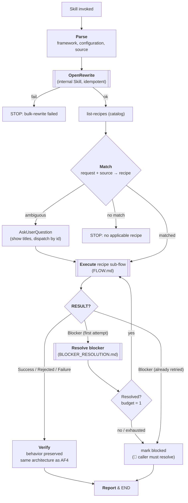
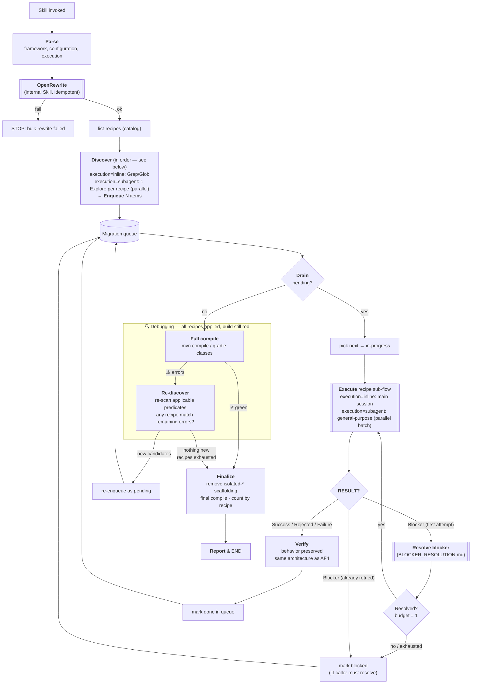

# axon4to5-migrate

## Goal

> Fully (or as most as possible) compiling, green-test codebase on AF5, **same architecture as AF4**.
> No DCB. No new patterns. Legacy event storage preserved.
> The migration preserves the project's existing configuration style: a Spring Boot
> project stays on Spring auto-config (recipes use `@Component` / `@Bean`
> idioms); a plain framework-configuration project stays on the direct
> `Configurer` API (recipes use `EventSourcingConfigurer` /
> `MessagingConfigurer` / `CommandHandlingModule` / `EventSourcedEntityModule`).

## Available recipes (auto-listed)

Run `bash scripts/list-recipes.sh` from the skill root directory. Output format:

```
- file: references/recipes/<dir>/RECIPE.md
  id: <id>
  title: <title>
  description: <description>
  applicable: |
    <applicable section content, or "(none)" if missing>
```

## Inputs

- `framework` (**required**): which Axon flavor to migrate. Currently supported values: `axon`, `axoniq`. Any other
  value → STOP.
- `configuration` (**required**): how the application wires Axon. Currently supported values: `native`, `spring`. Any
  other value → STOP.
- `mode` (required): what gets migrated in one invocation.
    - `single` — one element (a class, e.g. an Aggregate). Requires `source`.
    - `project` — the whole application (default: current working directory). `source` ignored.
- `execution` (optional, default `inline`): how the orchestrator runs its steps. Only meaningful for `mode=project` —
  for `mode=single` it has no observable effect.
    - `inline` — main session does discovery + recipe runs sequentially. No `Agent` tool use.
    - `subagent` — orchestrator MAY dispatch via the `Agent` tool: discovery → `Explore` subagent, recipe sub-flow per
      item → `general-purpose` subagent (parallel batches). Useful for `project` mode on large codebases.
- `source` (required for `mode=single`): hint identifying the thing to migrate (class name, file path, FQN).
- `skip-openrewrite` (optional, default `false`): when `true`, the orchestrator SKIPS Pre-step 2 (the OpenRewrite bulk pass) and goes straight to the mode-specific producer. Use this when (a) OpenRewrite Phase 1 has already been run separately on the tree, (b) the caller is exercising a recipe in isolation (e.g. evals — subagents cannot recursively invoke another Skill), or (c) the project is not built with Maven/Gradle so the OpenRewrite plugin is unreachable. Values: `true` / `false`. Any other value → STOP. The downstream recipe must still tolerate both AF4-shaped and partially-migrated sources (see each recipe's `# Applicable` predicates).
- `max-subagents` (optional, default `0`): max parallel `general-purpose` subagents for item processing in the drain loop. `mode=project` only — ignored for `mode=single`. `0` = inline (no subagents, sequential). `N > 0` = dispatch up to N items simultaneously as subagents; **BLOCKER_RESOLUTION always runs in main session** regardless of this value. Any non-integer or value < 0 → STOP.
- `auto` (optional, default `false`): when `true`, never calls `AskUserQuestion` — all interactive decisions resolved automatically (see `## Auto mode`). Values: `true` / `false`. Any other value → STOP.

## Auto mode (`auto=true`)

Orchestrator makes all decisions without `AskUserQuestion`. Every auto-resolved choice emits `⚙️ auto: <decision>` so the log stays auditable.

| Decision point | Auto action |
|---|---|
| Ambiguous recipe match (`mode=single`) | Pick first candidate by `applicable` score. |
| Blocker | Auto-select `skip` — leave `$SOURCE` in current partial state, queue moves on. |
| Resume + selection-args mismatch | Args identical → auto-resume. Args differ → auto-start-over. |
| Working tree mismatch on resume | Proceed; record `⚠️ auto: tree mismatch ignored` in `progress.md`. |
| OpenRewrite step completes | Immediately continue to mode-specific producer. Do NOT pause or end session. |

## Durability

**Load order — see § Recipe sub-flow.** FLOW.md first, then DURABILITY.md (second). Defines state files under `.axon4to5-migration/`, hooks across pre-steps + queue + recipe results + caller decisions, and commit protocol. Reads `progress.md` on entry to decide resume vs fresh.

## Pre-steps (common to every mode)

These run **before** any mode-specific logic — independent of whether `mode=single`, `project`, or anything added later.

1. **Parse** — read `framework`, `configuration`, `mode`, `execution`, `skip-openrewrite`, `max-subagents`, `auto` from `$ARGUMENTS`.
    - If `framework` is missing or ∉ {`axon`, `axoniq`} → STOP and report unsupported framework.
    - If `configuration` is missing or ∉ {`native`, `spring`} → STOP and report unsupported configuration.
    - If `mode` is missing or ∉ {`single`, `project`} → STOP and report unsupported mode.
    - `execution` defaults to `inline` if missing. If present and ∉ {`inline`, `subagent`} → STOP and report unsupported execution.
    - `skip-openrewrite` defaults to `false` if missing. If present and ∉ {`true`, `false`} → STOP and report unsupported value.
    - `max-subagents` defaults to `0` if missing. If present and not a non-negative integer → STOP.
    - `auto` defaults to `false` if missing. If present and ∉ {`true`, `false`} → STOP.
2. **OpenRewrite** — **skipped entirely when `skip-openrewrite=true`.** Otherwise, internally invoke
   `axon4to5-openrewrite` via the `Skill` tool, passing `--framework $framework --commit false`. Do NOT pass `--commit true` or omit `--commit`; DURABILITY's `on:openrewrite-done` hook owns the single combined commit. This is a step of this orchestrator, not a separate command. Idempotent — safe even on a partially-migrated tree. If it fails → STOP and report the failure (no gap-filling on a broken bulk pass). When skipped, surface that fact in the eventual report (Notes or Learnings) so the caller knows the queue ran against unprocessed AF4 (or already-partially-migrated) sources and the recipes did all the work themselves.
   **`auto=true`: after this step returns (success or skip), immediately continue to the mode-specific producer — do NOT end the session or pause.**

Only after pre-steps complete does the mode-specific producer below run.

## Modes

### `single`

Migrate ONE element (one aggregate, one event processor, etc.) using exactly one recipe from the list above.

Steps (after the common pre-steps):

1. **Match** — map user's request + `source` to ONE recipe in the auto-listed set. Primary signal: the catalog's
   `applicable` block (surface predicates against `$SOURCE` — annotations / type markers). Fallback signal: `id` +
   `title` + `description`. If ambiguous → ask user via `AskUserQuestion` to pick (show `title` to the user; dispatch by
   `id`). If no `applicable` block matches and description is also unclear → STOP and report.
2. **Execute** — `Read` the chosen recipe file under [`references/recipes/`](references/recipes/) (`<name>/RECIPE.md`)
   and execute it per the **Recipe sub-flow** ([`FLOW.md`](references/recipes/FLOW.md), already loaded). Recipe-local
   auxiliary files (examples, fixtures, supporting docs) live alongside it in the same `<name>/` directory.
3. **Verify** — behavior is preserved (no DCB, keep `AggregateBasedEventStorageEngine`, etc.).
4. **Report** — render the report (see Queue flow § Render report).

MUST NOT:

- Run without all required parameters resolved to a supported value.
- Run multiple recipes in one invocation.
- Migrate more than the single source named by the user.
- Migrate anything outside the supported `(framework, configuration)` matrix — the rest of the codebase stays untouched.
- Introduce DCB or swap event storage engine.

### `project`

Migrate **everything in the working directory** that any recipe in the catalog declares applicable. `source` is ignored.

Steps (after the common pre-steps):

1. **Discover** — for each recipe in the auto-listed catalog, evaluate its `applicable` predicates across the codebase
   to produce candidate sources.
    - `execution=inline` → orchestrator scans inline using `Grep` / `Glob` / `Read`.
    - `execution=subagent` → dispatch one `Explore` subagent **per recipe** (parallel batch via a single `Agent` tool
      message with multiple calls). Each agent receives the recipe's `applicable` block + `id` and returns a list of
      FQNs / file paths. Read-only — no edits.
2. **Enqueue** — every `(recipe, source)` candidate. Deduplication is recipe's concern (handled inside its Recipe
   sub-flow); orchestrator does not collapse items across recipes.
3. **Drain** — for each item run the Recipe sub-flow:
    - `max-subagents=0` (default) → inline, main session, sequentially.
    - `max-subagents=N` → main session acts as **coordinator**. Dispatches up to N pending items simultaneously as `general-purpose` subagents (single `Agent` message per batch). Each subagent executes ONE recipe sub-flow and returns a result block (`RESULT:` line + NOTES).
      - ✅ Success / ⏭ Rejected / ❌ Failure → main records result, immediately dispatches next pending item. **No pause.**
      - 🚧 Blocker → **BLOCKER_RESOLUTION in main session**: `AskUserQuestion` if `auto=false`; auto-skip if `auto=true`. Resolved → re-dispatch same item to a new subagent. Not resolved → mark blocked, dispatch next pending item.
      - Main session never pauses unless waiting for user input on a blocker (`auto=false`).
      - **Fallback** — if a subagent cannot be spawned (Agent tool unavailable or dispatch fails), process that item inline in the main session and continue.
4. **Report** — render the report (see Queue flow § Render report).

**Context hygiene** — after every 5 items drained, emit this tip once (then reset counter):

> 💡 Context is growing. Run `/clear` and re-invoke the skill — it resumes automatically from `.axon4to5-migration/progress.md`, no work is lost.

MUST NOT:

- Spawn a subagent under `execution=inline`.
- Pass anything beyond `(recipe path, source, framework, configuration)` to a recipe subagent — context bloat defeats
  the parallelism win.
- Cross repository boundaries during discovery.
- Halt the queue on a single Failure — record and drain the rest.
- Introduce DCB or swap event storage engine.

## Queue flow

`$SOURCE` is referenced throughout the recipe sub-flow as the argument passed to the skill from `source`.

> `[[Execute recipe sub-flow]]` = [`references/recipes/FLOW.md`](references/recipes/FLOW.md), loaded at skill start. `[[Resolve blocker]]` = [`references/recipes/BLOCKER_RESOLUTION.md`](references/recipes/BLOCKER_RESOLUTION.md), budget = 1 attempt per item; on exhaustion item is marked blocked and drain continues.

### Single mode flow



### Project mode flow



**Discovery order** — Discover scans recipes in this fixed sequence. Aggregates first: they define the events and commands consumed by downstream types.

| # | Recipe (`id` per frontmatter `order:`) |
|---|----------------------------------------|
| 1 | `aggregate` |
| 2 | `event-processor` |
| 3 | `command-gateway` |
| 4 | `query-gateway` |
| 5 | `query-handler` |
| 6 | `interceptors` |
| 7 | `saga` |
| 8 | `event-store` |

## Debugging loop (project mode only)

Entered when drain empties but build is still red. All known recipes have been applied — this phase asks: "is there still something a recipe can fix?"

1. **Full compile** — `mvn compile` / `gradle classes` (Java + Kotlin). Green → exit loop → Finalize.
2. Errors remain:
   - **Re-discover** — re-scan every recipe's `applicable` predicates against current codebase. Sources mutated during drain may now match recipes that rejected earlier.
   - New `(recipe, source)` pairs not already terminal → re-enqueue as `pending`, resume drain (loop repeats).
   - Nothing new → all applicable recipes exhausted → Finalize.

## Finalize (project mode only)

1. **Cleanup scaffolding** — `Grep` all `pom.xml` / `build.gradle(.kts)` for `isolated-*` Maven profiles and `isolated*` Gradle source-sets added by `axon4to5-isolatedtest`. `Edit` each build file to remove found blocks. Commit: `chore(af5): remove isolated-test scaffolding`. Skip if none found.
2. **Final compile** — full compile; record pass/fail + error count in `progress.md`. Commit: `chore(af5): record final compile status`.
3. **Count results** — group queue rows by recipe type × status (Success / Rejected / Failure / Blocked).
4. → Render report.

## Report format (project mode)

Emit this block to the user on `on:session-end`:

```
🏁 Migration complete — all applicable recipes exhausted.

| Recipe type     | ✅ Success | ⏭ Rejected | ❌ Failure | 🚧 Blocked |
|-----------------|-----------|------------|-----------|-----------|
| aggregate       |     N     |     N      |     N     |     N     |
| event-processor |     N     |     N      |     N     |     N     |
| …               |           |            |           |           |

Compilation: ✅ green
     — or —
Compilation: ⚠️ N error(s) remain — manual intervention required.

Blocked items (caller must resolve):
- <recipe>/<source>: <blocker notes>

See .axon4to5-migration/progress.md for full details.
```

## Recipe sub-flow

**Load order at skill start (before any pre-steps or mode logic):**
1. `Read` [`references/recipes/FLOW.md`](references/recipes/FLOW.md) — recipe control-flow spec. Non-optional. Recipes fill in named sections; they never re-implement it.
2. `Read` [`references/DURABILITY.md`](references/DURABILITY.md) — state + resume protocol (`mode=project`; skim for `mode=single`).

### Recipe defaults ([`DEFAULT.md`](references/recipes/DEFAULT.md))

**ALWAYS `Read` [`references/recipes/DEFAULT.md`](references/recipes/DEFAULT.md) BEFORE any per-recipe `RECIPE.md` under
[`references/recipes/`](references/recipes/).** It holds shared defaults for every named recipe section (`# Applicable`,
`# Scope`, `# References`, `# Success Criteria`, `# Blocker`, `# Toolbox`, `# Out of Scope`, `# Gotchas`).

Merge rule when executing a recipe:

- For each section the FLOW consults, start from [`DEFAULT.md`](references/recipes/DEFAULT.md)'s content for that
  section.
- If `RECIPE.md` defines the same section → **`RECIPE.md` overrides** (full section replacement, not append).
    - Exception: if `RECIPE.md`'s section body references [`DEFAULT.md`](references/recipes/DEFAULT.md) (e.g. literal
      token `@DEFAULT.md` or prose like "inherits from DEFAULT.md" / "extends DEFAULT.md") → **append** the recipe's
      content to the default's content for that section instead of replacing.
- If `RECIPE.md` omits the section → the [`DEFAULT.md`](references/recipes/DEFAULT.md) content stands.
- Recipe authors only write sections that differ from the default. No need to re-state defaults.

## References/Docs: Migration paths catalog

Shared cross-recipe knowledge base at [`references/docs/paths/`](references/docs/paths/). Recipes pick relevant entries
in their `### Migration Paths` subsection, each with an **apply-condition** (a fact about current scope that triggers
loading the file). The orchestrator never reads these directly — only recipes do, gated by their declared
apply-condition.

Catalog (one file per topic; `.adoc`):

| Path                                                                                                       | Topic                                               |
|------------------------------------------------------------------------------------------------------------|-----------------------------------------------------|
| [`aggregates/index.adoc`](references/docs/paths/aggregates/index.adoc)                                     | Aggregate migration entry point                     |
| [`aggregates/configuration-migration.adoc`](references/docs/paths/aggregates/configuration-migration.adoc) | Aggregate Spring/Configurer wiring                  |
| [`aggregates/multi-entity-migration.adoc`](references/docs/paths/aggregates/multi-entity-migration.adoc)   | Aggregates with child entities (`@AggregateMember`) |
| [`aggregates/polymorphism-migration.adoc`](references/docs/paths/aggregates/polymorphism-migration.adoc)   | Polymorphic aggregates                              |
| [`configuration.adoc`](references/docs/paths/configuration.adoc)                                           | Global Axon configuration / Configurer              |
| [`messages.adoc`](references/docs/paths/messages.adoc)                                                     | Command / Event / Query message changes             |
| [`event-store.adoc`](references/docs/paths/event-store.adoc)                                               | Event Store engine + APIs                           |
| [`snapshotting.adoc`](references/docs/paths/snapshotting.adoc)                                             | Snapshot trigger + storage                          |
| [`serializers.adoc`](references/docs/paths/serializers.adoc)                                               | Serializer registration + payload formats           |
| [`interceptors.adoc`](references/docs/paths/interceptors.adoc)                                             | Command / Event / Query handler interceptors        |
| [`projectors-event-processors.adoc`](references/docs/paths/projectors-event-processors.adoc)               | Projection / Event Processor wiring                 |
| [`sequencing-policies.adoc`](references/docs/paths/sequencing-policies.adoc)                               | Event sequencing policies                           |
| [`dlq.adoc`](references/docs/paths/dlq.adoc)                                                               | Dead-Letter Queue                                   |
| [`test-fixtures.adoc`](references/docs/paths/test-fixtures.adoc)                                           | Test fixtures migration                             |
