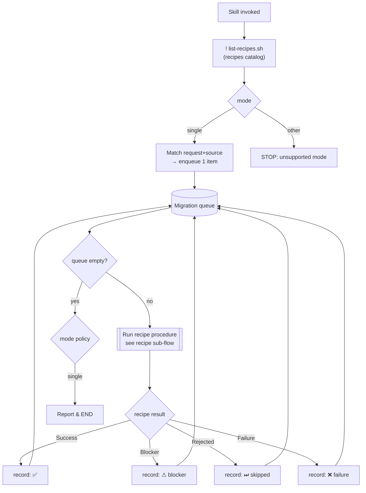

# axon4to5-migrate

## Available recipes (auto-listed)

!`./scripts/list-recipes.sh`

## Inputs

- `mode` (required): currently only `single`.
- `source` (optional, mode=single): user-supplied hint identifying the thing to migrate (class name, file path, FQN).

## Modes

### `single`

Migrate ONE element (one aggregate, one handler, etc.) using exactly one recipe from the list above.

Steps:

1. Parse `mode` from `$ARGUMENTS`. If `mode != single` → STOP and report unsupported mode.
2. Match user's request + `source` to ONE recipe in the auto-listed set (by `name` + `description`). If ambiguous → ask
   user via `AskUserQuestion` to pick. If no match → STOP and report.
3. `Read` the chosen recipe file (`references/recipes/<name>.md`) and follow it exactly for the single source.
4. Verify behavior is preserved (no DCB, keep `AggregateBasedEventStorageEngine`, etc.).
5. Report: recipe used, files changed, follow-ups.

MUST NOT:

- Run multiple recipes in one invocation.
- Migrate more than the single source named by the user.
- Introduce DCB or swap event storage engine.

## Flow

Every mode ends up producing a **queue** of `(recipe, source)` items. A single processing loop drains it. What happens on empty queue depends on the mode.

> The `[[Run recipe procedure]]` node is a **nested sub-flow** governed by `references/recipes/_contract.md`. The orchestrator only reacts to the recipe's emitted result (`Success` / `Blocker` / `Rejected` / `Failure`) — it does not look inside.

### Queue-level result handling

How each result is recorded in the queue and rendered in `single` mode. Result *semantics* (what each value means) are defined in `_contract.md` — not duplicated here.

| Result     | Queue action                | `single` mode end-state |
|------------|-----------------------------|-------------------------|
| `Success`  | mark item done, drain next  | Report ✅                |
| `Blocker`  | record + drain next         | Report ⚠ with reason    |
| `Rejected` | record + drain next         | Report ⏭ with reason    |
| `Failure`  | record + drain next         | Report ❌ with reason    |

Rule of thumb:

- `single` → enqueue exactly 1, process, END (report whichever result came back).

## Recipe contract

Recipe execution (the `[[Run recipe procedure]]` node above) is governed by `references/recipes/_contract.md` — the spec covering sub-flow, state, per-step contract, retry policy, and result emission. `Read` it before running any recipe.

Every recipe file in `references/recipes/` MUST follow `references/recipes/_template.md`, which is the authoring guide describing what each recipe section must contain.
