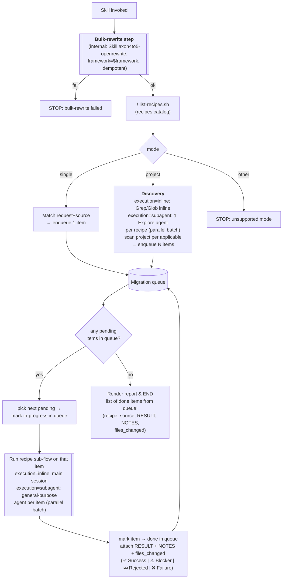

# axon4to5-migrate

## Available recipes (auto-listed)

!`./scripts/list-recipes.sh`

## Inputs

- `framework` (**required**): which Axon flavor to migrate. Currently supported values: `axon`, `axoniq`. Any other
  value → STOP.
- `configuration` (**required**): how the application wires Axon. Currently supported values: `native`, `spring`. Any
  other value → STOP.
- `mode` (required): what gets migrated in one invocation.
    - `single` — one element (a class, e.g. an Aggregate). Requires `source`.
    - `project` — the whole application (default: current working directory). `source` ignored.
- `execution` (optional, default `inline`): how the orchestrator runs its steps. Only meaningful for `mode=project` —
  for `mode=single` it has no observable effect.
    - `inline` — main session does discovery + recipe runs sequentially. No `Agent` tool use.
    - `subagent` — orchestrator MAY dispatch via the `Agent` tool: discovery → `Explore` subagent, recipe sub-flow per
      item → `general-purpose` subagent (parallel batches). Useful for `project` mode on large codebases.
- `source` (required for `mode=single`): hint identifying the thing to migrate (class name, file path, FQN).

## Pre-steps (common to every mode)

These run **before** any mode-specific logic — independent of whether `mode=single`, `project`, or anything added later.

1. Parse `framework`, `configuration`, `mode`, `execution` from `$ARGUMENTS`.
    - If `framework` is missing or ∉ {`axon`, `axoniq`} → STOP and report unsupported framework.
    - If `configuration` is missing or ∉ {`native`, `spring`} → STOP and report unsupported configuration.
    - If `mode` is missing or ∉ {`single`, `project`} → STOP and report unsupported mode.
    - `execution` defaults to `inline` if missing. If present and ∉ {`inline`, `subagent`} → STOP and report unsupported
      execution.
2. **Run the bulk-rewrite step** — internally invoke `axon4to5-openrewrite` via the `Skill` tool, passing
   `framework=$framework`. This is a step of this orchestrator, not a separate command. Idempotent — safe even on a
   partially-migrated tree. If it fails → STOP and report the failure (no gap-filling on a broken bulk pass).

Only after pre-steps complete does the mode-specific producer below run.

## Modes

### `single`

Migrate ONE element (one aggregate, one event processor, etc.) using exactly one recipe from the list above.

Steps (after the common pre-steps):

1. Match user's request + `source` to ONE recipe in the auto-listed set. Primary signal: the catalog's `applicable`
   block (surface predicates against `$SOURCE` — annotations / type markers). Fallback signal: `id` + `title` +
   `description`. If ambiguous → ask user via `AskUserQuestion` to pick (show `title` to the user; dispatch by `id`). If
   no `applicable` block matches and description is also unclear → STOP and report.
2. `Read` the chosen recipe file under [`references/recipes/`](references/recipes/) (`<name>/RECIPE.md`) and execute it
   per the **Recipe sub-flow** ([`FLOW.md`](references/recipes/FLOW.md), already loaded). Recipe-local auxiliary files (
   examples, fixtures, supporting docs) live alongside it in the same `<name>/` directory.
3. Verify behavior is preserved (no DCB, keep `AggregateBasedEventStorageEngine`, etc.).
4. Render the report (see Queue flow § Render report).

MUST NOT:

- Run without all required parameters resolved to a supported value.
- Run multiple recipes in one invocation.
- Migrate more than the single source named by the user.
- Migrate anything outside the supported `(framework, configuration)` matrix — the rest of the codebase stays untouched.
- Introduce DCB or swap event storage engine.

### `project`

Migrate **everything in the working directory** that any recipe in the catalog declares applicable. `source` is ignored.

Steps (after the common pre-steps):

1. **Discovery** — for each recipe in the auto-listed catalog, evaluate its `applicable` predicates across the codebase
   to produce candidate sources.
    - `execution=inline` → orchestrator scans inline using `Grep` / `Glob` / `Read`.
    - `execution=subagent` → dispatch one `Explore` subagent **per recipe** (parallel batch via a single `Agent` tool
      message with multiple calls). Each agent receives the recipe's `applicable` block + `id` and returns a list of
      FQNs / file paths. Read-only — no edits.
2. **Enqueue** every `(recipe, source)` candidate. Deduplication is recipe's concern (handled inside its Recipe
   sub-flow); orchestrator does not collapse items across recipes.
3. **Drain the queue** — for each item run the Recipe sub-flow:
    - `execution=inline` → run in main session, sequentially.
    - `execution=subagent` → dispatch each item to a `general-purpose` subagent. Batch independent items in a single
      `Agent` tool message so they run in parallel. Subagent receives `(recipe path, source, framework, configuration)`
      and the full Recipe sub-flow spec; returns one result block (`RESULT:` line + NOTES). Orchestrator parses and
      records.
4. Render the report (see Queue flow § Render report).

MUST NOT:

- Spawn a subagent under `execution=inline`.
- Pass anything beyond `(recipe path, source, framework, configuration)` to a recipe subagent — context bloat defeats
  the parallelism win.
- Cross repository boundaries during discovery.
- Halt the queue on a single Failure — record and drain the rest.
- Introduce DCB or swap event storage engine.

## Queue flow

`$SOURCE` is referenced throughout the recipe sub-flow as the argument passed to the skill from `source`.
Every mode produces a **queue** of `(recipe, source)` items. A single processing loop drains it. What happens on empty
queue depends on the mode.

> The `[[Run recipe sub-flow]]` node is the **nested** sub-flow defined in
> [`references/recipes/FLOW.md`](references/recipes/FLOW.md) (loaded at skill start). The queue only reacts to the
> recipe's emitted result.

## Recipe sub-flow

**ALWAYS load [`references/recipes/FLOW.md`](references/recipes/FLOW.md) via the `Read` tool at skill start — before any
mode-specific logic.** It defines the orchestrator-owned control flow every recipe executes against. Non-optional.
Recipes fill in named sections referenced from that flow; they never re-implement it.

### Recipe defaults ([`DEFAULT.md`](references/recipes/DEFAULT.md))

**ALWAYS `Read` [`references/recipes/DEFAULT.md`](references/recipes/DEFAULT.md) BEFORE any per-recipe `RECIPE.md` under
[`references/recipes/`](references/recipes/).** It holds shared defaults for every named recipe section (`# Applicable`,
`# Scope`, `# References`, `# Success Criteria`, `# Blocker`, `# Toolbox`, `# Out of Scope`, `# Gotchas`).

Merge rule when executing a recipe:

- For each section the FLOW consults, start from [`DEFAULT.md`](references/recipes/DEFAULT.md)'s content for that
  section.
- If `RECIPE.md` defines the same section → **`RECIPE.md` overrides** (full section replacement, not append).
    - Exception: if `RECIPE.md`'s section body references [`DEFAULT.md`](references/recipes/DEFAULT.md) (e.g. literal
      token `@DEFAULT.md` or prose like "inherits from DEFAULT.md" / "extends DEFAULT.md") → **append** the recipe's
      content to the default's content for that section instead of replacing.
- If `RECIPE.md` omits the section → the [`DEFAULT.md`](references/recipes/DEFAULT.md) content stands.
- Recipe authors only write sections that differ from the default. No need to re-state defaults.

## References/Docs: Migration paths catalog

Shared cross-recipe knowledge base at [`references/docs/paths/`](references/docs/paths/). Recipes pick relevant entries
in their `### Migration Paths` subsection, each with an **apply-condition** (a fact about current scope that triggers
loading the file). The orchestrator never reads these directly — only recipes do, gated by their declared
apply-condition.

Catalog (one file per topic; `.adoc`):

| Path                                                                                              | Topic                                               |
|---------------------------------------------------------------------------------------------------|-----------------------------------------------------|
| [`aggregates/index.adoc`](references/docs/paths/aggregates/index.adoc)                            | Aggregate migration entry point                     |
| [`aggregates/configuration-migration.adoc`](references/docs/paths/aggregates/configuration-migration.adoc) | Aggregate Spring/Configurer wiring                  |
| [`aggregates/multi-entity-migration.adoc`](references/docs/paths/aggregates/multi-entity-migration.adoc)   | Aggregates with child entities (`@AggregateMember`) |
| [`aggregates/polymorphism-migration.adoc`](references/docs/paths/aggregates/polymorphism-migration.adoc)   | Polymorphic aggregates                              |
| [`configuration.adoc`](references/docs/paths/configuration.adoc)                                  | Global Axon configuration / Configurer              |
| [`messages.adoc`](references/docs/paths/messages.adoc)                                            | Command / Event / Query message changes             |
| [`event-store.adoc`](references/docs/paths/event-store.adoc)                                      | Event Store engine + APIs                           |
| [`snapshotting.adoc`](references/docs/paths/snapshotting.adoc)                                    | Snapshot trigger + storage                          |
| [`serializers.adoc`](references/docs/paths/serializers.adoc)                                      | Serializer registration + payload formats           |
| [`interceptors.adoc`](references/docs/paths/interceptors.adoc)                                    | Command / Event / Query handler interceptors        |
| [`projectors-event-processors.adoc`](references/docs/paths/projectors-event-processors.adoc)      | Projection / Event Processor wiring                 |
| [`sequencing-policies.adoc`](references/docs/paths/sequencing-policies.adoc)                      | Event sequencing policies                           |
| [`dlq.adoc`](references/docs/paths/dlq.adoc)                                                      | Dead-Letter Queue                                   |
| [`test-fixtures.adoc`](references/docs/paths/test-fixtures.adoc)                                  | Test fixtures migration                             |
