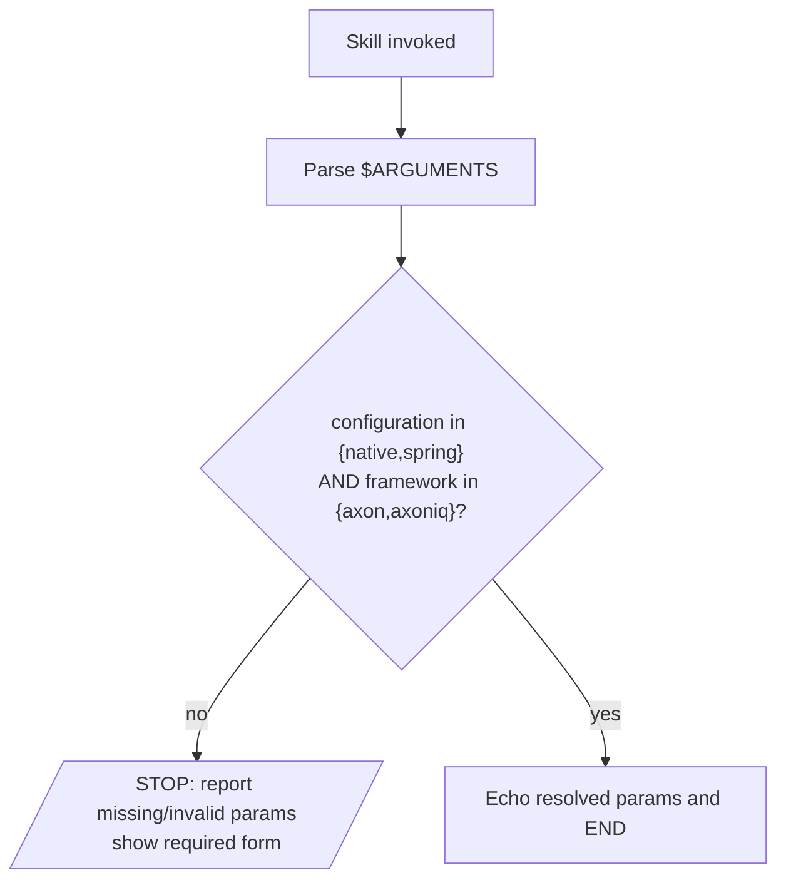

# axon4to5-migrate

## Inputs (all required)

| Param           | Values             | Meaning                                          |
|-----------------|--------------------|--------------------------------------------------|
| `configuration` | `native` \| `spring` | Project wiring style: plain Java vs Spring Boot. |
| `framework`     | `axon` \| `axoniq`   | Target stack: Axon Framework 5 vs AxonIQ 5.      |

Both MUST be present in `$ARGUMENTS`. No defaults. No inference.

## Flow

## MUST

- Parse `configuration` and `framework` from `$ARGUMENTS`.
- STOP if either is missing or has a value outside its allowed set.
- Report which param is missing/invalid and the required form:
  `configuration=<native|spring> framework=<axon|axoniq>`.

## MUST NOT

- Assume a default for either parameter.
- Proceed past parameter validation (migration logic intentionally not wired yet).
