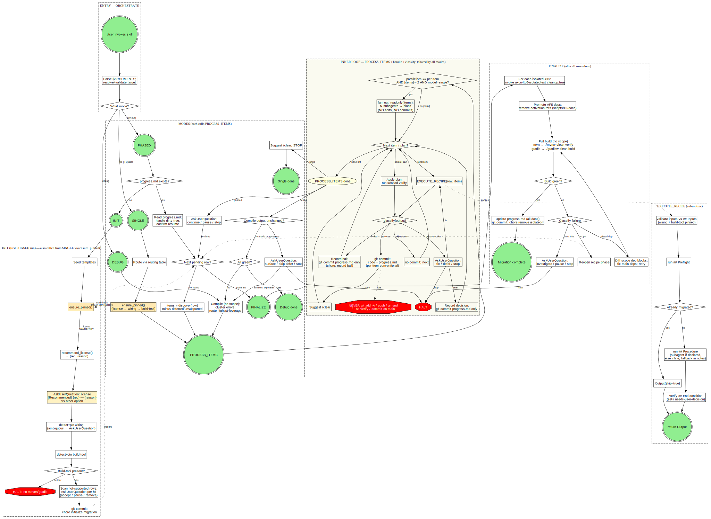

# AF4 → AF5 orchestration — visualised (simplified pass, license-mandatory revision)

> **Revision note (license mandatory):** `INIT` now runs `ensure_pinned()` as its first action, with `license` mandatory and asked *before* any detection step or recipe — including the openrewrite Phase 1. `SINGLE` mode shares the same `ensure_pinned()` block via a dotted bridge so the license prompt is **never** skipped even when there's no `progress.md` yet. The orchestrator computes `recommend_license()` from project signals (commercial-only deps like `axon-mongo` / `axon-kafka` / `org.axoniq.*`, or features not yet in free AF5 like sagas / upcasters / replay) and surfaces the recommendation as the first option labelled `[Recommended] — {reason}`.

Visualisation of the `SKILL.md` orchestrator pseudo-code, following the conventions in `knowledge/repositories/obra-superpowers/skills/writing-skills/graphviz-conventions.dot`:

- **diamond** = decision
- **box** = action
- **plaintext** = literal shell/git command
- **ellipse** = state (join point)
- **octagon (red)** = hard rule / NEVER
- **doublecircle (green)** = entry/exit point
- **dotted edge** = "triggers / invokes" (cross-procedure)

Rendered image: [`orchestration.svg`](./orchestration.svg)

## What changed vs. the first pass

| Before | After |
|---|---|
| Three near-identical loops (`ITEM_LOOP`, `PARALLEL_FAN_OUT`, `RUN_ONE`) | One `PROCESS_ITEMS` inner loop shared by PHASED / SINGLE / DEBUG |
| Three nested diamonds (`Output.skip?` → `bailed?` → `needs-decision?`) all funnelling into the same `fix/defer/stop` AskUserQuestion | One `classify(output)` 4-way switch — `skip / success / bailed / needs-decision` |
| `SPAWN_SUBAGENT` as its own block with a `Subagent available?` fork that converged again | Folded into `EXECUTE_RECIPE`'s "run ## Procedure" step; inline fallback recorded in `Output.notes` |
| `FINALIZE` with two nested diamonds (`recipe traceable?` → `dep traceable?` → env) | One `Classify failure` 3-way diamond |
| Floating `HARD RULES` cluster with 7 octagons untethered from the flow | One octagon anchored to the commit step ("NEVER git add -A / push / amend / --no-verify / commit on main") |
| 10 clusters | 6 clusters |
| `.dot` size: 21 KB | `.dot` size: 13 KB |
| `.svg` size: 128 KB | `.svg` size: 74 KB |

## Full orchestration graph

```dot
digraph AF4_TO_AF5_ORCHESTRATION {
    rankdir=TB;
    compound=true;
    node [fontname="Helvetica"];
    edge [fontname="Helvetica", fontsize=10];

    // ============================================================
    // ENTRY — mode dispatch
    // ============================================================
    subgraph cluster_entry {
        label="ENTRY — ORCHESTRATE";
        style=dashed;

        "User invokes skill" [shape=doublecircle, style=filled, fillcolor=lightgreen];
        "Parse $ARGUMENTS;\nresolve+validate target" [shape=box];
        "What mode?" [shape=diamond];

        "User invokes skill" -> "Parse $ARGUMENTS;\nresolve+validate target";
        "Parse $ARGUMENTS;\nresolve+validate target" -> "What mode?";
    }

    "What mode?" -> "PHASED" [label="(default)"];
    "What mode?" -> "SINGLE" [label="file | FQ class"];
    "What mode?" -> "DEBUG"  [label="debug"];

    // ============================================================
    // THREE MODES — each a thin wrapper around the inner loop
    // ============================================================
    subgraph cluster_modes {
        label="MODES (each calls PROCESS_ITEMS)";
        style=dashed;

        "PHASED" [shape=doublecircle, style=filled, fillcolor=lightgreen];
        "progress.md exists?" [shape=diamond];
        "Read progress.md;\nhandle dirty tree;\nconfirm resume" [shape=box];
        "Next pending row?" [shape=diamond];
        "items = discover(row)\n  minus deferred/unsupported" [shape=box];
        "AskUserQuestion:\ncontinue / pause / stop" [shape=box];

        "PHASED" -> "progress.md exists?";
        "progress.md exists?" -> "INIT" [label="no"];
        "progress.md exists?" -> "Read progress.md;\nhandle dirty tree;\nconfirm resume" [label="yes"];
        "Read progress.md;\nhandle dirty tree;\nconfirm resume" -> "Next pending row?";
        "Next pending row?" -> "items = discover(row)\n  minus deferred/unsupported" [label="row found"];
        "Next pending row?" -> "FINALIZE" [label="none left"];
        "items = discover(row)\n  minus deferred/unsupported" -> "PROCESS_ITEMS";
        "AskUserQuestion:\ncontinue / pause / stop" -> "Next pending row?" [label="continue"];

        "SINGLE" [shape=doublecircle, style=filled, fillcolor=lightgreen];
        "Route via routing table" [shape=box];
        "ensure_pinned()\n(license → wiring → build-tool)" [shape=box, style=filled, fillcolor="#ffe9b3"];
        "Suggest /clear, STOP" [shape=box];
        "Single done" [shape=doublecircle, style=filled, fillcolor=lightgreen];

        "SINGLE" -> "Route via routing table";
        "Route via routing table" -> "ensure_pinned()\n(license → wiring → build-tool)";
        "ensure_pinned()\n(license → wiring → build-tool)" -> "PROCESS_ITEMS";

        "DEBUG" [shape=doublecircle, style=filled, fillcolor=lightgreen];
        "Compile (no scope);\ncluster errors;\nroute highest-leverage" [shape=box];
        "All green?" [shape=diamond];
        "Compile output unchanged?" [shape=diamond];
        "AskUserQuestion:\nsurface / skip-defer / stop" [shape=box];
        "Debug done" [shape=doublecircle, style=filled, fillcolor=lightgreen];

        "DEBUG" -> "Compile (no scope);\ncluster errors;\nroute highest-leverage";
        "Compile (no scope);\ncluster errors;\nroute highest-leverage" -> "PROCESS_ITEMS";
    }

    // PROCESS_ITEMS returns — join point shared by all three modes
    "PROCESS_ITEMS done" [shape=ellipse, style=filled, fillcolor=lightyellow];
    "PROCESS_ITEMS done" -> "AskUserQuestion:\ncontinue / pause / stop" [label="phased"];
    "PROCESS_ITEMS done" -> "Suggest /clear, STOP" [label="single"];
    "PROCESS_ITEMS done" -> "Compile output unchanged?" [label="debug"];

    "Suggest /clear, STOP" -> "Single done";
    "Compile output unchanged?" -> "AskUserQuestion:\nsurface / skip-defer / stop" [label="yes"];
    "Compile output unchanged?" -> "All green?" [label="no (made progress)"];
    "All green?" -> "Debug done" [label="yes"];
    "All green?" -> "Compile (no scope);\ncluster errors;\nroute highest-leverage" [label="no"];
    "AskUserQuestion:\nsurface / skip-defer / stop" -> "Compile (no scope);\ncluster errors;\nroute highest-leverage" [label="surface / skip-defer"];
    "AskUserQuestion:\nsurface / skip-defer / stop" -> "HALT" [label="stop"];

    // ============================================================
    // INNER LOOP — the heart. Shared by PHASED, SINGLE, DEBUG.
    // ============================================================
    subgraph cluster_inner {
        label="INNER LOOP — PROCESS_ITEMS + handle + classify  (shared by all modes)";
        style=dashed;
        bgcolor="#fafaf0";

        "PROCESS_ITEMS" [shape=doublecircle, style=filled, fillcolor=lightgreen];
        "parallelism == per-item\nAND |items|>=2 AND mode!=single?" [shape=diamond];
        "fan_out_readonly(items):\nN subagents → plans\n(NO edits, NO commits)" [shape=box];
        "Next item / plan?" [shape=diamond];
        "EXECUTE_RECIPE(row, item)" [shape=box];
        "Apply plan;\nrun scoped verify" [shape=box];
        "classify(output)" [shape=diamond];
        "no commit; next" [shape=box];
        "git commit:\ncode + progress.md\n(per-item conventional)" [shape=plaintext];
        "Record bail;\ngit commit progress.md only\n(chore: record bail)" [shape=box];
        "AskUserQuestion:\nfix / defer / stop" [shape=box];
        "Record decision;\ngit commit progress.md only" [shape=box];
        "Suggest /clear" [shape=box];
        "NEVER git add -A / push / amend\n/ --no-verify / commit on main" [shape=octagon, style=filled, fillcolor=red, fontcolor=white];

        "PROCESS_ITEMS" -> "parallelism == per-item\nAND |items|>=2 AND mode!=single?";
        "parallelism == per-item\nAND |items|>=2 AND mode!=single?" -> "fan_out_readonly(items):\nN subagents → plans\n(NO edits, NO commits)" [label="yes"];
        "parallelism == per-item\nAND |items|>=2 AND mode!=single?" -> "Next item / plan?" [label="no (serial)"];
        "fan_out_readonly(items):\nN subagents → plans\n(NO edits, NO commits)" -> "Next item / plan?";

        "Next item / plan?" -> "EXECUTE_RECIPE(row, item)" [label="serial item"];
        "Next item / plan?" -> "Apply plan;\nrun scoped verify"    [label="parallel plan"];
        "Next item / plan?" -> "PROCESS_ITEMS done"                [label="none left"];
        "EXECUTE_RECIPE(row, item)" -> "classify(output)";
        "Apply plan;\nrun scoped verify"    -> "classify(output)";

        "classify(output)" -> "no commit; next"                                              [label="skip"];
        "classify(output)" -> "git commit:\ncode + progress.md\n(per-item conventional)"     [label="success"];
        "classify(output)" -> "Record bail;\ngit commit progress.md only\n(chore: record bail)" [label="bailed"];
        "classify(output)" -> "AskUserQuestion:\nfix / defer / stop"                         [label="needs-decision"];

        "git commit:\ncode + progress.md\n(per-item conventional)" -> "NEVER git add -A / push / amend\n/ --no-verify / commit on main" [style=dotted, label="rule"];
        "git commit:\ncode + progress.md\n(per-item conventional)" -> "Suggest /clear";
        "Suggest /clear" -> "Next item / plan?";
        "Record bail;\ngit commit progress.md only\n(chore: record bail)" -> "Next item / plan?";
        "no commit; next" -> "Next item / plan?";

        "AskUserQuestion:\nfix / defer / stop" -> "EXECUTE_RECIPE(row, item)" [label="fix"];
        "AskUserQuestion:\nfix / defer / stop" -> "Record decision;\ngit commit progress.md only" [label="defer"];
        "AskUserQuestion:\nfix / defer / stop" -> "HALT" [label="stop"];
        "Record decision;\ngit commit progress.md only" -> "Next item / plan?";
    }

    "HALT" [shape=octagon, style=filled, fillcolor=red, fontcolor=white];

    // ============================================================
    // EXECUTE_RECIPE — subroutine
    // ============================================================
    subgraph cluster_execute {
        label="EXECUTE_RECIPE (subroutine)";
        style=dashed;

        "validate inputs vs ## Inputs\n(wiring + build-tool pinned)" [shape=box];
        "run ## Preflight" [shape=box];
        "Already migrated?" [shape=diamond];
        "Output{result: skipped}" [shape=box];
        "run ## Procedure\n(subagent if declared,\nelse inline; fallback in notes)" [shape=box];
        "verify ## End condition\n(sets Output.result)" [shape=box];
        "return Output" [shape=doublecircle, style=filled, fillcolor=lightgreen];

        "validate inputs vs ## Inputs\n(wiring + build-tool pinned)" -> "run ## Preflight";
        "run ## Preflight" -> "Already migrated?";
        "Already migrated?" -> "Output{result: skipped}" [label="yes"];
        "Already migrated?" -> "run ## Procedure\n(subagent if declared,\nelse inline; fallback in notes)" [label="no"];
        "run ## Procedure\n(subagent if declared,\nelse inline; fallback in notes)" -> "verify ## End condition\n(sets Output.result)";
        "verify ## End condition\n(sets Output.result)" -> "return Output";
        "Output{result: skipped}" -> "return Output";
    }

    "EXECUTE_RECIPE(row, item)" -> "validate inputs vs ## Inputs\n(wiring + build-tool pinned)" [style=dotted, label="invokes"];

    // ============================================================
    // INIT — one-time, at first PHASED run
    // ============================================================
    subgraph cluster_init {
        label="INIT (first PHASED run) — also called from SINGLE via ensure_pinned()";
        style=dashed;

        "INIT" [shape=doublecircle, style=filled, fillcolor=lightgreen];
        "Seed templates" [shape=box];
        "ensure_pinned()" [shape=box, style=filled, fillcolor="#ffe9b3"];
        "recommend_license()\n→ (rec, reason)" [shape=box];
        "AskUserQuestion: license\n[Recommended] {rec} — {reason}\nvs other option" [shape=box, style=filled, fillcolor="#fff2c2"];
        "detect+pin wiring\n(ambiguous → AskUserQuestion)" [shape=box];
        "detect+pin build-tool" [shape=box];
        "Build-tool present?" [shape=diamond];
        "HALT: no maven/gradle" [shape=octagon, style=filled, fillcolor=red, fontcolor=white];
        "Scan not-supported rows;\nAskUserQuestion per hit\n(accept / pause / remove)" [shape=box];
        "git commit:\nchore initialize migration" [shape=plaintext];

        "INIT" -> "Seed templates";
        "Seed templates" -> "ensure_pinned()";
        "ensure_pinned()" -> "recommend_license()\n→ (rec, reason)" [label="license\nMANDATORY"];
        "recommend_license()\n→ (rec, reason)" -> "AskUserQuestion: license\n[Recommended] {rec} — {reason}\nvs other option";
        "AskUserQuestion: license\n[Recommended] {rec} — {reason}\nvs other option" -> "detect+pin wiring\n(ambiguous → AskUserQuestion)";
        "detect+pin wiring\n(ambiguous → AskUserQuestion)" -> "detect+pin build-tool";
        "detect+pin build-tool" -> "Build-tool present?";
        "Build-tool present?" -> "HALT: no maven/gradle" [label="neither"];
        "Build-tool present?" -> "Scan not-supported rows;\nAskUserQuestion per hit\n(accept / pause / remove)" [label="yes"];
        "Scan not-supported rows;\nAskUserQuestion per hit\n(accept / pause / remove)" -> "git commit:\nchore initialize migration";
        "git commit:\nchore initialize migration" -> "Next pending row?" [style=dotted, label="triggers"];
    }

    // SINGLE's ensure_pinned() short-circuits to INIT's ensure_pinned() block —
    // license is asked even when no progress.md exists yet.
    "ensure_pinned()\n(license → wiring → build-tool)" -> "ensure_pinned()" [style=dotted, label="same block;\nlicense MANDATORY"];

    // ============================================================
    // FINALIZE — one-time, after every row done
    // ============================================================
    subgraph cluster_finalize {
        label="FINALIZE (after all rows done)";
        style=dashed;

        "FINALIZE" [shape=doublecircle, style=filled, fillcolor=lightgreen];
        "For each isolated-<X>:\ninvoke axon4to5-isolatedtest cleanup:true" [shape=box];
        "Promote AF5 deps;\nremove activation refs (scripts/CI/docs)" [shape=box];
        "Full build (no scope)\nmvn → ./mvnw clean verify\ngradle → ./gradlew clean build" [shape=plaintext];
        "Build green?" [shape=diamond];
        "Classify failure" [shape=diamond];
        "Reopen recipe phase" [shape=box];
        "Diff scope dep blocks;\nfix main deps; retry" [shape=box];
        "AskUserQuestion:\ninvestigate / pause / stop" [shape=box];
        "Update progress.md (all done);\ngit commit: chore remove isolated-*" [shape=box];
        "Migration complete" [shape=doublecircle, style=filled, fillcolor=lightgreen];

        "FINALIZE" -> "For each isolated-<X>:\ninvoke axon4to5-isolatedtest cleanup:true";
        "For each isolated-<X>:\ninvoke axon4to5-isolatedtest cleanup:true" -> "Promote AF5 deps;\nremove activation refs (scripts/CI/docs)";
        "Promote AF5 deps;\nremove activation refs (scripts/CI/docs)" -> "Full build (no scope)\nmvn → ./mvnw clean verify\ngradle → ./gradlew clean build";
        "Full build (no scope)\nmvn → ./mvnw clean verify\ngradle → ./gradlew clean build" -> "Build green?";
        "Build green?" -> "Update progress.md (all done);\ngit commit: chore remove isolated-*" [label="yes"];
        "Build green?" -> "Classify failure" [label="no"];
        "Classify failure" -> "Reopen recipe phase" [label="recipe"];
        "Classify failure" -> "Diff scope dep blocks;\nfix main deps; retry" [label="missed dep"];
        "Classify failure" -> "AskUserQuestion:\ninvestigate / pause / stop" [label="env / infra"];
        "Reopen recipe phase" -> "Next pending row?" [style=dotted, label="re-enter"];
        "Diff scope dep blocks;\nfix main deps; retry" -> "Full build (no scope)\nmvn → ./mvnw clean verify\ngradle → ./gradlew clean build";
        "AskUserQuestion:\ninvestigate / pause / stop" -> "HALT" [label="stop"];
        "Update progress.md (all done);\ngit commit: chore remove isolated-*" -> "Migration complete";
    }
}
```

## What was applied to `SKILL.md` as well

The `## Orchestrator pseudocode` section in `SKILL.md` was rewritten to mirror this shape: three modes as thin wrappers, one `PROCESS_ITEMS` / `handle` / `classify(output)` inner loop, EXECUTE_RECIPE without the subagent fork, FINALIZE with one 3-way classifier, and the NEVER rules collapsed into one sentence next to the commit step. Recipe `Output` schema is unchanged — `classify()` is orchestrator-internal.

## Candidate next-pass simplifications (only if you want to push further)

1. **Drop the `bailed` lane entirely** by treating it as `needs-decision` with a synthesised "defer" answer. Today only `openrewrite` emits it; the orchestrator would still record the same Pinned-decision. Cost: one recipe special-case becomes an orchestrator one-liner instead of a classify branch.
2. **Promote `status` (skip|success|bailed|needs-decision) into the recipe `## Output` schema** so `classify()` becomes a single field read. Cost: touches every recipe's Output emission — bigger blast radius. Benefit: kills the helper.
3. **Inline INIT into PHASED step 1** (it only has one caller). Cost: PHASED grows; INIT stops being a named subroutine that can be referenced from RUN_ONE's "ensure pinned wiring + build-tool" step. So keep it separate unless RUN_ONE goes away.
4. **Move the `parallelism == per-item` branch out of PROCESS_ITEMS** into a recipe-side decorator — caller doesn't see the fan-out. Cost: more abstraction; only `aggregate` is likely to ever declare it. Probably not worth it yet.

Tell me which (if any) to take next.
