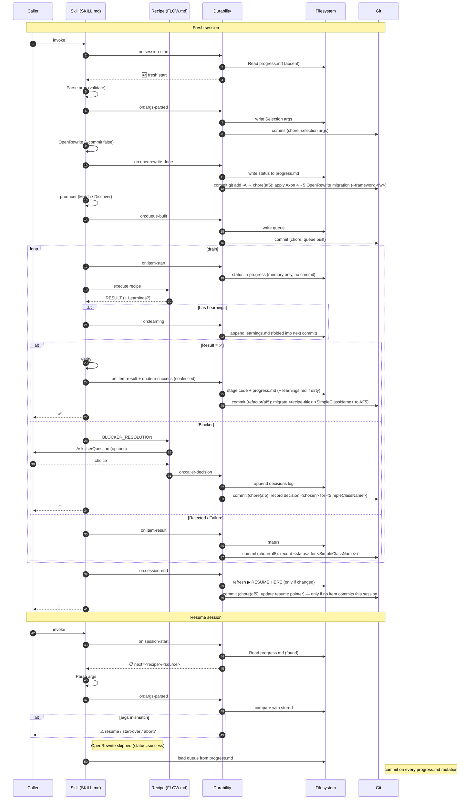

# DURABILITY

**Scope: `mode=project` only.** For `mode=single` — no state dir, no hooks fire, no resume. Recipe runs, result emitted, file edits left for user to review and commit. Skip this entire file for `mode=single`.

Owns state, commits, decisions. Observes hooks across SKILL.md flow. No phases — recipes applied to items.

## State dir

`<repo-root>/.axon4to5-migration/`

- `progress.md` — state + resume + queue + decisions. Seeded from [`../assets/progress-template.md`](../assets/progress-template.md).
- `learnings.md` — append-only surprises. Seeded from [`../assets/learnings-template.md`](../assets/learnings-template.md).

Created lazily after Parse accepts args. Never overwritten without caller approval.

## Always first (project mode only)

Before pre-step #1 (Parse):

1. `Read .axon4to5-migration/progress.md` if exists.
2. Present → resume protocol (§Resume) + 📋 message.
3. Absent → seed `progress.md` from `assets/progress-template.md`, seed `learnings.md` from `assets/learnings-template.md`, emit 🆕 message, continue to Parse.

## `progress.md` schema

Fixed section order.

```
## ▶︎ RESUME HERE
- next: <one sentence>
- recipe-loop: <recipe id> (N/8)
- recipe: <id>
- source: <fqn or path>
- verify: <exact command>
- tree: <clean | last-commit <sha>>
- awaiting-caller: <yes | no>

## Selection arguments (frozen frame)
framework=<v> configuration=<v> mode=<v> execution=<v>
# `source` is NOT part of the frozen frame:
#   - mode=project → source ignored.
#   - mode=single  → source is queue-driven (each invocation appends/matches a Queue row).

## OpenRewrite
status: <not-run | success | failed>
ts: <iso>
note: <optional>

## Recipe status
| # | Recipe | Status | Items done/total | Last commit |
|---|--------|--------|------------------|-------------|
| 1 | aggregate | pending | 0/? | — |
| 2 | event-processor | pending | 0/? | — |
| 3 | command-gateway | pending | 0/? | — |
| 4 | query-gateway | pending | 0/? | — |
| 5 | query-handler | pending | 0/? | — |
| 6 | interceptors | pending | 0/? | — |
| 7 | saga | pending | 0/? | — |
| 8 | event-store | pending | 0/? | — |

## Queue
| # | recipe | source | status | last-commit | notes |
|---|--------|--------|--------|-------------|-------|

## Caller decisions log
- <iso-ts> <recipe>/<source> — blocker(<options>) → <chosen> [<rationale>]
```

Status ∈ `pending`, `in-progress`, `done`, `blocked`, `skipped`, `rejected`, `failed`. Resume skips non-`pending`/`in-progress`.

## `learnings.md` schema

```
## YYYY-MM-DD — <headline>
**Context:** ...
**Surprise:** ...
**Resolution:** ... (commit <sha>?)
```

**MUST `Read learnings.md` when:** surprised, unexpected result, blocker, or ≥2 consecutive failures on the same item. Prior entries often pre-explain the current problem. Skip on routine resume.

## Proactive Learnings

`learnings.md` capture is **orthogonal to the Result block**. The `on:learning` hook (§ Hooks) fires when a recipe includes a `**Learnings:**` section in its Result — but that is not the only path. The orchestrator MUST also write to `learnings.md` proactively, on its own initiative, whenever any of the following occur during a recipe run or between runs:

- An import path, class name, or method signature differed from what the recipe documentation predicted (had to discover the correct form by reading jars, grepping, or trial-compile).
- A compile error occurred that was not expected from the recipe's documented migration steps.
- A retry was consumed (2nd Apply attempt used).
- A blocker was detected, regardless of how it was resolved.
- The project's shape (annotations, dependencies, module layout) required a deviation from the recipe's use cases or toolbox steps.
- Any step required external investigation (reading jars with `javap`, grepping to discover correct packages, consulting MCP docs, etc.).
- A microservices or secondary module had a different shape than the primary module and required separate handling.

**How to write:** Append a dated entry to `learnings.md` using the schema (§ `learnings.md` schema). Do NOT wait for the Result block — write as soon as the surprise is understood and resolved. Fold into the next item commit (`on:item-success` stages `learnings.md` when dirty).

**Debug-loop mandatory rule:** After EVERY compile attempt (during any Apply → compile → fix cycle) that produces an error not predicted by the recipe's documented steps, write a `learnings.md` entry for that error **before taking any further action** — before the next edit, before the next compile, before calling the next tool. "Not predicted" means: the error references a class, method, package, or API shape not mentioned in the recipe's Toolbox or Gotchas. Do not batch multiple novel errors into one entry after the fact; write each as it is understood. This rule is non-negotiable and applies even if the session ends before the item is complete.

**Deciding on your own:** The agent does not need a signal from the user, a blocker resolution, or a Result block to trigger this. If the migration surprised you — write it down.

## Hooks

Every hook that mutates `progress.md` commits the change in the same op. Code-bearing → `refactor(af5)`. State-only → `chore(af5)`.

| Hook | Trigger in SKILL.md | Action | Commit subject |
|------|---------------------|--------|----------------|
| `on:session-start` | Before pre-steps | Read `progress.md`; resume or fresh. | — |
| `on:args-parsed` | After Parse validates | Init state dir if absent; write Selection frame (framework, configuration, mode, execution — **not** `source`). Resume + frame mismatch → AskUserQuestion (resume / start-over / abort) **before** writing. | `chore(af5): record selection frame` |
| `on:openrewrite-done` | After pre-step #2 | Write outcome to `progress.md`. If status=`success`: stage **all** working-tree changes with `git add -A` (covers OpenRewrite recipe edits + `progress.md`); commit with canonical message (substitute `<framework>` from resolved arg). Resume + already `success` → skip pre-step entirely (no new commit). | `chore(af5): apply Axon 4 → 5 OpenRewrite migration (--framework <framework>)` |
| `on:queue-built` | After Discover+Enqueue for current recipe | Snapshot queue for this recipe into `progress.md`. Resume → merge: keep prior statuses; add only new items. **No standalone commit** — state is flushed with the first `on:item-success` of this recipe. | — |
| `on:recipe-done` | When recipe drain empties (`mode=project`) | Update Recipe status table row: status → `done` (or `partially-blocked`), Items done/total, Last commit. Fold into last item commit of this recipe; no standalone commit. | — |
| `on:item-start` | Drain pick | Write status → `in-progress` in memory only. **No commit** — state is flushed with `on:item-success` or `on:item-result`. | — |
| `on:item-result` | After FLOW.md `## Result` emitted for non-success outcomes | Status per outcome emoji; update notes col; commit `progress.md` only. | `chore(af5): record <status> for <SimpleClassName>` |
| `on:item-success` | Result=✅ + Verify ok | Stage code paths + `progress.md` (+ `learnings.md` if dirty). Subject uses `<SimpleClassName>` (last `.`-delimited segment of FQN) and the recipe's `title` field from its RECIPE.md frontmatter (lowercased). | `refactor(af5): migrate <recipe-title> <SimpleClassName> to AF5` |
| `on:caller-decision` | After BLOCKER_RESOLUTION choice applied | Append to decisions log. | `chore(af5): record decision <chosen> for <SimpleClassName>` |
| `on:learning` | Recipe emits `**Learnings:**` block | Append dated entry to `learnings.md`; fold into next commit. | — |
| `on:session-end` | At Render report | Refresh `▶︎ RESUME HERE` **only if pointer changed**. Fold into last item commit when possible; emit standalone only when session ends with no new item commits. | `chore(af5): update resume pointer` |

`on:item-result` + `on:item-success` MUST coalesce into one `refactor(af5)` commit (never two commits for one item).

Example (recipe title = "Aggregate"): `refactor(af5): migrate aggregate DwellingAggregate to AF5`

DURABILITY observes; SKILL/FLOW/BLOCKER never call it explicitly.

## Commit rules

- `git commit <explicit-paths>` only. Never `--amend`, `--no-verify`, `push`, co-author lines.
- Exception: `on:openrewrite-done` (status=`success`) uses `git add -A` to stage recipe-wide changes alongside `progress.md` in the one combined commit.
- `git status --porcelain` before each commit. Unexpected paths → AskUserQuestion (reuse existing channel).
- State-write failure → surface, continue. Do not corrupt code state.

## Resume protocol

1. Read `progress.md`. Extract `▶︎ RESUME HERE`.
2. Validate working-tree expectation. Mismatch → AskUserQuestion.
3. Validate incoming frame (`framework`, `configuration`, `mode`, `execution`) vs stored `## Selection arguments`. Mismatch → AskUserQuestion (resume / start-over / abort). Do not overwrite stored frame unless caller picks start-over.
4. Mode-specific source handling:
   - `mode=project` — ignore incoming `source`.
   - `mode=single` — look up the queue row for the matched recipe + incoming `source`:
     - **not in queue** → append a new `pending` row (extending a prior run with a new target).
     - **exists, status=`pending`/`in-progress`** → resume on it.
     - **exists, status=`done`** → 🏁 already-done message, exit.
     - **exists, status=`blocked`/`failed`/`rejected`/`skipped`** → AskUserQuestion: `retry` (status → `pending`) / `leave-as-is` (exit) / `start-over` (wipe state dir).
5. Skip pre-steps marked complete (OpenRewrite `success` → skip pre-step #2). Skip queue rebuild — load from `## Queue`.
6. Jump to drain loop at next `pending` item.

## Messages

| Marker | Text |
|--------|------|
| 🆕 | `New migration. State → .axon4to5-migration/` |
| 📋 | `Resuming. Next: <recipe>/<source>. <N> done · <M> blocked · <K> pending.` |
| ⚠️ | `Selection args changed (was: X, now: Y). Resume / start-over / abort?` |
| ⏭ | `OpenRewrite already succeeded on <ts>, skipping.` |
| ✅ | `Committed <source> (recipe: <id>) → <sha>` |
| 🚧 | `Recorded: <recipe>/<source> → <chosen>` |
| 💡 | `Surprise detected — checking learnings.md for prior occurrences.` |
| 🏁 | `Migration complete. <N done> · <M blocked> · <K skipped>. See .axon4to5-migration/progress.md.` |

## MUST / MUST NOT

MUST:
- read `progress.md` before any other action.
- persist + commit on every `progress.md` mutation.
- persist Selection arguments **only after** Parse validates them.
- `Read learnings.md` on surprise, blocker, or repeated failure.
- reuse the orchestrator's existing AskUserQuestion path for caller prompts.
- emit Result block per FLOW.md § Result before recipe execution returns to the orchestrator; missing Result = record `failed` status and surface as error.
- write a proactive learning to `learnings.md` whenever a surprise, discovery, or deviation from recipe docs occurs (see § Proactive Learnings), independent of the Result block's optional `**Learnings:**` field.

MUST NOT:
- identify the caller (user / subagent / auto) — `BLOCKER_RESOLUTION.md`'s concern.
- re-run OpenRewrite when state shows `success`.
- halt the orchestrator on a state-write failure.
- write SQL or recipe-emitted artifacts (recipes own their side files).
- overwrite Selection arguments on mismatch without caller approval.
- use the word "phase".

## Session sequence


