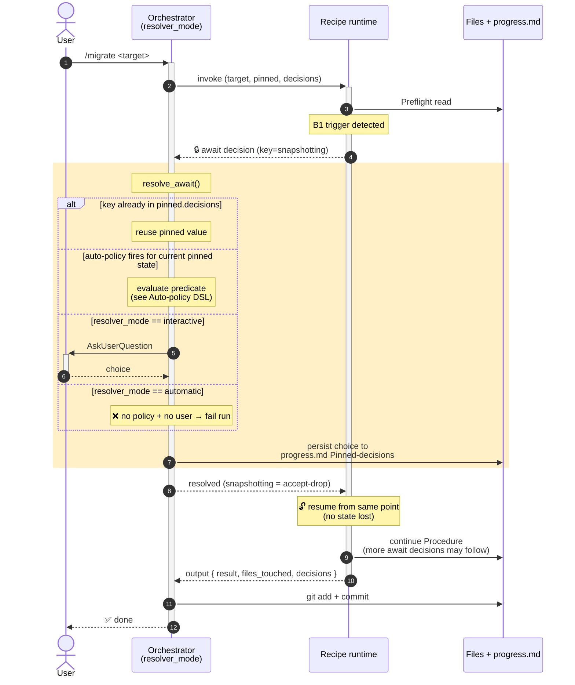
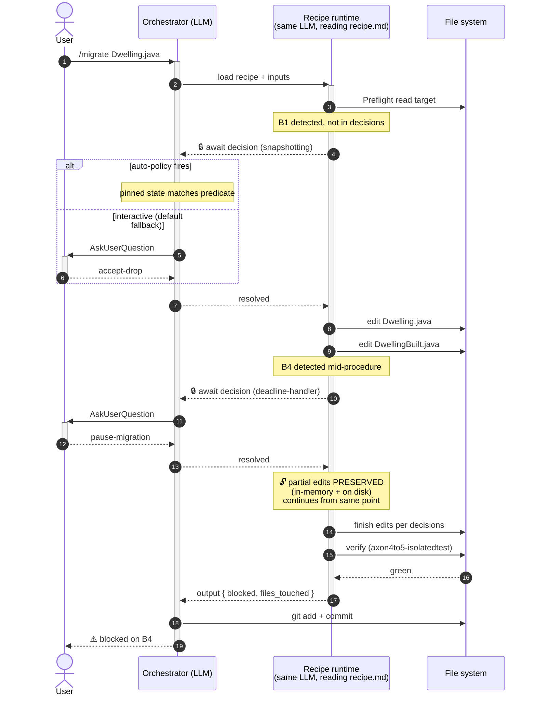
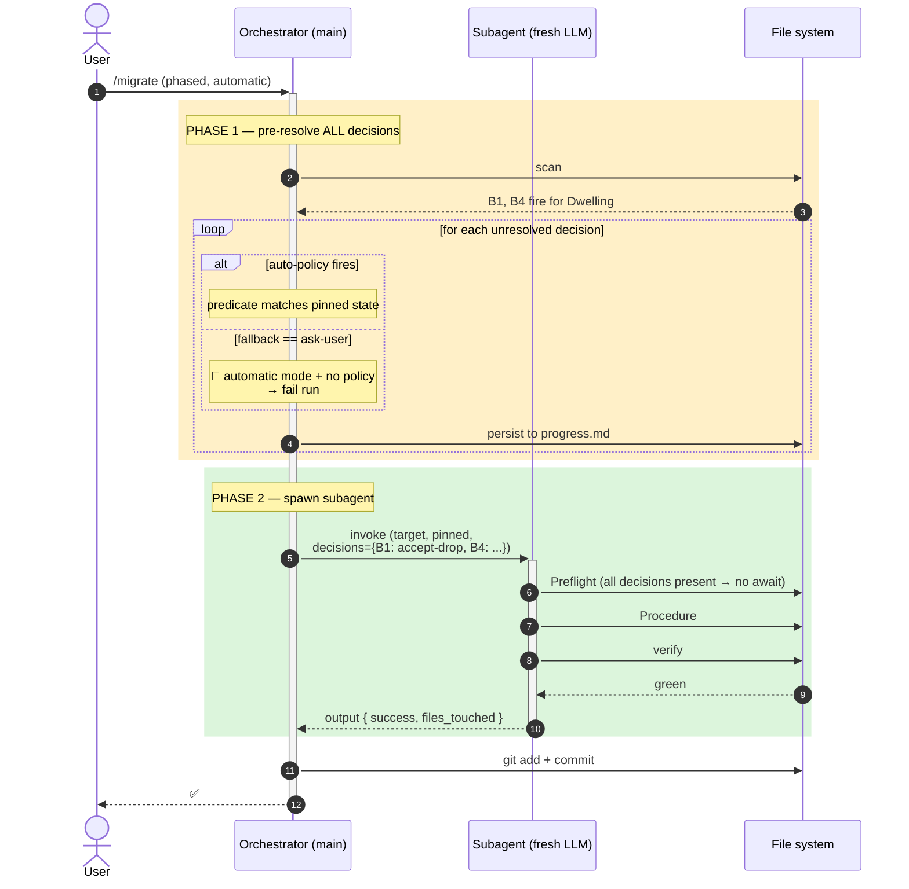

# Recipe template

> Copy this file to `references/<recipe>.md` and fill in the brackets. Delete this banner before committing.

A **recipe** is a workflow that migrates ONE target. It runs in a single session (main-Claude or a spawned subagent). When the recipe needs a project-level or per-target choice that hasn't been resolved yet, it executes the `await decision` primitive — the orchestrator pauses the workflow, resolves the decision (automatically from a declared policy, or by asking the user), and the workflow resumes from exactly that point with the answer in hand. No state is lost; partial edits stay on disk.

## Core concepts

### Two orthogonal modes

The orchestrator carries two independent mode axes. The recipe is unaware of either — it just emits `await decision` and lets the orchestrator decide what to do.

| Axis | Values | Meaning |
|---|---|---|
| **Source mode** | `single` · `phased` · `debug` | how units to migrate are picked (see [../SKILL.md](../SKILL.md)) |
| **Resolver mode** | `interactive` (default) · `automatic` · `dry-run` (planned) | how `await decision` is resolved |

| Resolver mode | Behavior on `await decision` |
|---|---|
| `interactive` | If decision already pinned in `progress.md` → use it. Else try auto-policy. Else `AskUserQuestion`. |
| `automatic` | Pinned → use it. Else auto-policy. Else **fail the run** (no user to ask; CI guardrail). |
| `dry-run` *(planned)* | Pinned → use it. Else auto-policy. Else stub the decision as `pause-migration` and continue. Produces a report of unresolved decisions; never edits files. |

### `await decision` lifecycle



The shaded region is the **universal resolver**. The recipe author writes `await decision <key>` and ignores how it's actually resolved — the policy + mode plug in at runtime.

### Execution contexts

A recipe runs in one of two contexts, decided by the orchestrator per invocation:

**Main session (default)** — the LLM driving the user's session reads `<recipe>.md` and follows its Procedure. `await decision` is implemented as a native `AskUserQuestion` call (or an internal policy lookup). The LLM's conversation context preserves partial work across the pause.



**Subagent (fan-out)** — orchestrator pre-resolves every decision point from `## Decision points` *before* spawning. The subagent receives a complete `inputs.decisions` map and never pauses. If the subagent encounters an unexpected condition mid-procedure (not declared as a decision point), it returns `output { result: failed }` and the orchestrator decides recovery.



**Constraint**: a recipe is subagent-eligible only if every `## Decision points` entry has an auto-policy that resolves against pinned state OR is pre-pinned by the user. If a decision can ONLY be resolved by `AskUserQuestion` (`Auto-policy: fallback: ask-user`), the orchestrator must resolve it in the main session before fan-out. After all decisions are pinned, mechanical follow-up may run in a subagent.

---

## Required sections (in this order — orchestrator parses by heading)

### `# Recipe: <kebab-name>`

One sentence — what does the recipe migrate? Match the entry in `SKILL.md` routing table.

### `## Inputs`

Schema of arguments the orchestrator passes per invocation:

```yaml
target: <FQ class | file path | "n/a">     # the unit being migrated
wiring: spring-boot | framework-config       # pinned project decision
decisions: { <key>: <value>, ... }           # decisions resolved so far; may be empty
<recipe-specific-key>: <type>                # required | optional, document each
```

`wiring`, `license`, `build-tool` are pinned project-wide once at INIT — they are NOT decision points (no per-target ask). They feed `inputs.pinned.<key>` and may appear in Auto-policy DSL.

### `## Preflight`

Cheap, side-effect-free inspection. Two purposes:

1. **Idempotency** — already on AF5? → `output { result: skipped }`.
2. **Decision-point detection** — for each entry in `## Decision points` with `trigger: detected-at-preflight`, run its Detection and, if the trigger fires AND the key isn't yet in `inputs.decisions`, emit **🔒 await decision \<key\>**.

Preflight MUST NOT mutate files.

### `## Decision points`

Enumerable, structured list of every place this recipe may pause. If the recipe has none (pure mechanical rewrite), write `_None._`.

Each entry follows this schema (use `### <key>` headings so the orchestrator can index them):

```markdown
### <decision-key>

- **Trigger**: detected-at-preflight | triggered-in-procedure | always-asked
- **Detection** *(if detected-at-preflight)*:
    ```
    grep -RnE '<pattern>' <file-or-package>
    ```
- **Question**: > "<literal text the user sees in `AskUserQuestion`>"
- **Options**:
    - `<option-a>` — <semantic meaning>
    - `<option-b>` *(Recommended for <context>)* — <semantic + reason>
    - `<option-c>` — <semantic>
- **Auto-policy**:
    - `<predicate>: <option-name>`
    - `<predicate>: <option-name>`
    - `fallback: <ask-user | <option-name> | fail>`
- **Effect on Procedure**:
    - `<option-a>` → <what changes in which Procedure step>
    - `<option-b>` → <...>
    - `<option-c>` → <... or `output { result: blocked }`, exit>
- **Reference**: link to [blockers.md#<Bn>](blockers.md#<Bn>) if this is a global blocker.
```

The orchestrator may resolve a decision in any of these ways (first match wins):
1. **Pre-pinned**: `inputs.decisions[<key>]` is already set (from earlier invocations or user pre-pinning in `progress.md`).
2. **Auto-policy**: evaluate predicates top-to-bottom against `pinned.*` and previously-resolved `decisions.*`; first matching predicate wins; if `fallback:` is the last line and no predicate fires, that's the answer.
3. **Interactive**: `resolver_mode == interactive` AND fallback is `ask-user` → `AskUserQuestion` with the literal Question + Options text from this section.

### `## Procedure`

Numbered steps the recipe executes when no decision is pending. Steps that depend on a resolved decision reference `decisions.<key>`:

```markdown
### Step N — <action>

N.1. <mechanical edit step>.
N.2. **🔒 await decision** [`<key>`](#<key>) — see ## Decision points.
N.3. Based on `decisions.<key>`:
     - `<option-a>` → <sub-action>
     - `<option-b>` → <sub-action>
N.4. <next edit>.
```

Steps MAY produce file edits (Write/Edit tool calls). Steps MUST NOT call `AskUserQuestion` directly — that's the orchestrator's job triggered by `🔒 await decision`. If a step discovers a previously-unknown decision point mid-run, the recipe should NOT invent one on the fly — that's a bug. Either declare it in `## Decision points` (and re-trigger Preflight) or emit `output { result: failed }` for orchestrator triage.

**Path A vs Path B branches** (`inputs.wiring`) are *not* decision points — `wiring` is pinned project-wide, never per-target asked. Express them as plain Procedure subsections:

```markdown
### Path A — Spring Boot (`wiring == spring-boot`)
...
### Path B — framework Configurer (`wiring == framework-config`)
...
```

### `## End condition`

Objective, machine-checkable test the orchestrator runs after Procedure. Usually a call to `axon4to5-isolatedtest`:

```yaml
target-name: <SimpleClassName>
build-file: <module>/pom.xml | build.gradle(.kts)
main-sources: [<files migrated>]
test-sources: [<test class>] | []
extra-deps: [<AF5 coords needed in this scope>]
```

A red verification flips `Output.result` to `failed`.

### `## Output`

Terminal result. Exactly one fenced YAML block per invocation. **Five variants — `needs-decision` does NOT exist as a result** (it's expressed through `await decision`, not Output).

```yaml
result: success | skipped | rejected | blocked | failed
target: <FQ class | file path | "n/a">
reason: <one short line>                      # required for everything except success
decisions:
  <recipe-specific keys recording every resolved decision-point choice for the progress.md audit trail>
files_touched:                                 # explicit — drives `git add`
  - <repo-relative path>
route_to: <recipe>                             # OPTIONAL, only on rejected
notes: <free text>                             # on failed: surface external-tool exit message
                                               # on blocked: cite the blocker key (e.g. "see blockers.md#B5")
```

| `result:` | Meaning |
|---|---|
| `success` | End condition green; ready to commit. |
| `skipped` | Preflight saw target already on AF5; no work done. |
| `rejected` | Wrong recipe for this target; orchestrator should re-route per `route_to`. |
| `blocked` | An AF5 gap; recipe commented-out AF4 surface with `TODO[AF5 migration: <key>]` marker; commit anyway. |
| `failed` | Recipe couldn't classify the failure; orchestrator decides recovery (debug mode, manual fix, pause). |

The orchestrator translates `result:` into commit / no-commit / route / halt — see [SKILL.md](../SKILL.md).

---

## Optional sections

### `## Subagent guidelines`

Declare when and how the orchestrator may fan this recipe out to a subagent. Required clauses:

```yaml
subagent_type: general-purpose
parallelism: per-item | single
isolation: none | worktree
prompt-framing: |
  <text prepended to subagent prompt>
on_unexpected_condition: keep-edits-and-fail | rollback-and-fail
```

**Eligibility constraint**: a recipe with one or more `## Decision points` whose `Auto-policy.fallback: ask-user` MUST be fan-out-eligible only AFTER those decisions are pre-pinned in `progress.md`. The orchestrator enforces this by pre-running Preflight in the main session, resolving every decision (interactive if needed), then spawning the subagent with the complete `inputs.decisions` map.

### `## Reference pairs (AF4 → AF5)`

Concrete bundled fixture pairs the recipe is tested against:

```markdown
- **<scenario label>:** `axon4/<project>/<file>` ↔ `axon5/<project>/<file>`. <one line on what makes this pair interesting>
```

Fixtures must be in `evals/manifest.tsv` so `evals/build.sh` bundles them.

### `## Caveats`

Project-specific gotchas that aren't decision points (e.g., IDE LSP false-positives, OpenRewrite interaction quirks).

---

## Auto-policy DSL

`Auto-policy` is a deterministic, predicate-matching list inside each decision-point entry. The orchestrator evaluates lines top-to-bottom; the first matching predicate wins.

### Predicates

| Form | Matches when |
|---|---|
| `pinned.<key> == "<value>"` | `inputs.pinned[<key>] == <value>` (e.g., `pinned.license == "axoniq-commercial"`) |
| `pinned.<key> in ["<v1>", "<v2>"]` | `inputs.pinned[<key>]` is in the listed set |
| `pinned.<key>` | `inputs.pinned[<key>]` is set to any non-empty value |
| `decisions.<other-key> == "<value>"` | a previously-resolved decision matches |
| `always` | unconditional |

### Fallback line (mandatory)

The last line MUST be one of:
- `fallback: ask-user` — defer to `AskUserQuestion` in interactive mode; **fail the run** in automatic mode.
- `fallback: <option-name>` — unconditional default choice if no predicate fires (use for safe defaults).
- `fallback: fail` — explicitly refuse to choose; orchestrator emits `result: failed` regardless of resolver mode.

### Examples

```
# Always interactive — too project-specific for a default
- Auto-policy:
    - fallback: ask-user

# License-driven default
- Auto-policy:
    - pinned.license == "axoniq-commercial": move-to-axon-server
    - pinned.license == "free-af5": move-to-jpa
    - fallback: ask-user

# Depends on an earlier decision
- Auto-policy:
    - decisions.saga == "accept-stays-af4": accept-stays-af4
    - fallback: ask-user

# Safe default (no user input needed)
- Auto-policy:
    - always: accept-drop
    - fallback: ask-user        # unreachable but documents intent
```

### Why a DSL, not free-form prose

The orchestrator needs to evaluate the policy deterministically every run. A constrained DSL means the same recipe gives the same answer for the same `pinned` state — critical for reproducible CI runs in `resolver_mode == automatic`. Free-form prose would force the orchestrator-LLM to "interpret" the policy each time, introducing nondeterminism.

If you find yourself wanting `!=`, regex, arithmetic — that's a smell. Split the decision into two simpler decisions, or push the complexity into the recipe's Effect-on-Procedure logic.

---

## Putting it together — minimum viable recipe skeleton

```markdown
# Recipe: minimal-example

Migrate ONE <kind> from AF4 to AF5.

## Inputs
- target: FQ class (required)
- wiring: spring-boot | framework-config (pinned)
- decisions: { ... }

## Preflight
1. Read target.
2. Detect blockers per ## Decision points.
3. If target already on AF5 → output { result: skipped }.

## Decision points
### example-blocker
- Trigger: detected-at-preflight
- Detection: `grep -nE 'foo\.bar' <target>`
- Question: > "Target uses foo.bar — AF5 has no equivalent. How to handle?"
- Options:
    - `accept-drop` — drop the call
    - `pause-migration` — stop; user fixes first
- Auto-policy:
    - pinned.license == "axoniq-commercial": accept-drop
    - fallback: ask-user
- Effect on Procedure:
    - `accept-drop` → skip Step 3
    - `pause-migration` → output { result: blocked }, exit
- Reference: [blockers.md#B-example](blockers.md#B-example)

## Procedure
### Step 1 — Rewrite imports
1.1. Replace AF4 imports with AF5 equivalents (table).

### Step 2 — Branch on wiring
- Path A (`wiring == spring-boot`): <edits>.
- Path B (`wiring == framework-config`): <edits>.

### Step 3 — Maybe drop foo.bar
🔒 await decision [example-blocker](#example-blocker)
- If `decisions.example-blocker == "accept-drop"`: remove the foo.bar call.

## End condition
axon4to5-isolatedtest compile-only: green.

## Output
yaml block per the 5-variant schema.
```

That's the entire contract. Everything else is recipe-specific content.
