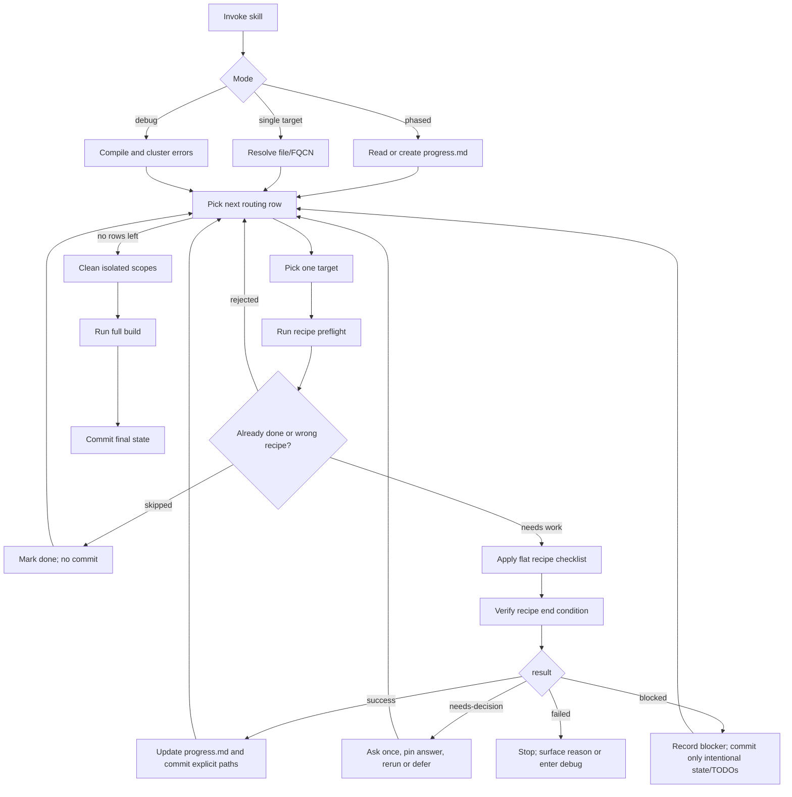

# Flow

This skill has one loop. Recipes do the edits; the runner owns state and
commits.

## Rules Behind the Diagram

- Only one target is edited at a time.
- A recipe never commits and never updates migration state directly.
- `result:` is the only branch discriminator.
- Full project builds happen only during finalization.
- Isolated build scopes are always created and removed by
  `axon4to5-isolatedtest`.
