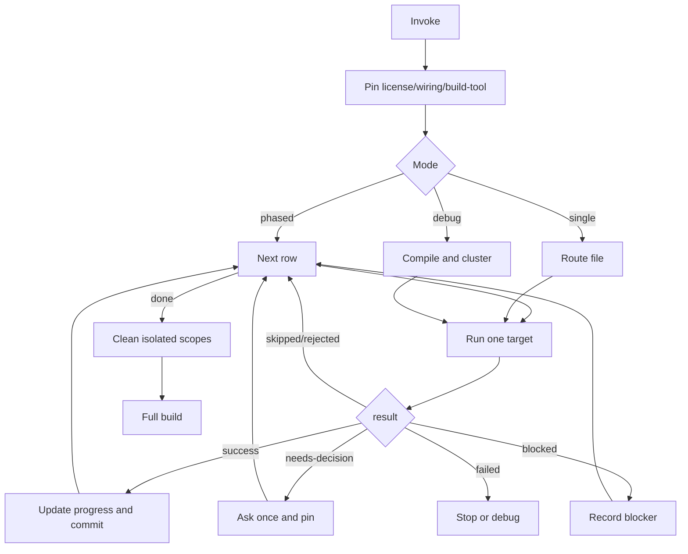

# Migration Playbook

One runner, one table, one target at a time.



## Pinning

| Decision | How |
|---|---|
| `license` | Recommend commercial for `org.axoniq.*`, `axon-mongo`, `axon-kafka`, `axon-amqp`, tracing, sagas, replay, upcasters, Mongo DLQ/token-store. Else recommend free AF5. |
| `wiring` | Spring starter / `@SpringBootApplication` / Axon `@Bean` -> `spring-boot`; direct `Configurer` / `DefaultConfigurer` -> `framework-config`; ask only if ambiguous. |
| `build-tool` | `pom.xml` -> Maven; `build.gradle(.kts)` -> Gradle; ask only if both. |

## Route Order

| # | Recipe | Detect | Rewrite |
|---|---|---|---|
| 1 | openrewrite | Axon 4 dependency, no AF5 BOM | Run `axon4to5-openrewrite --framework axon|axoniq --commit false`. Do not compile. |
| 2 | aggregate | `@Aggregate`, `@AggregateRoot` | `@EventSourced` entity, `EventAppender`, entity creator, member/subtype mapping, `AxonTestFixture`. |
| 3 | command-handler | `@CommandHandler` outside aggregate | AF5 command annotation/imports; preserve return type, validation, unit of work side effects. |
| 4 | event-processor | `@EventHandler`, `@ProcessingGroup` | `@Namespace`, AF5 handler imports, dispatcher parameter, sequencing, processor config. |
| 5 | command-gateway | AF4 `CommandGateway` / `ReactorCommandGateway` in non-handler caller | AF5 command dispatch preserving blocking/async/reactive/callback shape. |
| 6 | query-gateway | AF4 `QueryGateway` / `ReactorQueryGateway` in non-handler caller | AF5 query dispatch preserving names, response types, subscription/scatter behavior. |
| 7 | query-handler | `@QueryHandler` | AF5 query annotations/imports; preserve names and return contracts. |
| 8 | interceptors | `MessageDispatchInterceptor`, `MessageHandlerInterceptor` | AF5 `interceptOnDispatch` / `interceptOnHandle`, `ProcessingContext`, registration/order. |
| 9 | configuration | `Configurer`, `ConfigurerModule`, bus/register wiring | AF5 config modules, processor policy, DLQ, serializer, metrics/tracing decisions. |
| 10 | event-storage-engine | AF4 event store wiring or direct `EventStore` reads | Explicit aggregate-based AF5 engine; route generic event reads/writes here. |
| 11 | test-fixture | `AggregateTestFixture`, `SagaTestFixture`, `AxonTestFixture` | AF5 fixture setup, registered entities, disabled Axon Server when needed. |
| 12 | final-build | all rows done | Cleanup isolated scopes, promote deps, run full build. |

Route a mixed file by its most invasive Axon role: saga, aggregate,
command-handler, event-processor, query-handler, gateways, interceptors,
configuration, event storage, tests.

## Recipe Checklist

For any row:

1. Preflight: already migrated -> `skipped`; wrong recipe -> `rejected`.
2. Run blocker table below.
3. Apply the row rewrite only to the target and direct config/test files.
4. Verify with `axon4to5-isolatedtest` unless row says otherwise.
5. Emit output and let the runner update state/commit.

## Blockers

| Key | Detect | Action |
|---|---|---|
| `saga` | `@Saga`, `@SagaEventHandler`, `@StartSaga`, `@EndSaga`, `SagaConfigurer` | Ask: migrate to event-handler-with-state, accept stays AF4, pause, or remove first. No auto-port. |
| `deadline` | `@DeadlineHandler`, `DeadlineManager` | Ask; do not invent scheduler/workflow migration. |
| `mongo` | Mongo event/token/DLQ store | Block or commercial/user-owned path; no silent rewrite. |
| `jdbc-store` | `JdbcEventStorageEngine` | Block/defer; no AF5 drop-in. |
| `custom-store` | custom `EventStorageEngine` subclass | Manual port decision. |
| `snapshot` | AF4 snapshot trigger/wiring | Record decision; do not drop silently. |
| `kafka` | `axon-kafka` | Block/defer unless a supported AF5 path is known in the project. |
| `serializer` | custom `Serializer`/`XStreamSerializer` | Surface converter work; do not auto-port complex serializers. |

If blocked code is commented, keep enough AF4 context and add
`TODO[AF5 migration: <key>]`.

## Output

```yaml
result: success | skipped | rejected | needs-decision | blocked | failed
target: <file/FQCN/project>
reason: <required except simple success>
decisions: {}
caller-expects:
  commit: true | false
  next: proceed | ask-user | record-and-skip | halt | route-to:<recipe>
notes: []
```

Branch only on `result`.

## Verification

- OpenRewrite: external skill only; no compile expected.
- Iterative rows: call `axon4to5-isolatedtest` with target name, build file,
  main sources, tests, extra deps, `cleanup:false`.
- Before committing a successful target, rerun isolatedtest with `cleanup:true`
  if the scoped compile/tests are green.
- Finalization: clean every remaining isolated scope, remove CI/script
  activation, then run the full build.

## Commit

Update `.axon4to5-migration/progress.md` before staging. Commit only touched
code + migration state. Suggested subjects:

| Work | Subject |
|---|---|
| init | `chore(af5-migration): initialize migration` |
| openrewrite | `chore(af5-migration): apply OpenRewrite recipe` |
| target rewrite | `refactor(af5-migration): migrate <recipe> <Target> to AF5` |
| event store | `feat(af5-migration): wire aggregate-based AF5 event storage` |
| decision only | `docs(af5-migration): record decision on <recipe>/<target>` |
| final cleanup | `chore(af5-migration): remove isolated migration scaffolding` |
