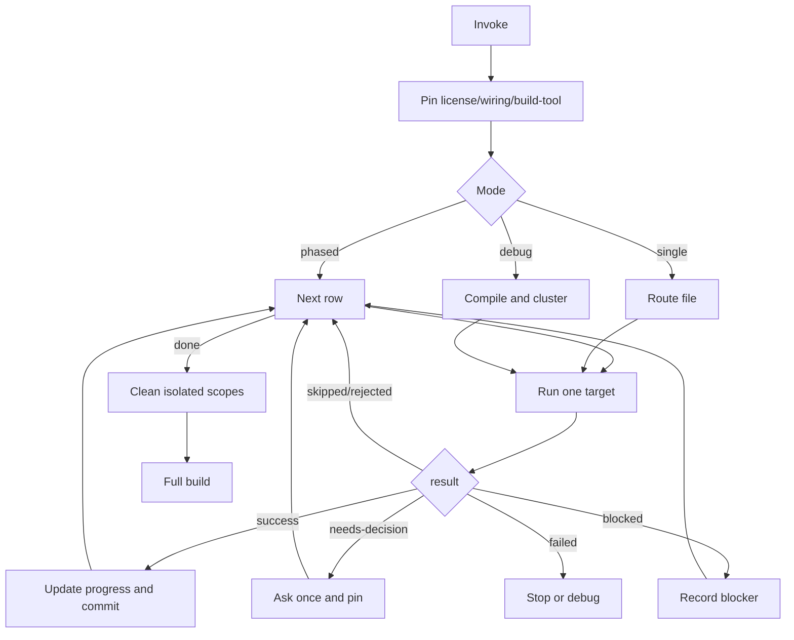

# Migration Playbook

One runner, one table, one target at a time.



## Pinning

| Decision | How |
|---|---|
| `license` | Recommend commercial for `org.axoniq.*`, `axon-mongo`, `axon-kafka`, `axon-amqp`, tracing, sagas, replay, upcasters, Mongo DLQ/token-store. Else recommend free AF5. |
| `wiring` | Spring starter / `@SpringBootApplication` / Axon `@Bean` -> `spring-boot`; direct `Configurer` / `DefaultConfigurer` -> `framework-config`; ask only if ambiguous. |
| `build-tool` | `pom.xml` -> Maven; `build.gradle(.kts)` -> Gradle; ask only if both. |

## Route Order

| # | Recipe | Detect | Rewrite |
|---|---|---|---|
| 1 | openrewrite | Axon 4 dependency, no AF5 BOM | Run `axon4to5-openrewrite --framework axon|axoniq --commit false`. Do not compile. |
| 2 | aggregate | `@Aggregate`, `@AggregateRoot` | `@EventSourced` entity, `EventAppender`, entity creator, member/subtype mapping, `AxonTestFixture`. |
| 3 | command-handler | `@CommandHandler` outside aggregate | AF5 command annotation/imports; preserve return type, validation, unit of work side effects. |
| 4 | event-processor | `@EventHandler`, `@ProcessingGroup` | `@Namespace`, AF5 handler imports, dispatcher parameter, sequencing, processor config. |
| 5 | command-gateway | AF4 `CommandGateway` / `ReactorCommandGateway` in non-handler caller | AF5 command dispatch preserving blocking/async/reactive/callback shape. |
| 6 | query-gateway | AF4 `QueryGateway` / `ReactorQueryGateway` in non-handler caller | AF5 query dispatch preserving names, response types, subscription/scatter behavior. |
| 7 | query-handler | `@QueryHandler` | AF5 query annotations/imports; preserve names and return contracts. |
| 8 | interceptors | `MessageDispatchInterceptor`, `MessageHandlerInterceptor` | AF5 `interceptOnDispatch` / `interceptOnHandle`, `ProcessingContext`, registration/order. |
| 9 | configuration | `Configurer`, `ConfigurerModule`, bus/register wiring | AF5 config modules, processor policy, DLQ, serializer, metrics/tracing decisions. |
| 10 | event-storage-engine | AF4 event store wiring or direct `EventStore` reads | Explicit aggregate-based AF5 engine; route generic event reads/writes here. |
| 11 | test-fixture | `AggregateTestFixture`, `SagaTestFixture`, `AxonTestFixture` | AF5 fixture setup, registered entities, disabled Axon Server when needed. |
| 12 | final-build | all rows done | Cleanup isolated scopes, promote deps, run full build. |

Route a mixed file by its most invasive Axon role: saga, aggregate,
command-handler, event-processor, query-handler, gateways, interceptors,
configuration, event storage, tests.

## Migration Rules

Use these rules when applying a row. Preserve package boundaries and business
names. Do not introduce DCB unless the project already owns that design.

### Aggregate

| AF4 | AF5 rule |
|---|---|
| `org.axonframework.spring.stereotype.Aggregate` | Use `@EventSourced(tagKey=..., idType=...)` for Spring-style examples or `@EventSourcedEntity(tagKey=...)` for framework config examples. |
| `org.axonframework.commandhandling.CommandHandler` | Use `org.axonframework.messaging.commandhandling.annotation.CommandHandler`. |
| `AggregateLifecycle.apply(event)` | Add `EventAppender` to the command handler and call `eventAppender.append(event)`. |
| constructor command handler | Make it static when the AF5 entity is created from the emitted event; otherwise keep an instance handler plus `@EntityCreator` no-arg constructor. |
| `@AggregateIdentifier` | Convert to `tagKey` / `idType`; keep the same stream identity and command routing key. |
| `@EventSourcingHandler` mutates state | Keep mutation, or return a new immutable entity when the AF5 example does that. |

Preserve invariants, command names, exception types, return values, deleted or
closed flags, aggregate members, and subtype routing. If aggregate member
routing cannot be mapped confidently, block instead of flattening the model.

### Command Handler

Use this only for non-aggregate handlers. Change the annotation import to AF5
messaging, keep the Spring/component boundary, and preserve validation, return
type, exception type, transaction boundary, metadata reads, and repository side
effects. If the handler manually folds or appends an event stream through AF4
`EventStore`, also run the `event-storage-engine` row for that file.

### Event Processor

| AF4 | AF5 rule |
|---|---|
| `org.axonframework.eventhandling.EventHandler` | Use `org.axonframework.messaging.eventhandling.annotation.EventHandler`. |
| `@ProcessingGroup("x")` | Add `@Namespace("x")`; if missing, derive a stable namespace from the component name. |
| `@DisallowReplay` / reset behavior | Preserve replay semantics with AF5 replay/reset annotations or config. |
| `SequencingPolicy` bean | Prefer AF5 `@SequencingPolicy`; keep the same key. |
| gateway call from processor | Inject `CommandDispatcher`; send command plus metadata and return/compose the result. |
| `QueryUpdateEmitter` | Keep all emitted query types, predicates, initial/update contract, and ordering. |

Do not merge processors just because they share an event type. Preserve
processor mode, token store/DLQ needs, idempotency, and side effects.

### Gateways

| AF4 | AF5 rule |
|---|---|
| `org.axonframework.commandhandling.gateway.CommandGateway` | Use `org.axonframework.messaging.commandhandling.gateway.CommandGateway`. |
| `org.axonframework.queryhandling.QueryGateway` | Use `org.axonframework.messaging.queryhandling.gateway.QueryGateway`. |
| `commandGateway.send(cmd)` | Keep async shape; add expected response type when AF5 compile requires it. |
| `queryGateway.query(name/payload, ..., ResponseType)` | Prefer typed query object + response class only when the AF5 example uses that pattern; otherwise preserve query name and response shape. |
| `streamingQuery` | Keep streaming behavior, e.g. `Flux.from(queryGateway.streamingQuery(query, Type.class))`. |
| `subscriptionQuery` | Preserve initial result, update stream, close behavior, and response types. |
| Reactor/Kotlin gateway extensions | Preserve `Mono`/`Flux` or Kotlin extension shape; do not silently convert to blocking. |

### Query Handler

Use `org.axonframework.messaging.queryhandling.annotation.QueryHandler`.
Preserve query name, payload type, response type, null/empty behavior,
pagination/sorting, streaming results, and subscription initial/update contract.
If a class has both `@EventHandler` and `@QueryHandler`, migrate it as an
`event-processor` first and keep the query methods in that component.

### Interceptors

Map AF4 `MessageDispatchInterceptor` to AF5 dispatch interception and
`MessageHandlerInterceptor` to AF5 handler interception. Preserve registration
target, order, message type, metadata mutation, correlation data, exception or
rejection behavior, and `ProcessingContext` access. If the old interceptor
depends on mutable AF4 message internals, block with a TODO rather than faking
equivalence.

### Configuration

Migrate build deps first, then wiring. Keep Maven/Gradle style unchanged. For
Spring examples, keep Spring auto-config unless explicit AF4 config exists. For
framework-config examples, use AF5 config modules. Migrate or decide on:
serializer, command/event/query bus interceptors, event processor mode, DLQ,
token store, metrics/tracing, transaction manager, entity manager, and Axon
Server enablement. Custom serializer, Mongo/JDBC/Kafka/tracing, replay,
upcasters, and DLQ are decisions; do not rewrite silently.

### Event Storage

For JPA-backed examples, register an explicit
`AggregateBasedJpaEventStorageEngine` bean using `JpaTransactionalExecutorProvider`
and `EventConverter`. Keep aggregate stream semantics, event conversion,
transaction boundary, and append/read ordering. Direct `EventStore.readEvents`
or manual single-stream transactions must be mapped explicitly; do not replace
them with generic publish/subscribe behavior.

### Tests

Convert `AggregateTestFixture` / `SagaTestFixture` to `AxonTestFixture` only
after the production target compiles. Register entities with
`EventSourcingConfigurer.create().registerEntity(EventSourcedEntityModule...)`
or use the Spring `ApplicationConfigurer` pattern from the AF5 example. Disable
or configure Axon Server consistently with the repo. Keep given/when/then
expectations, exception assertions, result payload assertions, metadata, and
event order.

## Recipe Checklist

For any row:

1. Preflight: already migrated -> `skipped`; wrong recipe -> `rejected`.
2. Run blocker table below.
3. Apply the row rewrite only to the target and direct config/test files.
4. Verify with `axon4to5-isolatedtest` unless row says otherwise.
5. Emit output and let the runner update state/commit.

## Blockers

| Key | Detect | Action |
|---|---|---|
| `saga` | `@Saga`, `@SagaEventHandler`, `@StartSaga`, `@EndSaga`, `SagaConfigurer` | Ask: migrate to event-handler-with-state, accept stays AF4, pause, or remove first. No auto-port. |
| `deadline` | `@DeadlineHandler`, `DeadlineManager` | Ask; do not invent scheduler/workflow migration. |
| `mongo` | Mongo event/token/DLQ store | Block or commercial/user-owned path; no silent rewrite. |
| `jdbc-store` | `JdbcEventStorageEngine` | Block/defer; no AF5 drop-in. |
| `custom-store` | custom `EventStorageEngine` subclass | Manual port decision. |
| `snapshot` | AF4 snapshot trigger/wiring | Record decision; do not drop silently. |
| `kafka` | `axon-kafka` | Block/defer unless a supported AF5 path is known in the project. |
| `serializer` | custom `Serializer`/`XStreamSerializer` | Surface converter work; do not auto-port complex serializers. |

If blocked code is commented, keep enough AF4 context and add
`TODO[AF5 migration: <key>]`.

## Output

```yaml
result: success | skipped | rejected | needs-decision | blocked | failed
target: <file/FQCN/project>
reason: <required except simple success>
decisions: {}
caller-expects:
  commit: true | false
  next: proceed | ask-user | record-and-skip | halt | route-to:<recipe>
notes: []
```

Branch only on `result`.

## Verification

- OpenRewrite: external skill only; no compile expected.
- Iterative rows: call `axon4to5-isolatedtest` with target name, build file,
  main sources, tests, extra deps, `cleanup:false`.
- Before committing a successful target, rerun isolatedtest with `cleanup:true`
  if the scoped compile/tests are green.
- Finalization: clean every remaining isolated scope, remove CI/script
  activation, then run the full build.

## Commit

Update `.axon4to5-migration/progress.md` before staging. Commit only touched
code + migration state. Suggested subjects:

| Work | Subject |
|---|---|
| init | `chore(af5-migration): initialize migration` |
| openrewrite | `chore(af5-migration): apply OpenRewrite recipe` |
| target rewrite | `refactor(af5-migration): migrate <recipe> <Target> to AF5` |
| event store | `feat(af5-migration): wire aggregate-based AF5 event storage` |
| decision only | `docs(af5-migration): record decision on <recipe>/<target>` |
| final cleanup | `chore(af5-migration): remove isolated migration scaffolding` |
