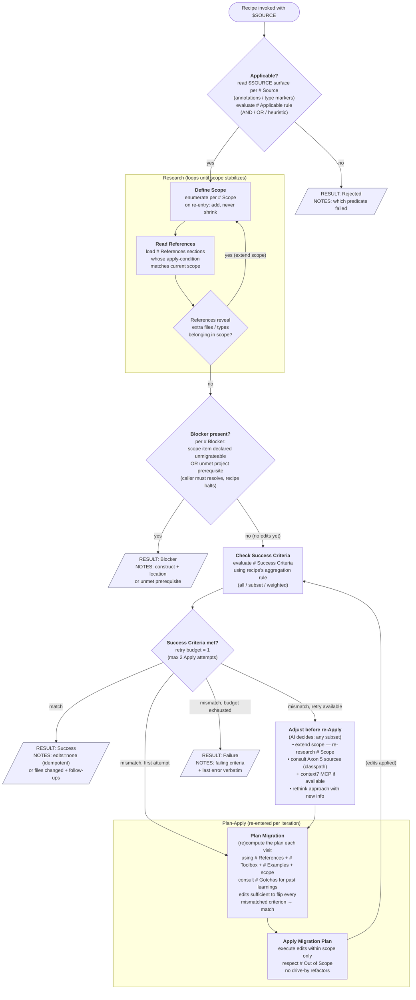

# Recipe sub-flow

The orchestrator-owned spec for executing any recipe in `references/recipes/`. Recipes never re-implement this — they fill in the named sections referenced from the diagram nodes (see `references/recipes/_template/RECIPE.md` for the authoring guide).

Retry budget = **1** additional Apply (≤ 2 Applies total). Each diagram node names the recipe section it consults using markdown header refs (`# Applicable`, `# Scope`, etc. — these map to top-level headings in the recipe file).



## Result

Each recipe completes by returning **exactly one** result block.
The orchestrator reads the `RESULT:` line to control the flow.

```
RESULT: <Success|Blocker|Rejected|Failure>
SOURCE: $SOURCE
RECIPE: axon4to5-<component>
NOTES: <short summary — why this result, what to look at next. Do NOT enumerate changed files; git diff covers that.>
LEARNINGS: <optional. Only when something surprised the recipe — didn't work first try, framework behaviour differed from the recipe's pseudocode, project quirk forced a decision. Omit entirely if the run was straightforward.>
```

**LEARNINGS is optional** and exists for the non-trivial cases: a step that needed a retry, an assumption that turned out wrong, a project-specific shape the recipe had to discover. Trivial green runs do not need LEARNINGS — leave the field out. When present, keep bullets short and scannable; reference `file:line` whenever possible.

**NOTES content:** baseline per-outcome guidance is defined in `references/recipes/DEFAULT.md` (§ Result NOTES / LEARNINGS baselines) and always applies. Recipes may augment via their own `# Result` subsections when they have recipe-specific facts to record; they cannot override the baseline.

### Example — ✅ Success (trivial — no LEARNINGS)

```
RESULT: Success
SOURCE: com.dddheroes.heroesofddd.creaturerecruitment.write.calendar.Calendar
RECIPE: axon4to5-aggregate
NOTES: ✅ All Success Criteria match on first Apply. OpenRewrite Phase 1 had already produced the correct AF5 shape; this recipe only verified.
```

### Example — ✅ Success (with LEARNINGS — surprises encountered)

```
RESULT: Success
SOURCE: com.dddheroes.heroesofddd.creaturerecruitment.write.army.Army
RECIPE: axon4to5-aggregate
NOTES: ✅ All Success Criteria match. Isolated test green; one test expectation updated for the AF5 entity-creator semantics.
LEARNINGS:
- Test expectation flip surprised the recipe: AF4 threw `AggregateNotFoundException` for a missing aggregate, but AF5 with no-arg `@EntityCreator` materialises an empty entity and runs the instance handler — so the domain rule (`Can remove only present creatures`) fires instead. Documented gotcha in `creation-policy-decision.md`; expected test outcome had to be rewritten before the criterion passed.
- Stranded comment in source (`// performance downside in comparison to constructor`) originally referred to `CREATE_IF_MISSING`'s cost on every command. Still loosely accurate (instance handler re-loads the aggregate), so left in place — but the original referent is gone.
```

### Example — 🚧 Blocker

```
RESULT: Blocker
SOURCE: com.dddheroes.heroesofddd.creaturerecruitment.write.dwelling.Dwelling
RECIPE: axon4to5-aggregate
NOTES: 🚧 Caller must decide before re-running. OpenRewrite Phase 1 already dropped the snapshotting attribute and left a `// TODO #LLM: reconfigure snapshot trigger`. AF5's `@EventSourced` does not yet expose a snapshotting API.
LEARNINGS:
- AF4 `@Aggregate(snapshotTriggerDefinition = "...")` has no AF5 equivalent yet — per `not-supported.md` B1 this needs an explicit `accept-drop / pause-migration / remove-feature-first` decision from the caller. The recipe cannot pick one.
- Existing snapshot rows in storage are NOT touched — data migration is out of scope of this skill, the caller owns that decision.
- The `public` field declarations on `Dwelling.java` (`public DwellingId dwellingId; // needs to be public for snapshotting`) become unnecessary once snapshotting is dropped — can be tightened to `private` during stabilization, not by this recipe.
```

### Example — ⏭️ Rejected

```
RESULT: Rejected
SOURCE: com.dddheroes.heroesofddd.creaturerecruitment.read.DwellingReadModelProjector
RECIPE: axon4to5-aggregate
NOTES: ⏭️ Not an aggregate — this is a read-side projector. Recipe did not apply any edits. Route to the event-processor recipe instead.
LEARNINGS:
- Class is annotated `@ProcessingGroup` (not `@Aggregate`) — Applicable predicate failed on the very first surface check.
- For projectors in this codebase, the migration is mostly OpenRewrite output (`@ProcessingGroup` → `@Namespace`, `@EventHandler` / `@ResetHandler` / `@MetadataValue` imports). The only manual step is moving the AF4 `axon.eventhandling.processors.<group>.sequencing-policy` YAML key onto the class as `@SequencingPolicy(type = MetadataSequencingPolicy.class, parameters = GameMetaData.GAME_ID_KEY)`.
- The shared bean `gameIdSequencingPolicy` is referenced by 4 other processor groups in YAML — do not delete it; the write-configuration recipe handles bean cleanup once all groups have been annotated.
```

### Example — ❌ Failure

```
RESULT: Failure
SOURCE: com.dddheroes.heroesofddd.creaturerecruitment.process.WhenCreatureRecruitedThenAddToArmyProcessor
RECIPE: axon4to5-aggregate
NOTES: ❌ Retry budget exhausted (2 Applies). Compilation OK on both attempts. Failing Success Criterion: isolated test — last error verbatim: `Wanted but not invoked: commandGateway.send(IncreaseAvailableCreatures.command(...), ...); Actually, there were zero interactions with this mock.`
LEARNINGS:
- AF5 `CommandGateway.send(...)` returns a `CommandResult` whose `getResultMessage()` is a `CompletableFuture<? extends Message>` — the AF4 try/catch around `send(...).getResultMessage()` never catches anything because the failure surfaces on the future, not in the try-block. This is a real behavioural regression, not just a test issue: AF4 automations that compensated via try/catch silently stop compensating under AF5.
- Suspected fix shape (not applied — outside this recipe's scope): rewrite to `.exceptionallyCompose(error -> commandDispatcher.send(IncreaseAvailableCreatures.command(...), metadata).getResultMessage())`. Will likely need a `.thenApply(m -> m)` bridge to widen `CompletableFuture<? extends Message>` to `CompletableFuture<Message>` (wildcard capture refuses `exceptionallyCompose`'s type bound otherwise).
- AF5 `org.axonframework.messaging.core.Message` is **NOT generic** — declared as `public interface Message` (verified via `javap` against `axon-messaging-5.1.1-SNAPSHOT.jar`). Any recipe pseudocode using `CompletableFuture<? extends Message<?>>` is wrong; the correct shape is `CompletableFuture<? extends Message>`.
- This `$SOURCE` is a processor, not an aggregate — Applicable should arguably have rejected it earlier. The aggregate recipe is the wrong tool for try/catch → reactive-compensation refactoring; caller should re-route to the event-processor recipe and re-invoke.
```

## Invariants

- **Applicable check sits outside Research** — cheap surface check on `$SOURCE` alone; don't pay the Research cost for the wrong recipe.
- **Scope before References** (inside Research) — `scope` drives *which* `references` sections are read.
- **Research is a fixed-point loop** — exits only when SQ says "no new in-scope items"; `scope` can only grow.
- **Single Check Success Criteria** — same evaluation logic pre- and post-Apply; the diamond branches on whether retry budget remains.
- **Blocker fires only from `Blocker in scope?`** — emitted after Research stabilizes. Check / Plan / Apply never short-circuit to Blocker; partial work either passes the Check or counts as Failure.
- **Apply loop is `Check → Plan → Apply → Check`** — only Apply consumes the retry budget. Adjust activities (re-research, source consultation) are *free*.
- **Adjust is open-ended** — on retry the AI picks any subset of: extend scope, consult Axon 5 sources / context7, rethink the approach. Plan Migration is rebuilt each iteration using whatever new info Adjust gathered.
- **Recipe owns content; orchestrator owns control flow.** A recipe never decides "retry" or "skip a step" — it only fills the named sections referenced from the diagram nodes.
