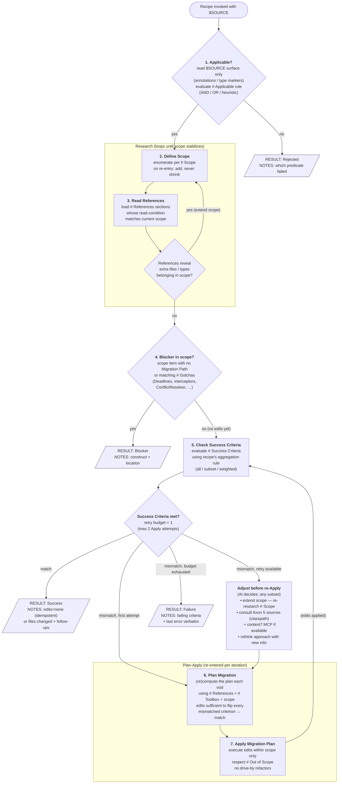

# Recipe execution contract

The **orchestrator-owned** spec for executing any recipe in `references/recipes/`. Defines sub-flow, state, retry, and result emission. Recipes never re-implement this — they fill in the named sections referenced in the diagram below (see `_template.md`).

`$SOURCE` = the recipe argument (FQN / file path of the thing to migrate). Retry budget = **1** additional Apply (≤ 2 Applies total).

## Sub-flow

Each node names the recipe section it consults using markdown header refs (# Applicable, # Scope, etc. — these map to top-level headings in the recipe file).



## Orchestrator state

The orchestrator tracks the following state across steps. The recipe never tracks state — it only provides decision logic and content.

| Variable | Type | Initialized | Mutated by | Purpose |
|----------|------|-------------|------------|---------|
| `$SOURCE` | string | invocation | — | argument passed to the recipe (FQN / file path) |
| `applicable` | bool | step 1 | — | gate for entering Research |
| `scope` | set&lt;path/type&gt; | step 2 | step 2 (loop) | inventory of files/types in scope |
| `references` | set&lt;ref section&gt; | step 3 | step 3 (loop), CTX | playbook sections currently loaded |
| `criteria_state` | match / mismatch | step 5 | step 5 | last check result |
| `apply_count` | 0..2 | 0 | step 7 | bounds retry; budget = 1 retry ⇒ max 2 Applies |

Apply consumes the retry budget; **scope extension and CTX do not** — only the next Apply does.

## Result emission

Each recipe completes by emitting **exactly one** result block. The orchestrator parses the `RESULT:` line; the rest is human-readable context.

```
RESULT: <Success|Blocker|Rejected|Failure>
SOURCE: $SOURCE
RECIPE: axon4to5-<component>
FILES_CHANGED: [<path>, ...]
NOTES: <one short paragraph — why this result, what to look at next>
```

## Invariants

- **Step 1 sits outside Research** — cheap surface check on `$SOURCE` alone; don't pay the Research cost for the wrong recipe.
- **Scope before References** (inside Research) — `scope` drives *which* `references` sections are read.
- **Research is a fixed-point loop** — exits only when SQ says "no new in-scope items"; `scope` can only grow.
- **Step 5 is the single check** — same evaluation logic pre- and post-Apply; visit context is encoded in `apply_count`.
- **Blocker fires only from step 4** — emitted after Research stabilizes. Steps 5–7 never short-circuit to Blocker; partial work either passes step 5 or counts as Failure.
- **Apply loop is `5 → 6 → 7 → 5`** with retry budget on `apply_count`. Re-Research (step 2 re-entry) and CTX are *free* (no budget); only Apply consumes.
- **Two retry routes converge at step 7**:
  - `scope_incomplete` → re-enter step 2; Research extends scope; eventually re-Apply.
  - `knowledge_gap` → CTX → step 6 → re-Apply.
- **Recipe owns content; orchestrator owns control flow.** A recipe never decides "retry" or "skip a step" — it only fills the named sections referenced from the diagram nodes.
