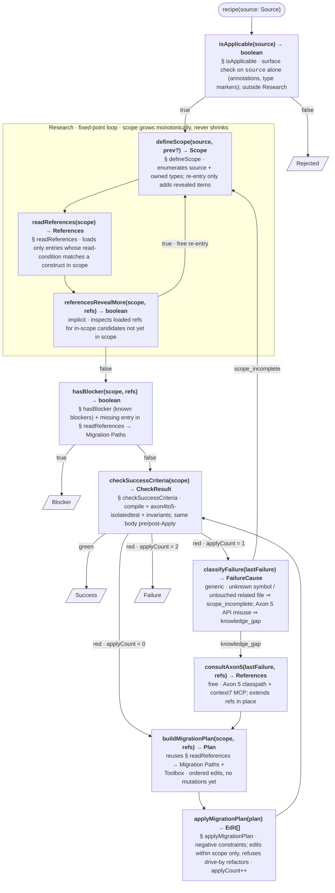

# Recipe execution contract

The **orchestrator-owned** specification for executing any recipe in `references/recipes/`. Recipes never re-implement this — they fill in the `§ Section`s that nodes in the diagram bind to (see `_template.md`).

**The sub-flow diagram below is the source of truth.** Every function lives there exactly once, carrying its full signature, recipe-section binding, and one-line behavior — read it as the interface. The TS blocks above and below the diagram only define the *types* it references and the *durable state* it threads.

Retry budget = **1** additional `applyMigrationPlan` call (≤ 2 Applies total).

## Types

```ts
type Source     = string;                           // FQN or file path; from skill invocation
type FilePath   = string;
type FQN        = string;
type Scope      = Set<FilePath | FQN>;              // monotonic — only grows during Research
type References = {                                 // subset of recipe playbook currently loaded
  migrationPaths: Section[];                        // from § readReferences → Migration Paths
  toolbox:        Section[];                        // from § readReferences → Toolbox
  examples:       Section[];                        // from § readReferences → Examples
};
type FailureOutput = {
  failedCheck: 'compile' | 'isolatedtest' | 'invariant';
  stderr:      string;                              // raw tool output, used by classifyFailure
};
type CheckResult = { state: 'green' } | { state: 'red'; output: FailureOutput };
type Plan = Edit[];                                 // ordered; sufficient to flip all red → green
type Edit = { path: FilePath; description: string };
type FailureCause = 'scope_incomplete' | 'knowledge_gap';
type Result = 'Rejected' | 'Blocker' | 'Success' | 'Failure';
```

## Sub-flow



## Orchestrator state

Execution is **durable**: state survives across function invocations and process boundaries, so any node can resume from the last persisted value. *How* the orchestrator persists this state (in-memory, file, DB, event log, …) is out of scope for this contract — recipes only see the shape.

```ts
interface State {
  source:      Source;                   // from skill arg; immutable
  scope:       Scope;                    // grows via defineScope (free re-entry)
  references:  References;               // extended by readReferences + consultAxon5 (free)
  applyCount:  0 | 1 | 2;                // bounds retry — only applyMigrationPlan increments
  lastFailure: FailureOutput | null;     // set by checkSuccessCriteria on red
}
```

Retry budget lives entirely in `applyCount`. `defineScope` re-entry and `consultAxon5` are free.

## Return values

The graph terminates at one of four parallelogram nodes. Each emits the same block; only `RESULT:` differs.

```yaml
RESULT:        Success | Blocker | Rejected | Failure
SOURCE:        <fully qualified name or path of source>
RECIPE:        axon4to5-<component>
FILES_CHANGED: [<path>, ...]
NOTES:         <one short paragraph — why this result, what to look at next>
```

The orchestrator parses the `RESULT:` line; the rest is human-readable context.

| Terminal      | Fired by                                              |
|---------------|-------------------------------------------------------|
| `Rejected`    | `isApplicable` → false                                |
| `Blocker`     | `hasBlocker` → true                                   |
| `Success`     | `checkSuccessCriteria` → green                        |
| `Failure`     | `checkSuccessCriteria` → red, `applyCount === 2`      |

## Invariants

- **`isApplicable` sits outside Research** — cheap surface check on `source` alone; don't pay the Research cost for the wrong recipe.
- **Scope before References** (inside Research) — `scope` drives *which* sections `readReferences` loads.
- **Research is a fixed-point loop** — exits only when `referencesRevealMore` returns false; `scope` is monotonically increasing.
- **`checkSuccessCriteria` is the single check** — same body pre- and post-Apply; visit context is encoded in `applyCount`.
- **`Blocker` fires only from `hasBlocker`** — emitted after Research stabilizes. Downstream functions never short-circuit to `Blocker`; partial work either passes `checkSuccessCriteria` or counts as `Failure`.
- **Apply loop is `checkSuccessCriteria → buildMigrationPlan → applyMigrationPlan → checkSuccessCriteria`** with retry budget on `applyCount`. `defineScope` re-entry and `consultAxon5` are free.
- **Two retry routes converge at `applyMigrationPlan`**:
  - `scope_incomplete` → `defineScope` extends scope, Research re-stabilizes, eventually re-Apply.
  - `knowledge_gap` → `consultAxon5` extends references, straight to `buildMigrationPlan`, then re-Apply.
- **Recipe owns content; orchestrator owns control flow.** A recipe never decides "retry" or "skip a function" — it only fills the `§` sections bound in the diagram nodes.
