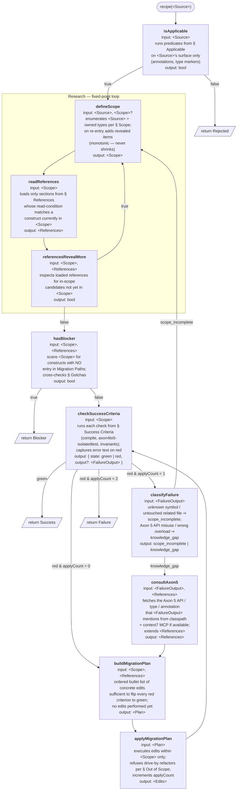

# Recipe execution contract

This file is the **orchestrator-owned** specification for executing any recipe in `references/recipes/`. It defines control flow, state, and per-function contracts. Recipes never re-implement this — they only fill in the sections this contract references (see `_template.md`).

The contract is modelled as a directed graph of typed functions. Each node carries its own `input` / `output` annotation and a short description of what it does. Retry budget = **1** additional `applyMigrationPlan` call (≤ 2 Applies total).

## Sub-flow



## Type glossary

Angle-bracketed names are the data the orchestrator carries between function calls.

| Type | Description |
|------|-------------|
| `<Source>` | Fully qualified class name or file path of the thing to migrate. Provided by the skill invocation. |
| `<Scope>` | Set of files / types the recipe is allowed to touch. Monotonically grows during Research; never shrinks. |
| `<References>` | Subset of the recipe's playbook (Migration Paths / Toolbox / Examples) currently loaded; extended in place by `consultAxon5`. |
| `<FailureOutput>` | Compile / test output captured when `checkSuccessCriteria` returns red. Used to classify the failure cause. |
| `<Plan>` | Ordered list of concrete edits sufficient to flip every red criterion to green. |
| `<Edits>` | Mutations made to the workspace by the most recent Apply. Tracked for the result block's `FILES_CHANGED`. |

## Orchestrator state

Held between function calls. The recipe never tracks state itself.

| Variable | Type | Initialized | Mutated by | Purpose |
|----------|------|-------------|------------|---------|
| `source` | `<Source>` | invocation | — | identifier from skill arg |
| `scope` | `<Scope>` | `defineScope` | `defineScope` (loop) | files/types in scope |
| `references` | `<References>` | `readReferences` | `readReferences`, `consultAxon5` | loaded playbook subset |
| `applyCount` | 0..2 | 0 | `applyMigrationPlan` | bounds retry; max 2 Applies |
| `lastFailure` | `<FailureOutput>?` | `checkSuccessCriteria` (red) | `checkSuccessCriteria` | input to `classifyFailure` / `consultAxon5` |

Only `applyMigrationPlan` consumes the retry budget; `defineScope` re-entry and `consultAxon5` are free.

## Recipe section bindings

Each function's body is driven by content the recipe author writes in a specific section. The diagram nodes name the section inline; this table is the index.

| Function | Recipe section |
|----------|----------------|
| `isApplicable` | `§ Applicable` |
| `defineScope` | `§ Scope` |
| `readReferences` | `§ References` (read-conditions) |
| `referencesRevealMore` | implicit — read-conditions inside `§ References` |
| `hasBlocker` | `§ Gotchas` + absence of entry in Migration Paths (subsection of `§ References`) |
| `checkSuccessCriteria` | `§ Success Criteria` |
| `classifyFailure` | none — generic orchestrator rule |
| `consultAxon5` | none — Axon 5 classpath + `context7` MCP |
| `buildMigrationPlan` | `§ References` (Migration Paths + Toolbox subsections) |
| `applyMigrationPlan` | `§ Out of Scope` (negative constraints) |

## Return values

The graph terminates with one of four parallelogram nodes. Each `return` produces the same result block format below; only the `RESULT:` line differs.

- `return Rejected` — `isApplicable` returned false.
- `return Blocker` — `hasBlocker` returned true.
- `return Success` — `checkSuccessCriteria` returned green.
- `return Failure` — `checkSuccessCriteria` returned red and retry budget exhausted.

```
RESULT: <Success|Blocker|Rejected|Failure>
SOURCE: <fully qualified name or path of <Source>>
RECIPE: axon4to5-<component>
FILES_CHANGED: [<path>, ...]
NOTES: <one short paragraph — why this result, what to look at next>
```

The orchestrator parses the `RESULT:` line; the rest is human-readable context.

## Invariants

- **`isApplicable` sits outside Research** — cheap surface check on `<Source>` alone; don't pay the Research cost for the wrong recipe.
- **Scope before References** (inside Research) — `<Scope>` drives *which* sections `readReferences` loads.
- **Research is a fixed-point loop** — exits only when `referencesRevealMore` returns false; `<Scope>` is monotonically increasing.
- **`checkSuccessCriteria` is the single check** — same body pre- and post-Apply; visit context is encoded in `applyCount`.
- **`return Blocker` fires only from `hasBlocker`** — emitted after Research stabilizes. Downstream functions never short-circuit to Blocker; partial work either passes `checkSuccessCriteria` or counts as `return Failure`.
- **Apply loop is `checkSuccessCriteria → buildMigrationPlan → applyMigrationPlan → checkSuccessCriteria`** with retry budget on `applyCount`. `defineScope` re-entry and `consultAxon5` are free.
- **Two retry routes converge at `applyMigrationPlan`**:
  - `scope_incomplete` → `defineScope` extends scope, Research re-stabilizes, eventually re-Apply.
  - `knowledge_gap` → `consultAxon5` extends references, straight to `buildMigrationPlan`, then re-Apply.
- **Recipe owns content; orchestrator owns control flow.** A recipe never decides "retry" or "skip a function" — it only fills the sections listed in *Recipe section bindings* above.
