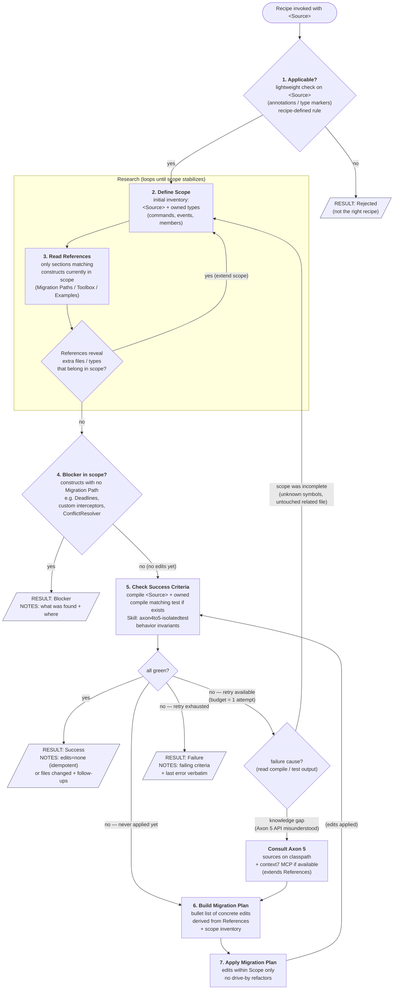

# Recipe execution contract

This file is the **orchestrator-owned** specification for executing any recipe in `references/recipes/`. It defines control flow, state, and step-by-step contracts. Recipes never re-implement this — they only fill in the sections this contract references (see `_template.md`).

Retry budget = **1** additional Apply (≤ 2 Applies total).

## Sub-flow



## Orchestrator state

The orchestrator tracks the following state across steps. The recipe never tracks state — it only provides decision logic and content.

| Variable | Type | Initialized | Mutated by | Purpose |
|----------|------|-------------|------------|---------|
| `source` | string | invocation | — | `<Source>` identifier from skill arg |
| `applicable` | bool | step 1 | — | gate for entering Research |
| `scope` | set&lt;path/type&gt; | step 2 | step 2 (loop) | inventory of files/types in scope |
| `references` | set&lt;ref section&gt; | step 3 | step 3 (loop) | playbook sections currently loaded |
| `criteria_state` | green / red | step 5 | step 5 | last check result |
| `apply_count` | 0..2 | 0 | step 7 | bounds retry; budget = 1 retry ⇒ max 2 |
| `last_failure` | string | step 5 (red) | step 5 | compile/test output used for cause classification |

Apply consumes the retry budget; **scope extension and CTX do not** — only the next Apply does.

## Step contract

Each row is one node in the mermaid above. "Recipe section" names the part of the recipe file the LLM consults at that step.

| # | Node | Type | Recipe section | Pre | LLM operation | Post / Branches |
|---|------|------|----------------|-----|---------------|-----------------|
| 1 | Applicable? | decision | `§ Applicable` (predicates + decision rule) | `source` set | Read `<Source>` surface (annotations / type markers only — do NOT walk owned graph). Evaluate predicates with the rule the recipe declares (AND / OR / heuristic). | `applicable = true → step 2` · `false → emit Rejected (NOTES: which predicate failed)` |
| 2 | Define Scope | action (loop body) | `§ Scope` (definition of what counts as "owned") | `applicable = true` | Enumerate `<Source>` + owned types per the recipe's scope rule. On re-entry from SQ, **add** newly-revealed items; never shrink. | `scope` updated → step 3 |
| 3 | Read References | action (loop body) | `§ References` (`Migration Paths` / `Toolbox` / `Examples`, each with read-condition) | `scope` non-empty | Load only sections whose read-condition matches any construct currently in `scope`. Skip irrelevant sections. | `references` updated → SQ |
| SQ | References reveal extra files/types? | decision | implicit — read-conditions in `§ References` | `references` updated | Inspect loaded references for in-scope candidates not yet in `scope`. | `yes → step 2 (extend)` · `no → step 4` |
| 4 | Blocker in scope? | decision | `§ Gotchas` + absence of entry in `Migration Paths` | `scope` stable, `references` loaded | Scan `scope` for constructs that have **no** entry in loaded `Migration Paths`. Cross-check with `Gotchas`. | `yes → emit Blocker (NOTES: construct + location)` · `no → step 5` |
| 5 | Check Success Criteria | action + decision | `§ Success Criteria` (concrete checks) | `scope` + `references` available | Run each check the recipe lists: (a) compile `<Source>` + owned, (b) compile matching test if exists, (c) Skill `axon4to5-isolatedtest`, (d) behavior invariants. Save compile/test output to `last_failure` on red. | `green → emit Success` · `red & apply_count = 0 → step 6` · `red & apply_count = 1 → RC` · `red & apply_count = 2 → emit Failure` |
| RC | Failure cause? | decision | none (generic classification rule) | `last_failure` set | Read `last_failure`. Classify: unknown symbol / reference to untouched file ⇒ `scope_incomplete`; Axon 5 API misuse / wrong overload ⇒ `knowledge_gap`. | `scope_incomplete → step 2` · `knowledge_gap → CTX` |
| CTX | Consult Axon 5 | action | none — uses Axon 5 source on classpath + `context7` MCP if available | `RC = knowledge_gap` | Fetch the specific Axon 5 API / type / annotation that `last_failure` references. Extend `references` with the new knowledge. | `references` extended → step 6 |
| 6 | Build Migration Plan | action | `§ References` + `§ Toolbox` | `criteria_state = red` | Produce an ordered bullet list of concrete edits sufficient to flip every red criterion to green. No edits performed yet. | plan ready → step 7 |
| 7 | Apply Migration Plan | action | `§ Out of Scope` (negative constraints) | plan ready | Execute edits **within `scope`** only. No drive-by refactors. | `apply_count++` → step 5 |

## Result emission

Each recipe completes by emitting **exactly one** result block. The orchestrator parses the `RESULT:` line; the rest is human-readable context.

```
RESULT: <Success|Blocker|Rejected|Failure>
SOURCE: <fully qualified name or path of <Source>>
RECIPE: axon4to5-<component>
FILES_CHANGED: [<path>, ...]
NOTES: <one short paragraph — why this result, what to look at next>
```

## Invariants

- **Step 1 sits outside Research** — cheap surface check on `<Source>` alone; don't pay the Research cost for the wrong recipe.
- **Scope before References** (inside Research) — `scope` drives *which* `references` sections are read.
- **Research is a fixed-point loop** — exits only when SQ says "no new in-scope items"; `scope` can only grow.
- **Step 5 is the single check** — same evaluation logic pre- and post-Apply; visit context is encoded in `apply_count`.
- **Blocker fires only from step 4** — emitted after Research stabilizes. Steps 5–7 never short-circuit to Blocker; partial work either passes step 5 or counts as Failure.
- **Apply loop is `5 → 6 → 7 → 5`** with retry budget on `apply_count`. Re-Research (step 2 re-entry) and CTX are *free* (no budget); only Apply consumes.
- **Two retry routes converge at step 7**:
  - `scope_incomplete` → re-enter step 2; Research extends scope; eventually re-Apply.
  - `knowledge_gap` → CTX → step 6 → re-Apply.
- **Recipe owns content; orchestrator owns control flow.** A recipe never decides "retry" or "skip a step" — it only fills the cells in column *Recipe section* above.
