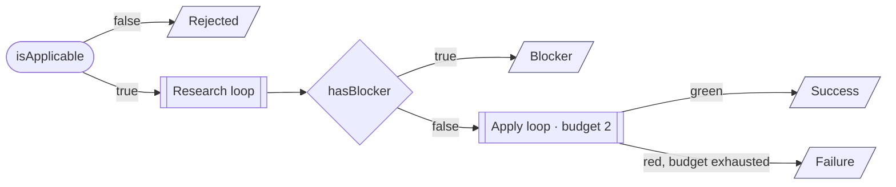

# Recipe execution contract

The orchestrator-owned spec for executing any recipe in `references/recipes/`. The pseudocode below is the source of truth. The Mermaid sketch shows the topology only.

How a recipe (`aggregate.md`, …) plugs in:

- Every **recipe-authored** function has the same name as a markdown heading in the recipe file. At runtime the LLM fulfills the call by reading that section's prose.
- **Orchestrator-owned** functions are generic and never overridden.
- State is **checkpointed after every mutation** — durable execution. Storage (in-memory, file, DB, event log, …) is implementation-defined and intentionally absent from this contract.
- Retry budget = at most **2 Applies** (`state.applyCount` ∈ {0,1,2}). Research re-entry and `consultAxon5` are FREE.

## Flow



## State

```text
state = {
  source,        # FQN or path of the thing to migrate — immutable
  scope,         # set of files/types in scope — grows monotonically
  refs,          # loaded playbook entries (Migration Paths / Toolbox / Examples)
  applyCount,    # 0..2 — only applyMigrationPlan increments
  lastFailure,   # set by checkSuccessCriteria on red
  files,         # accumulated file paths actually changed
}

Verdict = "Rejected" | "Blocker" | "Success" | "Failure"
```

## Functions

```text
# Recipe-authored — LLM fills body from the markdown heading of the same name.
isApplicable(source)                  -> bool                          # ## isApplicable · outside Research
defineScope(source, prev?)            -> Scope                         # ## defineScope · monotonic
readReferences(scope)                 -> Refs                          # ## readReferences · read-condition match
referencesRevealMore(scope, refs)     -> bool                          # implicit · read-conditions in ## readReferences
hasBlocker(scope, refs)               -> bool                          # ## hasBlocker · also "missing Migration Path"
checkSuccessCriteria(scope)           -> {green} | {red, error}        # ## checkSuccessCriteria · same body pre/post-Apply
buildMigrationPlan(scope, refs)       -> Plan                          # reuses ## readReferences → Migration Paths + Toolbox
applyMigrationPlan(plan)              -> Edits                         # ## applyMigrationPlan · filter by negative constraints
notes(verdict, state)                 -> str                           # ## Result → matching subsection

# Orchestrator-owned — generic, never overridden by recipes.
writeEdits(edits)                     -> [FilePath]                    # apply edits to workspace
checkpoint(state)                                                      # persist state (durable) — after every mutation
classifyFailure(error)                -> "scope_incomplete"|"knowledge_gap"
                                                                       #   unknown symbol / untouched file ⇒ scope_incomplete
                                                                       #   Axon 5 API misuse / wrong overload ⇒ knowledge_gap
consultAxon5(error, refs)             -> Refs                          # fetch cited Axon 5 API from classpath + context7 MCP · FREE
```

## recipe()

```python
def recipe(source):
    if not isApplicable(source):
        return done("Rejected")

    state.scope = defineScope(source)
    research()                                          # fixed-point — free

    if hasBlocker(state.scope, state.refs):
        return done("Blocker")

    while True:                                         # Apply loop — budget = 2
        check = checkSuccessCriteria(state.scope)
        if check.green:
            return done("Success")
        if state.applyCount >= 2:
            return done("Failure")
        state.lastFailure = check.error

        # Free detour, FIRST failed Apply only.
        if state.applyCount == 1:
            if classifyFailure(state.lastFailure) == "scope_incomplete":
                state.scope = defineScope(source, state.scope)
                research()
            else:                                       # "knowledge_gap"
                state.refs = consultAxon5(state.lastFailure, state.refs)

        plan  = buildMigrationPlan(state.scope, state.refs)
        edits = applyMigrationPlan(plan)                # negative constraints applied
        state.files += writeEdits(edits)
        state.applyCount += 1

def research():
    # Load only refs whose read-condition matches scope.
    # scope grows monotonically until refs reveal nothing new.
    while True:
        state.refs = readReferences(state.scope)
        if not referencesRevealMore(state.scope, state.refs):
            return
        state.scope = defineScope(source, state.scope)
```

> `checkpoint(state)` is omitted from the body above for readability — assume it runs after every line that mutates `state`. That is what "durable execution" means here.

## Result emission

The orchestrator emits this block; calling skills parse the `RESULT:` line only.

```yaml
RESULT:        Success | Blocker | Rejected | Failure
SOURCE:        <fully qualified name or path of source>
RECIPE:        axon4to5-<component>
FILES_CHANGED: [<path>, ...]                   # = state.files
NOTES:         <one short paragraph>           # = notes(verdict, state)
```

Each verdict is reached at exactly one point in `recipe()`:

| Verdict     | Reached at                                              |
|-------------|---------------------------------------------------------|
| `Rejected`  | `if not isApplicable(source)` — before Research.        |
| `Blocker`   | `if hasBlocker(...)` — after Research stabilizes.       |
| `Success`   | `if check.green` — top of the Apply loop.               |
| `Failure`   | `if state.applyCount >= 2` — budget exhausted on red.   |
