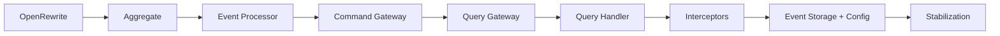

# Routing

Use this file to choose the next recipe. It is the only phase-order table.

## Modes

- `phased`: run rows in the order below, resuming from `progress.md`.
- `single`: inspect the requested file/FQCN and choose the first matching row.
- `debug`: compile without isolated scopes, cluster errors, and route the
  highest-leverage file through the same table.

## Phase Order

| Phase | Recipe | Mode | Discovery | Applies when | Notes |
|---:|---|---|---|---|---|
| 1 | `openrewrite` | one-shot | n/a | Project depends on Axon 4 and is not yet on AF5 BOM/deps. | Calls `axon4to5-openrewrite`. |
| 2 | `aggregate` | iterative | `@Aggregate\b\|@AggregateRoot\b` in `*.java` / `*.kt` | Class has AF4 aggregate annotation and event-sourcing handlers. | Detect simple, multi-entity, polymorphic variants inside the recipe. |
| 3 | `event-processor` | iterative | `@ProcessingGroup\|org\.axonframework\.eventhandling\.EventHandler` | Class has `@EventHandler` methods. | Usually projectors/processors. |
| 4 | `command-gateway` | iterative | `org\.axonframework\.commandhandling\.gateway\.CommandGateway` | Top-of-chain caller injects `CommandGateway`. | Exclude classes with handler/interceptor annotations. |
| 5 | `query-gateway` | iterative | `org\.axonframework\.queryhandling\.QueryGateway` | Top-of-chain caller injects `QueryGateway`. | Exclude classes with handler annotations. |
| 6 | `query-handler` | iterative | `org\.axonframework\.queryhandling\.QueryHandler` | Class has `@QueryHandler` methods. | Handler classes only. |
| 7 | `interceptors` | iterative | `implements\s+MessageDispatchInterceptor\b\|implements\s+MessageHandlerInterceptor\b` | Class implements an AF4 interceptor SPI and is not itself a handler. | Route mixed handler/interceptor classes to the handler recipe first. |
| 8 | `event-storage-engine` | one-shot | n/a | Project declares or registers AF4 event-store/configurer wiring. | Also owns generic configuration-class rewrites via `configuration.md`. |

Project-wide unsupported feature:

| Recipe | Discovery | Action |
|---|---|---|
| `saga` | `@Saga\b\|@SagaEventHandler\|@StartSaga\|@EndSaga\|SagaConfigurer` | Detect during initialization. Ask for `migrate-to-event-handler-with-state`, `accept-stays-af4`, `pause-migration`, or `remove-feature-first`. |

Debug is a mode, not a phase. Its recipe lives at
[debug/debug.md](debug/debug.md) and routes compile-error clusters back to the
table above.

## Single-Target Routing

For a requested file/FQCN:

1. Resolve it to one source file. If resolution fails, stop and show the bad
   target.
2. Read the file.
3. Walk iterative rows in phase order and pick the first whose discovery regex
   matches and whose exclude rule does not match.
4. If a class matches multiple rows, use the earliest phase. Ask for override
   only when the user explicitly asks to change the route.

Exclude rules:

| Recipe | Exclude when the same class contains |
|---|---|
| `command-gateway` | `@EventHandler\|@CommandHandler\|@QueryHandler\|@MessageHandlerInterceptor` |
| `query-gateway` | `@EventHandler\|@CommandHandler\|@QueryHandler` |
| `interceptors` | `@CommandHandler\|@EventHandler\|@QueryHandler` |

## Docs Map

Recipes contain mechanics. Conceptual explanation, FQN tables, and larger
before/after examples live in docs:

| Topic | Doc |
|---|---|
| Package/import changes, BOM/modules, unsupported AF5 areas | [../docs/paths/index.adoc](../docs/paths/index.adoc) |
| Messages and annotations | [../docs/paths/messages.adoc](../docs/paths/messages.adoc) |
| Event store choices | [../docs/paths/event-store.adoc](../docs/paths/event-store.adoc) |
| Event processors, namespaces, DLQ pointers | [../docs/paths/projectors-event-processors.adoc](../docs/paths/projectors-event-processors.adoc) |
| Sequencing policies | [../docs/paths/sequencing-policies.adoc](../docs/paths/sequencing-policies.adoc) |
| Interceptors | [../docs/paths/interceptors.adoc](../docs/paths/interceptors.adoc) |
| Configuration migration | [../docs/paths/configuration.adoc](../docs/paths/configuration.adoc) |
| Snapshotting | [../docs/paths/snapshotting.adoc](../docs/paths/snapshotting.adoc) |
| Serializers/converters | [../docs/paths/serializers.adoc](../docs/paths/serializers.adoc) |
| Test fixtures | [../docs/paths/test-fixtures.adoc](../docs/paths/test-fixtures.adoc) |
| Prerequisites | [../docs/prerequisites.adoc](../docs/prerequisites.adoc) |
| Architecture principles | [../docs/understanding-architecture-principles.adoc](../docs/understanding-architecture-principles.adoc) |

When a recipe needs a concept, link to the doc instead of duplicating it.
